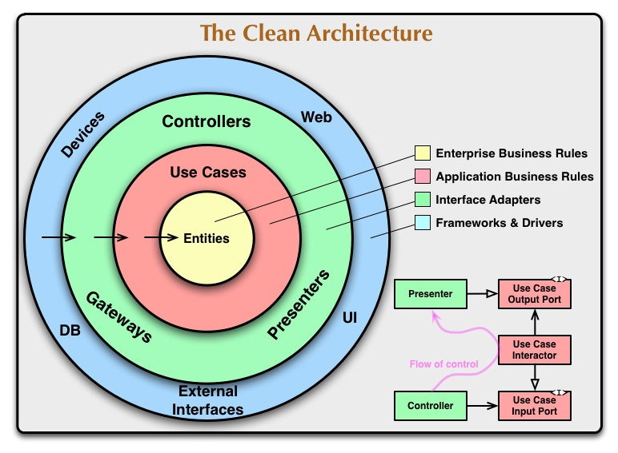
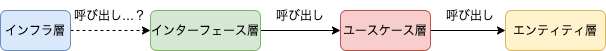
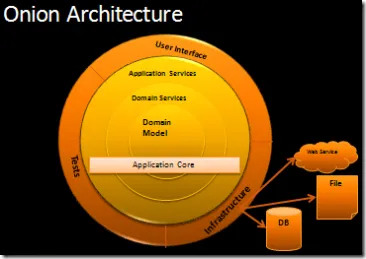
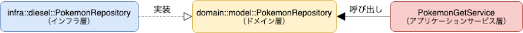

Rust で何か作ってみようと思い、API サーバーを作ってみました。  
アーキテクチャや開発手法、インフラ構成について色々と考えながら構築したので少しずつ記事にします。  
今回はアーキテクチャの面についてです。  

## 今回の設計に至るまでの経緯

### クリーンアーキテクチャ…に挫折した

かの有名な[Clean Architecture 達人に学ぶソフトウェアの構造と設計](https://www.kadokawa.co.jp/product/301806000678/)を読んだことはあったのですが、実践したことがなかったので、これを機に再度勉強して実装しようかと思いました。  
実際にコードにしてみる際に参考にした資料・コードは以下の通りです：

-   [API サーバーを Clean Architecture で構築する](https://tech-blog.optim.co.jp/entry/2019/01/29/173000)
-   [Clean ArchitectureでAPI Serverを構築してみる](https://qiita.com/hirotakan/items/698c1f5773a3cca6193e)
-   [Go × Clean Architectureのサンプル実装](https://nakawatch.hatenablog.com/entry/2018/07/11/181453)
-   [Rust API Server Architecture Sample](https://github.com/foresta/rust-api-architecture-sample)
-   [actix-web-clean-architecture-sample](https://github.com/11Takanori/actix-web-clean-architecture-sample)

特に、一番目の記事はかなりクリーンアーキテクチャの[例の図](https://blog.cleancoder.com/uncle-bob/2012/08/13/the-clean-architecture.html)に忠実に実装していたため、参考になりました（結構、 Output/Input Port, Interactor あたりは明確に分けずに実装している例が多いと個人的に感じています。）。  



しかし、1つ問題にぶつかりました。  
**「インフラ（フレームワーク＆ドライバー）層ってどうやって実装すれば良いの・・・？」**  
後ほど紹介しますが、DB の ORM（OR マッパー）や Actor に外部フレームワークを用いたため、フレームワーク＆ドライバー層からコントローラ層に向く依存の方向性（フレームワーク＆ドライバー層がコントローラ層を呼び出す構造）を実装する方法がピンと来ませんでした。  



### オニオンアーキテクチャとの出会い

同じような悩みを抱いてた方もいらっしゃるようで、下記の記事の内容にとても納得しました。

-   [クリーンアーキわからんかった人のためのオニオンアーキテクチャ](https://zenn.dev/streamwest1629/articles/no-clean_hello-onion-architecture)

以下、記事から引用します：

> 「フレームワーク」「ドライバ」は大抵ライブラリとして提供されている事実  
> エントリポイント以外ではインフラストラクチャ層からインターフェイス層を呼び出す手立てがありません（エントリポイント自体がインターフェイスに属するという意見も聞くので一概に言えませんが）。これはつまり、**どうやってもインフラストラクチャ層はインターフェイス層を呼び出すことはできません**。

記事内にもありますが、ORM などの外部ライブラリを使う際には、下記のような構造にせざるを得ないということです。  


そこで、記事内で提案されているのが[オニオンアーキテクチャ](https://jeffreypalermo.com/2008/07/the-onion-architecture-part-1/)です。クリーンアーキテクチャよりも古い概念だそうです。  



この構成でも、クリーンアークテクチャのキモとなる SOLID 原則を満たすことができるため、クリーンアーキテクチャのあの図とやりたいことは変わらないということなのです。

### DDD? ヘキサゴナルアーキテクチャ??

もう少し、オニオンアーキテクチャについて詳しく調べてみると、下記の記事に「結局、オニオンアーキテクチャはDDDの本にも載ってる『ヘキサゴナルアーキテクチャ』をもう少し具体的にしたものだよ」ということが書いてありました。

-   [[DDD]ドメイン駆動 + オニオンアーキテクチャ概略](https://qiita.com/little_hand_s/items/2040fba15d90b93fc124)

DDDについては、 [「実践ドメイン駆動設計」から学ぶDDDの実装入門](https://www.shoeisha.co.jp/book/detail/9784798161501) や [ドメイン駆動設計入門 ボトムアップでわかる！ドメイン駆動設計の基本](https://www.shoeisha.co.jp/book/detail/9784798150727) の本を読んでいたため、これもまたなんとなくは知ってましたが、実装したことはありませんでした。

### で、結論

どのアーキテクチャを採用するかを色々試行錯誤しましたが、最終的には、 DDD の考え方を入れてオニオンアーキテクチャで SOLID 原則を満たすアーキテクチャ を採用して実装することにしました。  
実際に、Rust のコードに落とし込むにあたっては、以下の記事を参考にしています：

-   [クリーンアーキわからんかった人のためのクリーンじゃないけどクリーンみたいなオニオンに見せかけたSOLIDの話](https://zenn.dev/streamwest1629/articles/no-clean_like-clean_its-onion-solid)
-   [Hexagonal architecture in Rust #1 - Domain](https://alexis-lozano.com/hexagonal-architecture-in-rust-1/)
-   [DDDのパターンをRustで表現する ~ Value Object編 ~](https://caddi.tech/archives/1373)
-   [Rustで楽しいDependency Injection](https://docs.google.com/presentation/d/1GpsRpeI8unwoZBvA3-K8t2_Q_dj4fsgdZpoyo-VmdAY/edit#slide=id.gda863db8a8_0_150)
-   [Rustでクリーンアーキテクチャによる依存関係逆転の原則について](https://zenn.dev/sgtkuc1118/articles/5e1743552bf00a)
-   [Rustでクリーンアーキテクチャを組む時DIするサンプルコード](https://qiita.com/kawadumax/items/0875eda8a89f5d24d3c3)
-   [Rust で DI する時の小技](https://ryym.tokyo/posts/rust-di/)

## 実際の成果物

前置きが長くなりましたが、今回の成果物は [こちら](https://github.com/tsuchinoko0402/rust-web-api-server-sample) です。  
この記事では、アーキテクチャの面で解説していきます。  
※記事に載せるソースコードは完全なものではありません。

### 作ったもの

ポケモンデータをDB（PostgreSQL）に出したり入れたり見たり（要は、CRUD操作）ができるようにする API です。

### ドメインモデル層

値オブジェクトやエンティティとビジネスルール、リポジトリを実装します（`/server/src/domain/models`）。今回は、ドメインサービスに相当するものがありませんでしたが、ある場合は`/server/src/domain/services`に実装します。  
ポケモンオブジェクトは以下のようにします（`/server/src/domain/models/pokemon/pokemon.rs`）：

```rust
#[derive(Clone, PartialEq, Eq, Debug)]
pub struct Pokemon {
    pub number: PokemonNumber,
    pub name: PokemonName,
    pub types: PokemonTypes,
}

impl Pokemon {
    pub fn new(number: PokemonNumber, name: PokemonName, types: PokemonTypes) -> Self {
        Self {
            number,
            name,
            types,
        }
    }
}
```

番号や名前、タイプについては値オブジェクトとして定義します。  
例えば、番号は以下のようにします（`/server/src/domain/models/pokemon/pokemon_number.rs`）：

```rust
use std::convert::TryFrom;

/// ポケモンの図鑑 No を表す。
#[derive(PartialEq, Eq, Clone, PartialOrd, Ord, Debug)]
pub struct PokemonNumber(i32);

/// ポケモンの図鑑 No の振る舞い：u16 から PokemonNumber への変換。
/// 現時点でポケモンの図鑑 No は898 までなので、
/// それ以上にならないように決めている。
impl TryFrom<i32> for PokemonNumber {
    type Error = ();

    fn try_from(n: i32) -> Result<Self, Self::Error> {
        if n > 0 && n < 899 {
            Ok(Self(n))
        } else {
            Err(())
        }
    }
}

/// 図鑑 No から u16 への変換処理の振る舞いを定義。
impl From<PokemonNumber> for i32 {
    fn from(n: PokemonNumber) -> Self {
        n.0
    }
}
```

番号は構造体として定義するものの、プロパティは1つしかないので、タプル構造体として定義します。  
採用する整数型ですが、 ORM の Diesel と PostgreSQL で扱う型の変換の都合上、 `i32` を使います。  
一般的な整数から `PokemonNumber` への変換の際にはチェックをしており、`Result` 型で返します。  
  
リポジトリについては基本的な CRUD 操作と存在確認を定義します（`/server/src/domain/models/pokemon/pokemon_repository.rs`）：

```rust
use anyhow::Result;

/// Pokemon のリポジトリインタフェース
pub trait PokemonRepository {
    /// 番号からポケモンを探す
    fn find_by_number(&self, number: &PokemonNumber) -> Result<Pokemon>;

    /// ポケモン一覧を表示する
    fn list(&self) -> Result<Vec<Pokemon>>;

    /// オブジェクトを永続化（保存）する振る舞い
    fn insert(&self, pokemon: &Pokemon) -> Result<()>;

    /// オブジェクトを再構築する振る舞い
    fn update(&self, pokemon: &Pokemon) -> Result<()>;

    /// オブジェクトを永続化（破棄）する振る舞い
    fn delete(&self, number: &PokemonNumber) -> Result<()>;

    /// 作成したポケモンの重複確認を行う。
    fn exists(&self, pokemon: &Pokemon) -> bool {
        match self.find_by_number(&pokemon.number) {
            Ok(_) => true,
            Err(_) => false,
        }
    }
}
```

### アプリケーションサービス層

いわゆる、ユースケースを定義します。ジェネリクスを利用して DI（依存性の注入）をおこなっています。  
以下は、指定された番号のポケモンを取り出してくるユースケースの実装の例です（`/server/src/application/pokemon_get_service.rs`）：

```rust
use anyhow::Result;
use std::convert::TryFrom;

/// アプリケーションサービスの構造体。
/// generics でリポジトリへの依存を表し、trait 境界を定義することで、DI を行う。
pub struct PokemonGetService<T>
where
    T: PokemonRepository,
{
    pokemon_repository: T,
}

/// アプリケーションサービスの振る舞いを定義。
impl<T: PokemonRepository> PokemonGetService<T> {
    /// コンストラクタ
    pub fn new(pokemon_repository: T) -> Self {
        Self { pokemon_repository }
    }

    /// 取得処理の実行。
    pub fn handle(&self, no: i32) -> Result<PokemonData> {
        let number = PokemonNumber::try_from(no).unwrap();
        match self.pokemon_repository.find_by_number(&number) {
            Ok(value) => Ok(PokemonData::new(value)),
            Err(_) => Err(anyhow::anyhow!(
                "取得しようとしたポケモンが存在しません: no {:?}",
                number
            )),
        }
    }
}
```

外部からドメインオブジェクトを直接扱わないように DTO（Data Transfer Object）も定義しています（`/server/src/domain/application/pokemon_data.rs`）：

```rust
use crate::domain::models::pokemon::pokemon::Pokemon;
use getset::Getters;
use serde::{Deserialize, Serialize};
use std::convert::TryInto;

#[derive(Serialize, Deserialize, Clone, Getters, PartialEq, Eq, Debug)]
pub struct PokemonData {
    #[getset(get = "pub with_prefix")]
    number: i32,
    #[getset(get = "pub with_prefix")]
    name: String,
    #[getset(get = "pub with_prefix")]
    types: Vec<String>,
}

impl PokemonData {
    pub fn new(source: Pokemon) -> Self {
        Self {
            number: source.number.try_into().unwrap(),
            name: source.name.try_into().unwrap(),
            types: source.types.try_into().unwrap(),
        }
    }
}
```

### インフラ層

DB とのやりとりと Actor を定義します。外部ライブラリを利用します。

### DB とのやりとり：Diesel を利用

[前回の記事](https://www.zakioka.net/blog/rust-diesel-sample) で利用した [Diesel](https://diesel.rs/) を利用します。  
下層であるドメイン層のリポジトリの実装を行います。  
これにより、依存性の逆転を実現しています：  



ソースコードのうち、ポケモンデータの取得処理の部分を示します（`/server/src/infra/diesel/pokemon/pokemon_repository.rs`）：

```rust
use anyhow::{Context, Result};
use diesel::pg::PgConnection;
use diesel::prelude::*;
use diesel::r2d2::{ConnectionManager, Pool};
use std::convert::TryInto;

/// Diesel が直接利用するデータモデル。
#[derive(Debug, Queryable, Clone)]
pub struct PokemonEntity {
    pub no: i32,
    pub name: String,
    pub type_: Vec<String>,
}

#[derive(Debug, Insertable)]
#[table_name = "pokemon"]
pub struct NewPokemon {
    pub no: i32,
    pub name: String,
    pub type_: Vec<String>,
}

/// Pokemon の振る舞い： PokemonEntity から Pokemon への変換処理。
impl From<PokemonEntity> for Pokemon {
    fn from(entity: PokemonEntity) -> Pokemon {
        Pokemon {
            number: entity.no.try_into().unwrap(),
            name: entity.name.try_into().unwrap(),
            types: entity.type_.try_into().unwrap(),
        }
    }
}

pub struct PokemonRepositoryImpl {
    pub pool: Box<Pool<ConnectionManager<PgConnection>>>,
}

impl PokemonRepository for PokemonRepositoryImpl {
    ...（略）

    /// 引数で渡した図鑑 No のポケモンを返却する
    fn find_by_number(&self, number: &PokemonNumber) -> Result<Pokemon> {
        let conn = self.pool.get().context("failed to get connection")?;
        let target_num: i32 = number.clone().try_into().unwrap();
        match pokemon
            .filter(pokemon::no.eq(target_num))
            .load::<PokemonEntity>(&conn)
        {
            Ok(result) => match result.get(0) {
                Some(value) => Ok(Pokemon::from(value.clone())),
                None => Err(anyhow::anyhow!("Not Found Pokemon number:{}", target_num)),
            },
            Err(e) => Err(anyhow::anyhow!(e)),
        }
    }
    ...（略）
}
```

各メソッド内でコネクションプールからコネクションを取得して利用するようにします。

#### 外部からのリクエストの受付（Actor）：actix-web の利用

受け付けた HTTP リクエストを [actix-web](https://actix.rs/) を利用して処理するようにします。  
リクエストの JSON データを格納する型を以下のように定義します（`/server/src/infra/actix/request.rs`）：

```rust
use std::convert::TryInto;
use crate::domain::models::pokemon::pokemon::Pokemon;
use serde::{Deserialize, Serialize};

#[derive(Debug, Clone, Eq, PartialEq, Hash, Default, Deserialize, Serialize)]
pub struct PokemonRequest {
    pub number: i32,
    pub name: String,
    pub types: Vec<String>,
}

impl PokemonRequest {
    pub fn of(&self) -> Pokemon {
        Pokemon::new(
            self.number.try_into().unwrap(),
            self.name.clone().try_into().unwrap(),
            self.types.clone().try_into().unwrap(),
        )
    }
}
```

（今記事で扱っているポケモンデータの取得処理ではこれは使いません）。  
リクエストのパス、メソッドに応じた処理は以下のように実装できます（`/server/src/infra/actix/handler.rs`）：

```rust
use crate::infra::actix::request::PokemonRequest;
use actix_web::{delete, get, post, put, web, web::Json, HttpResponse, Responder};
use serde::Serialize;

#[derive(Serialize)]
struct ErrorResponse {
    message: String,
    r#type: String,
}

...（略）

#[get("/pokemon/{number}")]
async fn get_pokemon(
    data: web::Data<RequestContext>,
    path_params: web::Path<(i32,)>,
) -> impl Responder {
    let pokemon_application = PokemonGetService::new(data.pokemon_repository());
    let no = path_params.into_inner().0.into();
    match pokemon_application.handle(no) {
        Ok(pokemon) => HttpResponse::Ok().json(pokemon),
        Err(_) => {
            let response = ErrorResponse {
                message: format!("FAILURE Get Pokemon: no {:?}", no),
                r#type: "get_pokemon_list_error".to_string(),
            };
            HttpResponse::InternalServerError().json(response)
        }
    }
}

...（略）
```

エラーについては、メッセージとタイプを定義して、レスポンスで返却できるようにしています。  
サーバーの起動処理は以下のように実装できます（`/server/src/infra/actix/router.rs`）：

```rust
use super::handlers;
use crate::{config::CONFIG, domain::models::pokemon::pokemon_repository::PokemonRepository};
use actix_web::{middleware::Logger, App, HttpServer};
use diesel::{
    r2d2::{ConnectionManager, Pool},
    PgConnection,
};

#[actix_web::main]
pub async fn run() -> std::io::Result<()> {
    dotenv::dotenv().ok();
    let port = std::env::var("PORT")
        .ok()
        .and_then(|val| val.parse::<u16>().ok())
        .unwrap_or(CONFIG.server_port);

    HttpServer::new(|| {
        App::new()
            .data(RequestContext::new())
            .wrap(Logger::default())
            .service(handlers::health)
            .service(handlers::post_pokemon)
            .service(handlers::get_pokemon)
            .service(handlers::update_pokemon)
            .service(handlers::delete_pokemon)
            .service(handlers::get_pokemon_list)
    })
    .bind(format!("{}:{}", CONFIG.server_address, port))?
    .run()
    .await
}

#[derive(Clone)]
pub struct RequestContext {
    pool: Pool<ConnectionManager<PgConnection>>,
}

impl RequestContext {
    pub fn new() -> RequestContext {
        let manager = ConnectionManager::<PgConnection>::new(&CONFIG.database_url);
        let pool = Pool::builder()
            .build(manager)
            .expect("Failed to create DB connection pool.");
        RequestContext { pool }
    }

    pub fn pokemon_repository(&self) -> impl PokemonRepository {
        use crate::infra::diesel::pokemon_repository::PokemonRepositoryImpl;

        PokemonRepositoryImpl {
            pool: Box::new(self.pool.to_owned()),
        }
    }
}
```

これをメイン関数で呼び出すことで、サーバーが起動するようになります。  

## まとめ

-   Rust で実装した API サーバーのアーキテクチャの考え方を解説しました。
-   細かい実現方法については違うものがあるかと思います（もっと厳密な実装方法があるかと思います）が、やりすぎてもコストが掛かってしまうので、個人開発ではこれくらいが妥協点かなと思います。
-   本を読んで知ってるだけではなく、実際に全部実装してみることでクリーンアーキテクチャやDDDへの理解が深まった気がします。