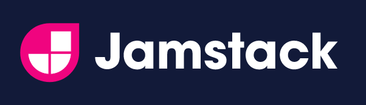

これまで、ブログサービスや Qiita や note を利用していたのですが、もっと気軽にアウトプットする手段が欲しいと思ったことと、フロントエンドに関する勉強も兼ねて、個人サイトを作成して立ち上げてみました。

ここまででやったことの概要をまとめて整理しておきます。それぞれの詳細については別の機会に記事にしようと思います。また、これからやろうとしていることも（忘れないように）書いておきます。

## サイトの構成

- 最近よく耳にする Jamstack な構成にしました。
    - 静的サイトジェネレータ：Gatsby
    - ビルドとデプロイ：GitHub Actions
    - データソース：Markdown ファイルと microCMS で作成した記事
    - ホスティング：Firebase Hositing

## 作成したサイト

- 実際のページ：[https://www.zakioka.net/](https://www.zakioka.net/)
- GitHub のリポジトリ：[https://github.com/tsuchinoko0402/website](https://github.com/tsuchinoko0402/website)

## 利用技術・サービス概要

- 詳細や実際の使い方などは別途記事にする予定です。

### Jamstack

- [公式サイト](https://jamstack.org/)
- CDN（Content Delivery Network）から直接サービスを提供できるサイトを構築するための新しいアーキテクチャ
    - JavaScript、API、および事前にレンダリングされたMarkupの略
    - サーバーとフロントエンドを疎結合にし、サーバーが担っていた機能を外部化してフロントだけで扱いやすくする構成
    - 一般的な Web アプリと違い、静的なコンテンツを配信するだけ
    - 動的なデータはビルド時に取得する
        - ビルドして HTML を生成する際に API からデータを取得して埋め込む
        - データが更新されたタイミングで都度ビルドとデプロイを行う

### Gatsby

-   [公式サイト](https://www.gatsbyjs.com/)
-   [React](https://ja.reactjs.org/) ベースの静的サイトジェネレータ（SSG）
-   各種データソースからコンテンツを取得する方法として [GraphQL](https://graphql.org/) が標準で利用可能
-   プラグインが豊富なため、効率的に Web サイトの機能を追加することが可能
    -   スターターテーマも充実しているため、サクッとそれっぽいサイトを立ち上げることも可能
-   SEO 対策も実装されている
-   "Jamstack" の「J」と「M」にあたる

### microCMS

-   [公式サイト](https://microcms.io/)
-   日本製のヘッドレス CMS
    -   ヘッドレス CMS は従来の CMS（WordPress、 Qiita、note 等）と比較して、ビューに当たる部分が無い
    -   入稿したコンテンツは API 経由で取得する
-   個人サイトレベルであれば無料で利用可能
-   "Jamstack" の「A」にあたる

### GitHub Actions

-   [公式サイト](https://github.co.jp/features/actions)
-   GitHub だけで CI/CD 的な機能を実現できる機能
    -   操作（リポジトリに対するプッシュやプルリクエスト等）やイベント（指定した時刻になる等）をトリガーとして、あらかじめ定義しておいた処理を実行する
-   今回は、GitHub のリポジトリへの Push（Gatsby で作成したサイトのソースや Markdown で書いた内容の更新）されたときと microCMS でブログの内容更新を契機とした Webhook を受けたときをトリガーとして、ビルドとデプロイを実行する

### Firebase Hosting

-   [公式サイト](https://firebase.google.com/?hl=ja)
-   Firebase はGoogle が提供しているモバイルおよび Web アプリケーションのバックエンドサービス
    -   クラウドサービスの形態では BaaS に位置付けされる
    -   2014年に Google に買収され、GCP の仲間入り
    -   現在は GCP の様々なサービスと連携して使うことができる
-   Firebase Hosting は静的な Web ページを公開することができる機能
-   無料の Spark プランが用意されている
    -   個人サイトレベルではこれで十分
    -   万が一、超過してしまっても勝手に課金されることはない
-   今回は、ビルド済みの静的サイトをホスティングして Web サイトを表示するために利用する

## 作成した Web サイトの機能

-   独自ドメインでサイトを公開
-   私のプロフィールの表示
-   [Material UI](https://material-ui.com/) を利用して画面をデザイン
-   microCMS で作成したブログコンテンツの表示
-   Markdown で記述したメモの表示
    -   Qiita や note に投稿したり、ブログ記事にするまでもない技術メモなどを溜めておく
-   Qiita や note に投稿した記事の一覧表示
    -   自分が書いたものが集約できるイメージ

## まだできていないこと

-   デザインの細かい変更
    -   ブログやメモのデザイン
    -   フォントの変更
    -   色の変更
    -   見出しのデザイン
-   ブログやメモのカテゴリ、タグ機能
    -   カテゴリやタグごとの一覧表示
-   データ部分と見た目に関する部分の分離
-   コンポーネントの上手い分割
-   ユニットテスト

## まとめ

-   Jamstack な構成で個人サイトを作成して公開してみました。
-   アーキテクチャ自体は難しくなく、また、個人利用程度であれば使いやすく無料なサービスが提供されているため、サイトの中身がある程度できてしまえば、公開までは意外とスムーズでした。
-   やはり、一番苦労したのは Gatsby を用いてサイトを作成する部分でした。
    -   React や Gatsby はチュートリアルを触ったり、入門書をパラ読みしたことがある程度だったので、実際にアレコレするために調べる時間が長かったです。
    -   Material UI の理解もまだまだだなと感じます。
-   今後は、ここまででやったことの詳細をきちんと書き残しておくことと、↑の「まだできてないこと」にも着手していきたいです。

## 参考資料

-   [JAMstack の紹介 - infoQ](https://www.infoq.com/jp/news/2020/10/introducing-jamstack/)
-   [JAMstackってなに？実践に学ぶ高速表示を実現するアーキテクチャの構成](https://eh-career.com/engineerhub/entry/2019/12/10/103000)
-   [ヘッドレスCMSとは何か？従来CMSとの違いやメリデメを解説！](https://blog.microcms.io/what-is-headlesscms/)