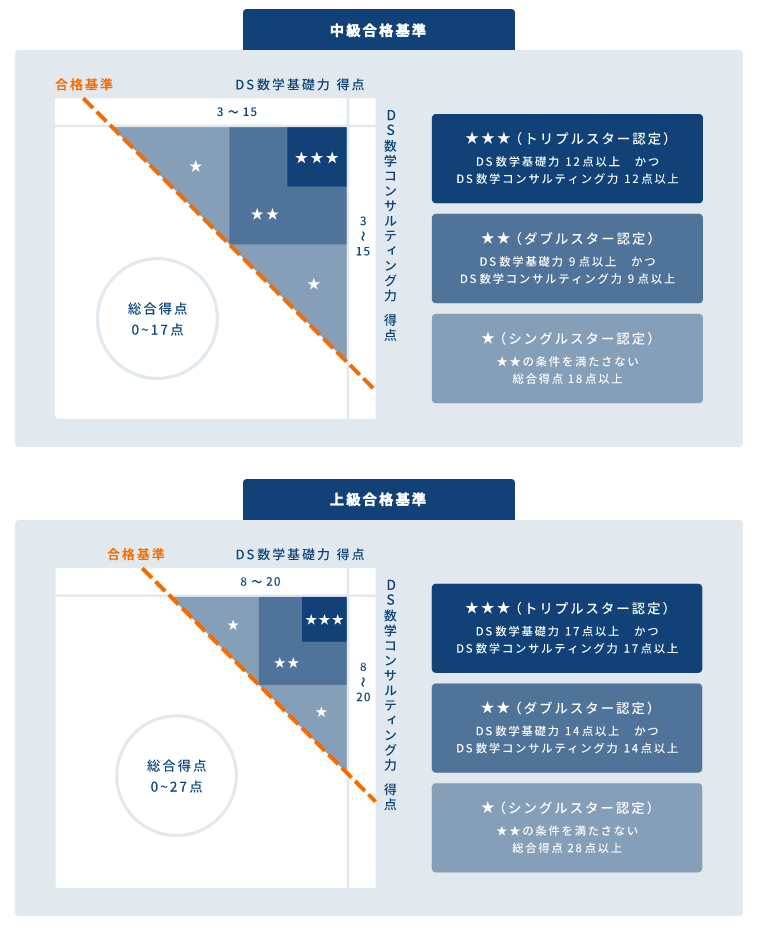
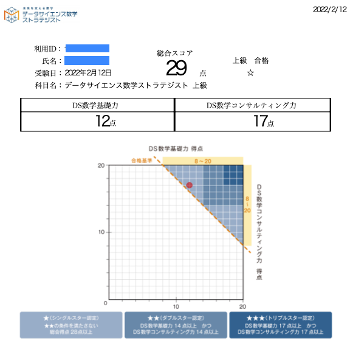

2月12日に [データサイエンス数学ストラテジスト](https://ds.su-gaku.biz/) の上級の試験を受けて無事に合格したので、その合格体験記です。  

## 「データサイエンス数学ストラテジスト」とは

[日本数学検定協会](https://www.su-gaku.net/) が行っている資格精度です。2021年9月より開始している、比較的新しい資格制度です。  
公式サイトより引用します：

> データサイエンスの基盤となる数学スキル、リテラシーを学び、その理解度・習熟度を測定することで、データサイエンスにおける数学を扱う技能を認定する資格です。

レベルに応じて中級・上級の2つが用意されています。

### 受験方法

自宅でオンラインで受験することができます。いつでもどこでも受けられます。

### 受験料

中級7000円、上級9000円です。

### 学習分野

学習分野として以下の4つが掲げられています：

-   **AI・データサイエンスを支える計算能力と数学的理論の理解**
    -   確率統計系分野：統計・確率・場合の数など
    -   線形代数系分野：行列・ベクトルなど
    -   微分積分系分野：微積分・関数・写像など
-   **機械学習・深層学習の数学的理論の理解**
    -   基礎理論：活性化関数・類似度・最小二乗法
    -   機械学習：回帰・分類・クラスタリングなど
    -   深層学習：ニューラルネットワークなど
-   **アルゴリズム・プログラミングに必要な数学リテラシー**
    -   アルゴリズム：探索・ソート・暗号、計算量
    -   プログラミング言語に依存しない手続き型思考
    -   数学的課題解決：論理的思考＋数学的発想
-   **ビジネスにおいて数学技能を活用する能力**
    -   把握力：データ・グラフの特徴の把握など
    -   分析力：売上・損益等財務的な分析など
    -   予測力：データに基づいた業績予測など

中級と上級の違いは、

-   中級：高校1年生の数学レベル（数I・A）までの範囲で、30問90分。合格点は18問（60%）正解。
-   上級：大学初年度の数学レベル（教養レベルの線形代数・解析学・統計学）までの範囲で、40問120分。合格点は28問（70%）正解。

となっています。  
単純に合格・不合格だけではなく、点数によって認定ランクが変わります（下図：「データサイエンス数学ストラテジスト」公式ページより）  

## 試験対策勉強方法

私の勉強方法を記しておきます。

### ① 公式問題集を買う

これを買わなきゃ話になりません。試験範囲のざっくり復習ができます。私は上級の Kindle 版で勉強しました。

-   [データサイエンス数学ストラテジスト[上級]公式問題集](https://www.nikkeibp.co.jp/atclpubmkt/book/21/283470/)
-   [データサイエンス数学ストラテジスト[中級]公式問題集](https://www.nikkeibp.co.jp/atclpubmkt/book/21/283480/)

### ② とりあえず問題集を1周する

ひとまず、問題集を1周しました。結構忘れている話もたくさんあったので、高校の時や大学の時の教科書・参考書を引っ張り出してきて復習しました。

-   高校数学の範囲の復習
    -   「本質の研究」シリーズ（旺文社）
        -   私の時代は「本質の研究」でしたが、今は、「総合的研究」シリーズ（[I・A](https://www.obunsha.co.jp/product/detail/037701), [II・B](https://www.obunsha.co.jp/product/detail/037702), [III](https://www.obunsha.co.jp/product/detail/037703)）になっているんですね。
    -   [公式集 (モノグラフ 24)](https://www.amazon.co.jp//dp/4894281635/)
-   大学数学の範囲の復習
    -   [解析入門1（東大出版）](http://www.utp.or.jp/book/b302042.html)
        -   微分積分学に関しては高校数学の範囲でほぼ十分でしたが、級数展開のところは参考にしました。
    -   [線形代数入門（岩波書店）](https://www.iwanami.co.jp/book/b378348.html)
        -   私が持っているのは旧版ですが、復刻したんですね。
    -   [確率・統計入門（岩波書店）](https://www.iwanami.co.jp/book/b265371.html)
        -   1・2・3・8章あたりの内容だけで大体十分でした。

機械学習やデータ分析に関わる分野の数学については良い参考書が手元になかったので、[コグニカル](https://cognicull.com/ja)というサイトを大変参考にさせていただきました。よくまとまっていて、見やすく、面白いサイトです。

#### 問題集1周目で注意したこと

色々と忘れていることも多かったので、ひとまず自力でなんとか解き、わからないことは参考書を見ながら解答を作ってみて、解答を見ました。  
正直、公式問題集の解答例はかなり雑（前提知識もかなり省略されてたり、誤植も多かったり・・・）なので、自分のノートには詳しい解説付きの解答をまとめるという作業をやっていきました。  
一部、どんな感じのことノートを作ったのかを（字が汚くて恥ずかしいですが）載せておきます：  

### ③ 問題集を2周目、3周目をやる

1周やっただけでも合格する人はするでしょうが、私の場合は3周やりました。もちろん、1周名よりも2周目、2周目よりは3周目となるにつれて、こなすスピードは上がってきます。「もう、これはやらなくてもわかるや」という問題は飛ばします。  
なんせ、実際の本番では1問平均3分で解かなくてはなりませんので、

-   よくあるパターンの問題はすぐに解法が思い浮かぶように反復練習する
-   計算力を上げるための練習を重ねる
    -   もしくは、上手い電卓の叩き方を身につけておく

ことを目標に2・3周目は取り組みました。

### ④ 問題集だけでは足りない部分を補う

問題集だけでは、補いきれていない/練習量が足りないジャンルがありました。パッと思い浮かんだのは

-   重積分
-   置換積分
-   二項分布以外の分布（幾何分布、ポアソン分布など）の計算
-   微分方程式（変数分離以外）
-   行列計算

あたりです。これらを上記参考書で主に復習しました。

## 試験本番

諸々の予定などの都合もあり、2月12日に受験しました。正直、④の練習は不足した状態でしたが、一度受けてみないとどんな感じかも分からん、ということもあり、思い切って受験しました。  
個人受験の場合、[こちらの記載](https://ds.su-gaku.biz/#anchor04)のある通り、2種類の試験システムが用意されています。私は、[CBTS](https://cbt-s.com/examinee/examination/MDS-S) の方で受験しました（要アカウント作成）。支払いが済んでから1ヶ月以内に受ける必要があります。  
カメラなどで監視されているわけではありませんが、手元に用意して良いのは、

-   筆記用具
-   計算用紙
-   電卓
-   表計算ソフト

となっています。参考書やWebサイトなどは見てはいけないことになります。  
  
私が試験を受けた感触としては、

-   前半（計算問題）を後回しにして、後半（応用問題）を先にやっておいて正解だった
    -   後半の問題は、公式問題集に類似した問題が多数出題されていた
-   思ったより計算問題で時間がかかって焦ってしまった
    -   結果を見ればわかりますが、かなりミスを多発してました。。。
-   分からない問題も5択なので、とりあえず埋める
-   計算問題では、おおよその値の見当をつければ、正確に計算が終わらなくても解答できる問題がある

といった感じでした。

## 結果

なんとまぁ、ぎりぎりの29問正解で合格、シングルスター認定でした。  
前半の計算問題の悲惨さたるや・・・  
学生時代から計算問題が苦手で、それは相変わらず、ということですが、後半の方はトリプルスター相当の点数が取れました。  

[このようなオープンバッジ証明書](https://nlp.netlearning.co.jp/ns/portal/openbadge/#/public/assertions/detail/cWxXZ2ptekp3dFA0emtFNllWb25ZUT09)も発行されます。

## 所感とまとめ

これを取得したからといってデータサイエンスや機械学習に関する数学についてはバッチリ身についた、ということでは全くありません。むしろ、ようやく入り口に立った程度の感触です。  
数学を大学で専攻してきた身としては、最近流行りのジャンルでどのように数学が使われているのかを知る良い機会となりました。  
後悔としては、計算練習を[この辺の本](https://www.sundaibunko.jp/contents/book/960/)とかで重ねて、計算力を大学受験レベルまで上げておいたらよかったな、ということと、公式問題集で補いきれなかったジャンルの練習をもっとしておくべきだったなといったところです。  
点数を上げるための再挑戦も余裕があったらやろうと思っていますが、多分しばらくないです笑  
今後は、データマイニングのジャンルの勉強をしながら、今回試験勉強で学んだ内容をより深く理解していくことに努めてみようと思います。