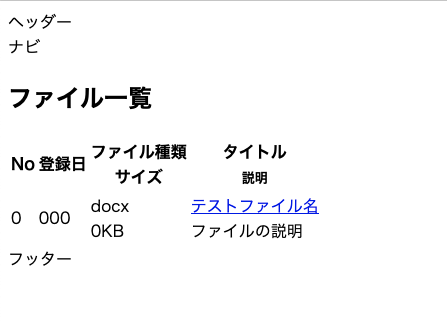

## はじめに

「OKAZAKI Shogo のひとりアドベントカレンダー2024」の6日目です。 
今回は、 Flask アプリと DB を繋げて、基本的な CRUD 処理が行えるようにします。
とりあえず、 SELECT 分が発行できたら良しというところまで。

## 準備

DB はとりあえずは SQLite を使う。ローカルで開発する分にはこれで十分。
（参考：[SQLite の基礎 #Database - Qiita](https://qiita.com/shikuno_dev/items/13de104aa2c2adf8aead)）

```shell
$ mkdir db
$ sqlite3 db/bshssa_member_sys.db
```

以下の SQL 分を発行してテーブルを作成。のちに使う SQLAlchemy の機能を使えばテーブル作成もできるらしいが、一旦自力で作成する。

```sql
CREATE TABLE ManagerUser (
	user_id INTEGER PARIMARY KEY AUTO_INCREMENT COMMENT '管理者ユーザーID',
	user_name TEXT COMMENT '管理者ユーザー名',
	password TEXT COMMENT 'パスワード',
	servide TEXT COMMENT '役務名',
	logined_at TEXT COMMENT 'ログイン日時'
);

CREATE TABLE File (
	file_id INTEGER PARIMARY KEY AUTO_INCREMENT COMMENT 'ファイルID',
	file_name TEXT COMMENT 'ファイル名',
	display_name TEXT　COMMENT 'ファイルの表示名',
	url TEXT COMMENT 'ファイルの所在URL(Google Drive)',
	file_type TEXT COMMENT 'ファイル形式',
	size TEXT COMMENT 'ファイルサイズ',
	description TEXT COMMENT 'ファイルについての説明',
	tag TEXT COMMENT 'タグ',
	is_standard INTEGER COMMENT '定型文書か否か',
    created_at TEXT COMMENT '作成日時',
    created_by TEXT COMMENT '作成者の管理者ユーザーID',	
    updated_at TEXT COMMENT '更新日時',
    updated_by TEXT COMMENT '更新者の管理者ユーザーID'
);
```

あらかじめ、 File テーブルにレコードを登録しておく。

ORM である Flask-SQLAlchemy を入れる。

```shell
poetry add Flask-SQLAlchemy
```

## DB に接続するコードを書く

最終的には以下のようなディレクトリ構成になる。

```
.
|-- Makefile
|-- app
|   |-- __init__.py　<-- 変更
|   |-- app.py
|   |-- index.cgi
|   |-- models
|   |   `-- file.py <-- 新規追加
|   |-- static
|   |   `-- css
|   |       `-- default.css
|   |-- templates
|   |   |-- files.html　<-- 新規追加
|   |   |-- index.html
|   |   `-- layout.html
|   `-- views
|       |-- files.py　<-- 新規追加
|       `-- index.py
|-- db
|   `-- bshssa_member_sys.db　<-- 新規追加
|-- instance
|   `-- config
|       `-- dev.py  <-- 新規追加
|-- poetry.lock
`-- pyproject.toml
```

### `__init__,py`

DB の設定を作成し、アプリに渡す処理を追加する。
DB 設定は `config/dev.py` に記述する。
File テーブルの一覧を表示するためのページへの Blueprint も登録しておく。

```python
import os
from flask import Flask
from flask_sqlalchemy import SQLAlchemy
from instance.config.dev import BASE_DIR

db = SQLAlchemy()


def create_app():
    # appの設定
    app = Flask(__name__, instance_relative_config=True)
    # configファイルを読み込む
    config_path = os.path.join("config", "dev.py")
    app.config.from_pyfile(config_path)

    # DB の設定
    db.init_app(app)
    from app import models

    # Blueprint の登録
    from app.views.index import index_bp
    from app.views.files import files_bp

    app.register_blueprint(index_bp)
    app.register_blueprint(files_bp)

    return app
```

### `instance/config/dev.py`

DB のパスとか SQLAlchemy の設定を追加。

```python
import os

DEBUG = True

# プロジェクトのルートディレクトリを基準にパスを解決
BASE_DIR = os.path.abspath(os.path.join(os.path.dirname(__file__), '../..'))
DATABASE_PATH = os.path.join(BASE_DIR, 'db', 'bshssa_member_sys.db')

# SQLAlchemyの設定
SQLALCHEMY_DATABASE_URI = f'sqlite:///{DATABASE_PATH}'
SQLALCHEMY_TRACK_MODIFICATIONS = False
```

### `views/files.py`

File テーブルにあるファイル一覧を出力する View を記述する。

```python
from flask import Blueprint, render_template
from app.models.file import File

files_bp = Blueprint("files", __name__, url_prefix="/files")


@files_bp.route("/", methods=["GET", "POST"])
def index():
    files = File.query.all()
    return render_template("files.html", files=files)
```

### `models/file.py`

File テーブルに対する Model を記述する。

```python
from app import db


# File テーブル
class File(db.Model):
    __tablename__ = "File"
    file_id = db.Column(db.Integer, primary_key=True)
    file_name = db.Column(db.String(255))
    display_name = db.Column(db.String(255))
    url = db.Column(db.String(255))
    file_type = db.Column(db.String(255))
    size = db.Column(db.String(255))
    description = db.Column(db.String(255))
    tag = db.Column(db.String(255))
    is_standard = db.Column(db.Integer)
    created_at = db.Column(db.String(255))
    created_by = db.Column(db.String(255))
    updated_at = db.Column(db.String(255))
    updated_by = db.Column(db.String(255))
```

### `templates/files.html`

最後に、 File 一覧を表示するページのテンプレートを用意する。

```html



<div>
    <h2>ファイル一覧</h2>
    <table>
        <thead>
            <tr>
            <th scope="col"><font>No</font></th>
            <th scope="col"><font>登録日</font></th>
            <th scope="col"><font>ファイル種類</font><br><font>サイズ</font></th>
            <th scope="col"><font>タイトル</font><br><font size="2">説明</font></th>
            </tr>
        </thead>
        <tbody>
            
            <tr>
                <td>{{ file.file_id }}</td>
                <td>{{ file.created_by }}</td>
                <td>{{ file.file_type }}<br>{{ file.size }}</td>
                <td><a href={{ file.url }}>{{ file.display_name }}</a><br>{{ file.description }}</td>
            </tr>
            
        </tbody>
    </table>
</div>

```

簡単にだが、こんな感じのものが出てくれば OK




## 参考資料

- [Flask-SQLAlchemy — Flask-SQLAlchemy Documentation (3.1.x)](https://flask-sqlalchemy.readthedocs.io/en/stable/)
- [Flask-SQLAlchemyについて色々 #Python - Qiita](https://qiita.com/tkr709/items/a95a635035a7e312da61)
- [Flask-SQLAlchemyとは？FlaskでDBを使おう - Flask WebAcademy - Flaskの学習サイト](https://flask-web-academy.com/article/flask-sqlalchemy/)
