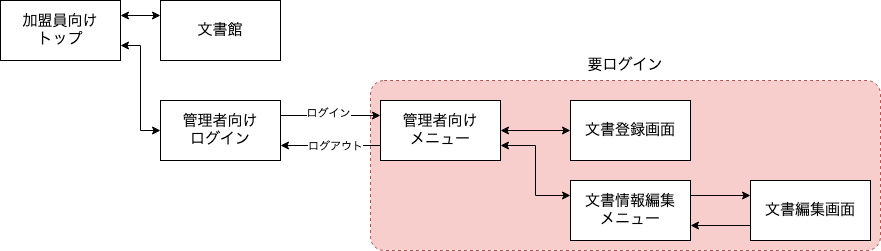

## はじめに

「OKAZAKI Shogo のひとりアドベントカレンダー2024」の12日目です。 
昨日導入した Flask-Login のライブラリを用いて、管理者向けログインページと、その先のページ技能を完成させていきますが、その前に、ここまで作成したものの整理を行なっていきます。

## 画面遷移と機能を整理する

少し内容が増えてきたので、画面遷移と内容を整理する。


今回、新たに増やすのは「管理者向けログイン」のページ。あとは、これまで実装してきたものを表示するが、赤色で囲った範囲の画面はログインを必要とする。

少しここまで作成してきたものが命名などについてもややこしくなってきたので、整理する。
また、ヘッダーやフッターも設定して、画面遷移が想定通りできるようにリンクを張る。
ログイン・ログアウトのページなどについてはこのあと実装する。

### 構成（完成形）

```
.
|-- Makefile
|-- app
|   |-- __init__.py
|   |-- app.py
|   |-- index.cgi
|   |-- models
|   |   |-- __init__.py
|   |   |-- file.py
|   |   `-- manager_user.py
|   |-- static
|   |   `-- css
|   |       `-- default.css
|   |-- templates
|   |   |-- files.html
|   |   |-- index.html
|   |   |-- layout-general.html
|   |   |-- layout-manager.html
|   |   |-- login.html              <= 新規追加
|   |   |-- manage-file-list.html
|   |   |-- manage-file.html
|   |   |-- manage-menu.html
|   |   `-- regist_file.html
|   `-- views
|       |-- files.py
|       |-- index.py
|       |-- login.py                <= 新規追加
|       |-- logout.py               <= 新規追加
|       |-- manage_file.py
|       |-- manage_file_list.py
|       |-- manage_menu.py
|       |-- regist_file.py
|       `-- update_file.py
|-- db
|   `-- bshssa_member_sys.db
|-- documents
|-- instance
|   |-- __init__.py
|   `-- config
|       `-- dev.py
|-- poetry.lock
|-- pyproject.toml
`-- tools
    `-- generate_password_hash.py
```

### アプリケーション全体の機能

#### `app/__init__.py`

```python
import os

import flask_login
from flask import Flask
from flask_sqlalchemy import SQLAlchemy

db = SQLAlchemy()
login_manager = flask_login.LoginManager()


def create_app():
    # appの設定
    app = Flask(__name__, instance_relative_config=True)

    # configファイルを読み込む
    config_path = os.path.join("config", "dev.py")
    app.config.from_pyfile(config_path)

    # DB の設定
    db.init_app(app)

    # flask-login の初期化
    login_manager.init_app(app)

    # Blueprint の登録
    from app.views.files import files_bp
    from app.views.index import index_bp
    from app.views.login import login_bp
    from app.views.logout import logout_bp
    from app.views.manage_file import manage_file_bp
    from app.views.manage_file_list import manage_file_list_bp
    from app.views.manage_menu import manage_menu_bp
    from app.views.regist_file import regist_file_bp
    from app.views.update_file import update_file_bp

    app.register_blueprint(index_bp)
    app.register_blueprint(files_bp)
    app.register_blueprint(regist_file_bp)
    app.register_blueprint(manage_file_bp)
    app.register_blueprint(manage_file_list_bp)
    app.register_blueprint(update_file_bp)
    app.register_blueprint(manage_menu_bp)
    app.register_blueprint(login_bp)
    app.register_blueprint(logout_bp)

    return app
```

#### `app/app.py`

```python
from flask import flash, redirect, url_for
from werkzeug.exceptions import RequestEntityTooLarge

from app import create_app

app = create_app()


if __name__ == "__main__":
    app.run()


@app.errorhandler(RequestEntityTooLarge)
def handle_over_max_file_size(error):
    flash("ファイルのサイズが大きすぎます。 50 MB 以下のファイルを選択してください。")
    return redirect(url_for("regist_file_form.index"))
```

### レイアウト（一般向け）

`app/templates/layout-general.html`
```html
<!DOCTYPE html>
<html lang="ja">
	<head>
		<meta charset="utf-8">
		<title>{{ page_title }} | ボーイスカウト阪神さくら地区 加盟員向けページ 管理者画面</title>
        <link rel="stylesheet" href="{{ url_for('static', filename='css/default.css') }}"/>
	</head>

	<body>
        <!----- ヘッダー ----->
		<header>ボーイスカウト阪神さくら地区 加盟員向けページ 管理者画面</header>
		<nav>
			<ul>
				<li><a href="{{ url_for('manage_menu.index') }}">管理者向けメニュー</a></li>
				<li><a href="{{ url_for('regist_file.index') }}">文書登録</a></li>
				<li><a href="{{ url_for('manage_file_list.index') }}">文書編集</a></li>
				<li><a href="{{ url_for('logout.index') }}">ログアウト</a></li>
			</ul>
		</nav>
		<!----- ヘッダー END ----->

        
		
		<!----- フッター ----->
		<footer>© Hanshin-Sakura District, Hyogo Scout Council, SAJ.</footer>
		<!----- フッター END ----->
	</body>
</html>
```

### レイアウト（管理者向け）

`app/templates/layout-manager.html`
```html
<!DOCTYPE html>
<html lang="ja">
	<head>
		<meta charset="utf-8">
		<title>{{ page_title }} | ボーイスカウト阪神さくら地区 加盟員向けページ 管理者画面</title>
        <link rel="stylesheet" href="{{ url_for('static', filename='css/default.css') }}"/>
	</head>

	<body>
        <!----- ヘッダー ----->
		<header>ボーイスカウト阪神さくら地区 加盟員向けページ 管理者画面</header>
		<nav>
			<ul>
				<li><a href="{{ url_for('manage_menu.index') }}">管理者向けメニュー</a></li>
				<li><a href="{{ url_for('regist_file.index') }}">文書登録</a></li>
				<li><a href="{{ url_for('manage_file_list.index') }}">文書編集</a></li>
				<li><a href="{{ url_for('logout.index') }}">ログアウト</a></li>
			</ul>
		</nav>
		<!----- ヘッダー END ----->

        
		
		<!----- フッター ----->
		<footer>© Hanshin-Sakura District, Hyogo Scout Council, SAJ.</footer>
		<!----- フッター END ----->
	</body>
</html>
```

### トップページ

#### `app/templates/index.html`

```html




<!----- メインコンテンツ ----->
<article>
    <h2>ボーイスカウト阪神さくら地区 加盟員向けページ</h2>
    <section>
        <ul>
            <li><a href="{{ url_for('files.index') }}">文書館</a></li>
            <li><a href="{{ url_for('login.index') }}">管理者向け</a></li>
        </ul>
    </section>
</article>
<!----- メインコンテンツ END ----->


```

#### `app/views/index.py`

```python
from flask import Blueprint, render_template

index_bp = Blueprint("index", __name__, url_prefix="/")


@index_bp.route("/", methods=["GET", "POST"])
def index():
    return render_template("index.html", page_title="TOP")
```

### 文書館（ファイル一覧表示）

#### `app/templates/files.html`

```html



<div>
    <h2>ファイル一覧</h2>
    <table>
        <thead>
            <tr>
            <th scope="col"><font>No</font></th>
            <th scope="col"><font>登録日</font></th>
            <th scope="col"><font>更新日</font></th>
            <th scope="col"><font>ファイル種類</font><br><font>サイズ</font></th>
            <th scope="col"><font>タイトル</font><br><font size="2">説明</font></th>
            </tr>
        </thead>
        <tbody>
            
            <tr>
                <td>{{ file.file_id }}</td>
                <td>{{ file.created_at }}</td>
                <td>{{ file.updated_at }}</td>
                <td>{{ file.file_type }}<br>{{ file.size }}</td>
                <td><a href={{ file.url }}>{{ file.display_name }}</a><br>{{ file.description }}</td>
            </tr>
            
        </tbody>
    </table>
</div>

```

#### `app/views/files.py`

```python
from flask import Blueprint, render_template

from app.models.file import File

files_bp = Blueprint("files", __name__, url_prefix="/files")


@files_bp.route("/", methods=["GET", "POST"])
def index():
    files = File.query.all()
    return render_template("files.html", files=files, page_title="文書館")
```

### 管理者向けメニュー

#### `app/templates/manage-menu.html`

```html



<div>
    <h2>{{ page_title }}</h2>
    <ul>
        <li><a href="{{ url_for('regist_file.index') }}">文書登録</a></li>
        <li><a href="{{ url_for('manage_file_list.index') }}">文書編集</a></li>
        <li><a href="{{ url_for('logout.index') }}">ログアウト</a></li>
    </ul>
</div>

```

#### `app/views/manage_menu.py`

```python
from flask import Blueprint, render_template
from flask_login import login_required

manage_menu_bp = Blueprint("manage_menu", __name__, url_prefix="/manage-menu")


@manage_menu_bp.route("/", methods=["GET"])
def index():
    return render_template("manage-menu.html", page_title="管理者向けメニュー")
```

### 文書登録画面

#### `app/templates/regist-file.html`

```html



<h2>{{ page_title }}</h2>
<form method="post" action="/regist-file" enctype=multipart/form-data class="regist-file-form">
  
  <div> 
    ファイル: {{ filename }} のアップロードが完了しました！     
  </div>        
  

  
  
  <ul>
    
    <li>{{ message }}</li>
    
  </ul>
  
  

  <div class="regist-file-form">
    <input type="file" name="file" id="file" />
    <br>アップロードするファイル名を入力するか、ボタンを押してファイルを選択してください
  </div>
  <div class="regist-file-form">
    <label for="title">タイトル: </label>
    <input type="text" name="title" id="title" />
  </div>
  <div class="regist-file-form">
    <label for="description">説明: </label>
    <input type="text" name="description" id="description" />
    <br>タイトルで内容が十分わかるときは、説明を入力しなくても構いません。
  </div>
  <div class="regist-file-form">
    <input type="submit" value="送信" />
  </div>
</form>

```

#### `app/views/regist_file.py`

```python
import os
from datetime import datetime, timedelta, timezone
from typing import Optional

from flask import Blueprint, flash, render_template, request
from flask_login import login_required
from werkzeug.datastructures import FileStorage
from werkzeug.utils import secure_filename

from app import db
from app.models.file import File
from instance.config import dev

JST = timezone(timedelta(hours=+9), "JST")

regist_file_bp = Blueprint("regist_file", __name__, url_prefix="/regist-file")


def __get_file_extension_if_allowed(filename: str) -> Optional[str]:
    # ファイル名に拡張子が含まれているかチェック
    if "." in filename:
        # 拡張子を取得（ドット以降）
        extension = filename.rsplit(".", 1)[1].lower()
        # 許容される拡張子かどうかを確認
        if extension in dev.ALLOWED_EXTENSIONS:
            return extension
    return None


def __get_file_size(uploaded_file: FileStorage) -> str:
    file_size_bytes = len(uploaded_file.read())
    # ファイルの読み取り位置をリセット
    uploaded_file.stream.seek(0)

    # ファイルサイズを適切な単位で表示
    if file_size_bytes >= 1_000_000:
        size_str = f"{file_size_bytes / 1_000_000:.2f} MB"
    elif file_size_bytes >= 1_000:
        size_str = f"{file_size_bytes / 1_000:.2f} KB"
    else:
        size_str = f"{file_size_bytes} bytes"

    return size_str


@regist_file_bp.route("/", methods=["GET", "POST"])
def index():
    if request.method == "POST":
        is_file_check_ok = True
        file = request.files["file"]

        if not file:
            flash("ファイルが選択されていません")
            is_file_check_ok = False

        if request.form["title"] == "":
            flash("タイトルが入力されていません")
            is_file_check_ok = False

        origin_filename = file.filename
        ext = __get_file_extension_if_allowed(origin_filename)
        if ext is None:
            flash("ファイルの拡張子が正しくありません")
            is_file_check_ok = False

        if is_file_check_ok:
            now = datetime.now(JST)
            filename = secure_filename(now.strftime("%Y%m%d_%H%M%S_") + origin_filename)
            now_str = now.strftime("%Y-%m-%d %H:%M:%S")

            title = request.form["title"]
            description = request.form["description"]
            file_size = __get_file_size(file)

            upload_file = File(
                file_name=filename,
                display_name=title,
                url=f"http://example.com/{filename}",
                file_type=ext,
                size=file_size,
                description=description,
                tag="example, test",
                is_standard=0,
                created_at=now_str,
                created_by="admin",
                updated_at=now_str,
                updated_by="admin",
            )

            db.session.add(upload_file)
            db.session.commit()

            file.save(os.path.join(dev.UPLOAD_FOLDER, filename))
            flash(f"{origin_filename}のアップロードが完了しました！")

    return render_template("regist-file.html", page_title="文書登録")
```

### 文書情報編集メニュー

#### `app/templates/manage-file-list.html`

```html



<div>
    <h2>{{ page_title }}</h2>
    <table>
        <thead>
            <tr>
            <th scope="col"><font>No</font></th>
            <th scope="col"><font>登録日</font></th>
            <th scope="col"><font>更新日</font></th>
            <th scope="col"><font>ファイル種類</font><br><font>サイズ</font></th>
            <th scope="col"><font>タイトル</font><br><font size="2">説明</font></th>
            </tr>
        </thead>
        <tbody>
            
            <tr>
                <td><a href="/manage-file?id={{ file.file_id }}">{{ file.file_id }}</a></td>
                <td>{{ file.created_at }}</td>
                <td>{{ file.updated_at }}</td>
                <td>{{ file.file_type }}<br>{{ file.size }}</td>
                <td><a href={{ file.url }}>{{ file.display_name }}</a><br>{{ file.description }}</td>
            </tr>
            
        </tbody>
    </table>
</div>

```

#### `app/views/manage_file_list.py`

```python
from flask import Blueprint, render_template
from flask_login import login_required

from app.models.file import File

manage_file_list_bp = Blueprint("manage_file_list", __name__, url_prefix="/manage-file-list")


@manage_file_list_bp.route("/", methods=["GET"])
@login_required
def index():
    files = File.query.all()
    return render_template("manage-file-list.html", files=files, page_title="文書一覧")
```

### 文書編集画面

#### `app/templates/manage-file.html`

```html



<div>
    <h2>{{ page_title }}</h2>
    <form method="post" action="/update-file" enctype=multipart/form-data class="update-file-form">
        
        
        <ul>
          
          <li>{{ message }}</li>
          
        </ul>
        
        
        
        <div class="regist-file-form">
            <input type="hidden" name="file_id" id="file_id" value={{ file.file_id }} />
            <label for="file_id">ファイル ID: </label><font>{{ file.file_id }}</font>
        </div>
        <div class="regist-file-form">
          <label for="title">タイトル: </label>
          <input type="text" name="title" id="title" value={{ file.display_name }} />
        </div>
        <div class="regist-file-form">
          <label for="description">説明: </label>
          <input type="text" name="description" id="description" value={{ file.description }} />
          <br>タイトルで内容が十分わかるときは、説明を入力しなくても構いません。
        </div>
        <div class="regist-file-form">
          <input type="submit" value="送信" />
        </div>
    </form>
</div>

```

#### `app/views/manage_file.py`

```python
from flask import Blueprint, render_template, request
from flask_login import login_required

from app.models.file import File

manage_file_bp = Blueprint("manage_file", __name__, url_prefix="/manage-file")


@manage_file_bp.route("/", methods=["GET"])
def index():
    file_id = request.args.get("id")
    file = File.query.filter(File.file_id == file_id).all()[0]
    return render_template("manage-file.html", file=file, file_id=id, page_title="文書編集")
```


ここまでの成果物としては以上のとおり。明日、ログイン機能を作成する。
