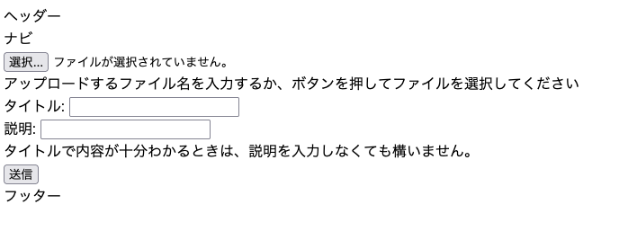
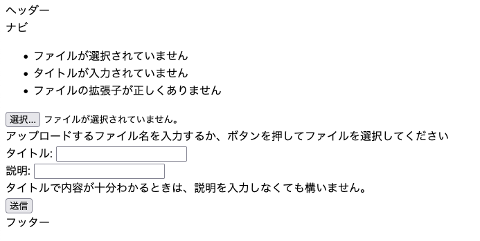
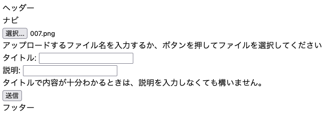
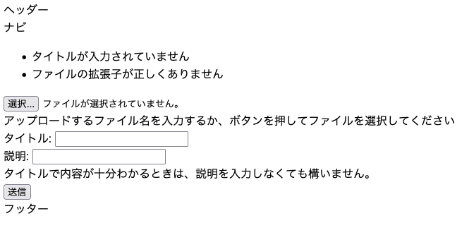
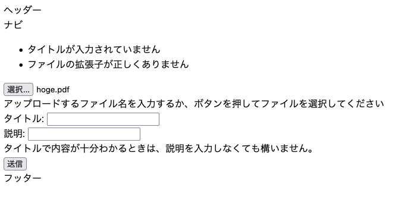
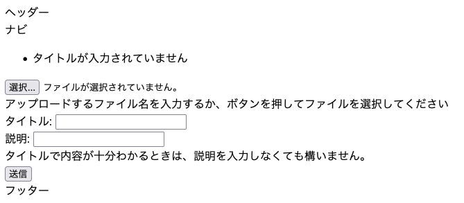
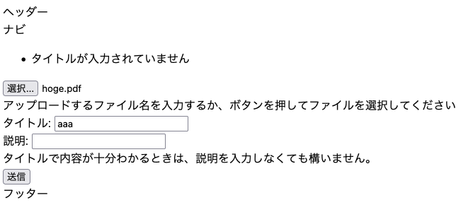
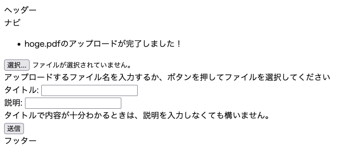

## はじめに

「OKAZAKI Shogo のひとりアドベントカレンダー2024」の8日目です。 
今日は、昨日作成したフォームを拡張してファイルのアップロード機能を実装します。ついでに、フォーム送信時の成功/エラー時にメッセージを表示する機能を実装します。

## 完成系

完成した時には以下のような構成になる。
ドキュメントの格納先として `document` フォルダを作成しておく。

```
.
|-- Makefile
|-- app
|   |-- __init__.py
|   |-- app.py
|   |-- index.cgi
|   |-- models
|   |   `-- file.py
|   |-- static
|   |   `-- css
|   |       `-- default.css
|   |-- templates
|   |   |-- files.html
|   |   |-- index.html
|   |   |-- layout.html
|   |   `-- regist_file_form.html  <-- 修正
|   `-- views
|       |-- files.py
|       |-- index.py
|       |-- regist_file.py  <-- 修正
|       `-- regist_file_form.py  <-- 修正
|-- db
|   `-- bshssa_member_sys.db
|-- documents  <-- 新規作成
|-- instance
|   `-- config
|       `-- dev.py <-- 修正
|-- poetry.lock
`-- pyproject.toml
```

## フォームを修正して、成功・エラー時にメッセージが表示できるようにする

テンプレートを以下のように修正して処理の成功時/失敗時にメッセージを表示する領域を作る。

### `template/regist_file_form.html`

```html



<form method="post" action="/regist-file" enctype=multipart/form-data class="regist-file-form">
  
  <div> 
    ファイル: {{ filename }} のアップロードが完了しました！     
  </div>        
  

  
  
  <ul>
    
    <li>{{ message }}</li>
    
  </ul>
  
  

  <div class="regist-file-form">
    <input type="file" name="file" id="file" />
    <br>アップロードするファイル名を入力するか、ボタンを押してファイルを選択してください
  </div>
  <div class="regist-file-form">
    <label for="title">タイトル: </label>
    <input type="text" name="title" id="title" />
  </div>
  <div class="regist-file-form">
    <label for="description">説明: </label>
    <input type="text" name="description" id="description" />
    <br>タイトルで内容が十分わかるときは、説明を入力しなくても構いません。
  </div>
  <div class="regist-file-form">
    <input type="submit" value="送信" />
  </div>
</form>

```

### `get_flashed_messages()` について

Flask はフラッシュ表示の仕組み（flashing system）によって、ユーザへフィードバックを与える。サーバサイドで設定したフラッシュメッセージは、リクエストの最後にメッセージを記録し、次のリクエストでだけでそのメッセージにアクセスできるようにする。メッセージのフラッシュ表示はレイアウトのテンプレートと組み合わされる。ブラウザや Web サーバが Cookie のサイズに制限を課している場合、大き過ぎるフラッシュ表示用のメッセージでは、何も反応せずにメッセージのフラッシュ表示が失敗する。

テンプレートで `get_flashed_messages()` を呼び出すことでフラッシュメッセージ受け取ることができる。

## ファイル登録処理の実装

昨日実装した、フォームからのリクエストを受けて動作する処理を拡張して、ファイル登録処理を実装する。

### `view/regist_file.py`

送信された内容の検証を行い、不敵であれば、エラーメッセージを追加する。エラーメッセージは `flask.flush()` を呼び出すことで追加することが可能。

成功した場合は、元の画面にファイル名を私、成功メッセージと共に表示できるようにする。

クライアントから送信されたファイル自体は、 `request.files` を利用して取得することができる。その後、`file.save()` で所定の場所に保存する。

```python
import os
from flask import Blueprint, render_template, request, flash, redirect
from werkzeug.utils import secure_filename
from instance.config import dev


regist_file_bp = Blueprint("regist_file", __name__, url_prefix="/regist-file")


def __allowed_file(filename):
    return '.' in filename and \
           filename.rsplit('.', 1)[1].lower() in dev.ALLOWED_EXTENSIONS


@regist_file_bp.route("/", methods=["POST"])
def index():
    is_file_check_ok = True
    file = request.files["file"]

    if not file:
        flash("ファイルが選択されていません")
        is_file_check_ok = False

    if request.form["title"] == "":
        flash("タイトルが入力されていません")
        is_file_check_ok = False

    if __allowed_file(file.filename) == False:
        flash("ファイルの拡張子が正しくありません")
        is_file_check_ok = False
    
    if is_file_check_ok:
        filename = secure_filename(file.filename)
        file.save(os.path.join(dev.UPLOAD_FOLDER, filename))
        return render_template("regist_file_form.html", filename=filename)
```

### `secure_filename()` について

secure_filenameは、ファイル名を安全な形式に変換してくれる関数。以下のように、特殊文字やディレクトリトラバーサル攻撃を防ぐ役割がある。

変換例：

| 元のファイル名     | 変換後のファイル名    |
| ------ | ------- | ---------- |
| `../../etc/passwd`     | `etc_passwd`    |
| `hello world!.jpg`      | `hello_world.jpg`    | 
| `my<script>.png`      | `my_script_.png` |

## 動作例

初期表示は以下のような感じ。


ファイルも何も選択せずに「送信」を押すとエラーメッセージが表示される。


次に、サーバーでは許容されていない拡張子のファイルを選択する。


これで「送信」を押すと、やはりエラーメッセージが表示されるが、先ほどと違いメッセージの数が変わっていることがわかる。


次は PDF ファイルを選択する。


これで「送信」を押すと、エラーメッセージは1つだけ表示される。


最後に、ファイル送信ができる条件を整える。


これで「送信」を押すと、成功のメッセージが表示される。


ちゃんと `document` フォルダ配下にも文書が格納されることが確認できた。


## 参考資料

- [ファイルのアップロード — Flask Documentation (2.2.x)](https://msiz07-flask-docs-ja.readthedocs.io/ja/latest/patterns/fileuploads.html)
- [メッセージのフラッシュ表示 — Flask Documentation (2.2.x)](https://msiz07-flask-docs-ja.readthedocs.io/ja/latest/patterns/flashing.html)
- [Flaskによるflashメッセージの体験 #Python - Qiita](https://qiita.com/yu__programming/items/dd0cdc38982b752d45b9)
