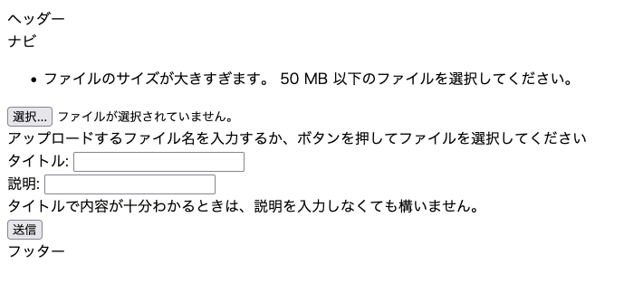

## はじめに

「OKAZAKI Shogo のひとりアドベントカレンダー2024」の9日目です。 
昨日作成したファイルのアップロード機能を改善します。

## アップロードのファイルサイズの上限を設ける

今のままではファイルサイズの上限に際限なくアップロードされてしまう。

Flask では上限を超えた場合に例外を投げる機能があるので、それを利用する。

### ファイルのアップロード上限サイズを設定する

今回は、アップロードできるファイルのサイズを 50 MB とする。設定ファイルに定数 `MAX_CONTENT_LENGTH` として設定する。これを `app.config['MAX_CONTENT_LENGTH]` として読み込ませると、設定された上限値を超えたファイルがアップロードされた時に `RequestEntityTooLarge` のエラーがスローされるようになる。

```python
import os

DEBUG = True
SECRET_KEY = "d56ec64032a3582931e560067426db08"

# プロジェクトのルートディレクトリを基準にパスを解決
BASE_DIR = os.path.abspath(os.path.join(os.path.dirname(__file__), "../.."))
DATABASE_PATH = os.path.join(BASE_DIR, "db", "bshssa_member_sys.db")

# SQLAlchemyの設定
SQLALCHEMY_DATABASE_URI = f"sqlite:///{DATABASE_PATH}"
SQLALCHEMY_TRACK_MODIFICATIONS = False

# ファイルアップロード機能のための設定
UPLOAD_FOLDER = os.path.join(BASE_DIR, "documents")
ALLOWED_EXTENSIONS = {"pdf", "docx", "doc", "xlsx", "xls"}
# ファイルサイズの上限を 50 MB に設定する
MAX_CONTENT_LENGTH = 50 * 1000 * 1000 # 追加
```

あとは、以下のように `app.py` でエラーハンドラーを設定すれば、上限を超えてしまった場合の処理を定義できる。

```python
from app import create_app
from werkzeug.exceptions import RequestEntityTooLarge
from flask import flash, redirect, url_for


app = create_app()


if __name__ == "__main__":
    app.run()


@app.errorhandler(RequestEntityTooLarge)
def handle_over_max_file_size(error):
    flash("ファイルのサイズが大きすぎます。 50 MB 以下のファイルを選択してください。")
    return redirect(url_for("regist_file_form.index"))
```

実際に上限を超えたファイルをアップロードしようとすると以下のようになる：



## 参考資料

- [アプリケーションのエラーの処理 — Flask Documentation (2.2.x)](https://msiz07-flask-docs-ja.readthedocs.io/ja/latest/errorhandling.html)
- [ファイルのアップロード — Flask Documentation (2.2.x)](https://msiz07-flask-docs-ja.readthedocs.io/ja/latest/patterns/fileuploads.html)
