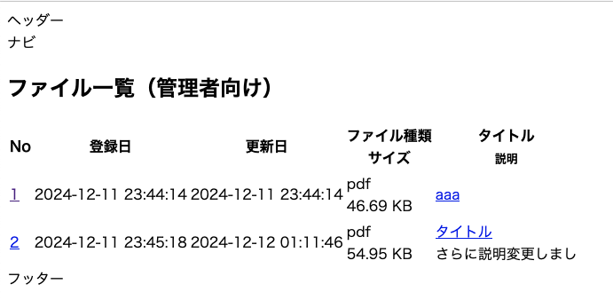
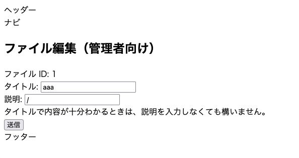
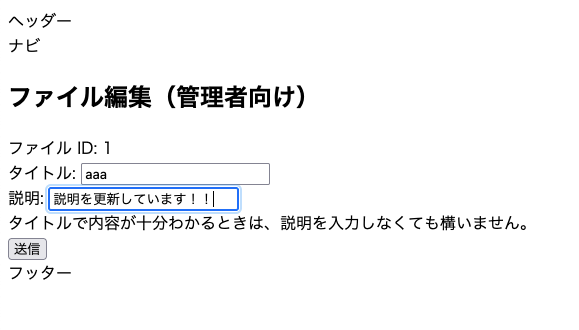
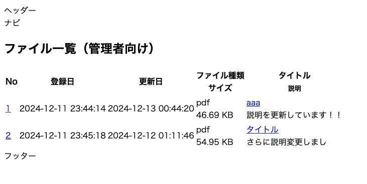

## はじめに

「OKAZAKI Shogo のひとりアドベントカレンダー2024」の10日目です。 
ファイルアップロードすると同時に、 DB へのレコード登録をする機能と、登録したファイル情報の編集する機能を実装します。

## アップロードされたファイル情報を登録する（INSERT）

`regist_file.py` に以下の機能を追加する：

- アップロードされたファイルサイズを計算する（`__get_file_size()`）
- 現在時刻を取得し、登録日時と更新日時にセットする
- 入力された情報と日時の情報を File オブジェクトにセットし、DB に登録する
    - `db.session.add()` で INSERT 文発行相当の処理を行う
    - `db.session.commit()` でトランザクションをコミットする

```python
from typing import Optional
from datetime import datetime, timedelta, timezone
import os
from flask import Blueprint, request, flash, redirect, url_for
from werkzeug.utils import secure_filename
from werkzeug.datastructures import FileStorage
from app.models.file import File
from instance.config import dev
from app import db

JST = timezone(timedelta(hours=+9), "JST")

regist_file_bp = Blueprint("regist_file", __name__, url_prefix="/regist-file")


def __get_file_extension_if_allowed(filename: str) -> Optional[str]:
    # ファイル名に拡張子が含まれているかチェック
    if "." in filename:
        # 拡張子を取得（ドット以降）
        extension = filename.rsplit(".", 1)[1].lower()
        # 許容される拡張子かどうかを確認
        if extension in dev.ALLOWED_EXTENSIONS:
            return extension
    return None

# ---------- ここから新規追加 -----------
def __get_file_size(uploaded_file: FileStorage) -> str:
    file_size_bytes = len(uploaded_file.read())
    # ファイルの読み取り位置をリセット
    uploaded_file.stream.seek(0)

    # ファイルサイズを適切な単位で表示
    if file_size_bytes >= 1_000_000:
        size_str = f"{file_size_bytes / 1_000_000:.2f} MB"
    elif file_size_bytes >= 1_000:
        size_str = f"{file_size_bytes / 1_000:.2f} KB"
    else:
        size_str = f"{file_size_bytes} bytes"

    return size_str
# ---------- ここまで新規追加 -----------

@regist_file_bp.route("/", methods=["POST"])
def index():
    is_file_check_ok = True
    file = request.files["file"]

    if not file:
        flash("ファイルが選択されていません")
        is_file_check_ok = False

    if request.form["title"] == "":
        flash("タイトルが入力されていません")
        is_file_check_ok = False

    origin_filename = file.filename
    ext = __get_file_extension_if_allowed(origin_filename)
    if ext is None:
        flash("ファイルの拡張子が正しくありません")
        is_file_check_ok = False

    if is_file_check_ok:
        # ---------- ここから新規追加 -----------
        now = datetime.now(JST)
        filename = secure_filename(now.strftime("%Y%m%d_%H%M%S_") + origin_filename)
        now_str = now.strftime("%Y-%m-%d %H:%M:%S")

        title = request.form["title"]
        description = request.form["description"]
        file_size = __get_file_size(file)

        upload_file = File(
            file_name=filename,
            display_name=title,
            url=f"http://example.com/{filename}",
            file_type=ext,
            size=file_size,
            description=description,
            tag="example, test",
            is_standard=0,
            created_at=now_str,
            created_by="admin",
            updated_at=now_str,
            updated_by="admin",
        )

        db.session.add(upload_file)
        db.session.commit()
        # ---------- ここまで新規追加 -----------

        file.save(os.path.join(dev.UPLOAD_FOLDER, filename))
        flash(f"{origin_filename}のアップロードが完了しました！")

    return redirect(url_for("regist_file_form.index"))
```

## ファイル情報の編集画面を作成する（SELECT, UPDATE）

管理者用画面で以下のような遷移で編集できるようにする
1. ファイル一覧を表示
1. 選択したファイルを選択するとそのファイル編集画面に遷移する
1. ファイル編集画面で「送信」を押すと、ファイル情報を更新する

先に完成した時の動作例を示す：



↑で「1」のリンクをクリック




説明を更新した上で「送信」をクリック


一覧に戻ると説明が更新されている



### `manage_file_list.html`

管理者向けファイル一覧を表示するテンプレートを作成する。

ID のところは次のページに GET パラメータとして ID を渡して選択したファイルの情報を表示できるようにする。

```html



<div>
    <h2>ファイル一覧（管理者向け）</h2>
    <table>
        <thead>
            <tr>
            <th scope="col"><font>No</font></th>
            <th scope="col"><font>登録日</font></th>
            <th scope="col"><font>更新日</font></th>
            <th scope="col"><font>ファイル種類</font><br><font>サイズ</font></th>
            <th scope="col"><font>タイトル</font><br><font size="2">説明</font></th>
            </tr>
        </thead>
        <tbody>
            
            <tr>
                <td><a href="/manage-file?id={{ file.file_id }}">{{ file.file_id }}</a></td>
                <td>{{ file.created_at }}</td>
                <td>{{ file.updated_at }}</td>
                <td>{{ file.file_type }}<br>{{ file.size }}</td>
                <td><a href={{ file.url }}>{{ file.display_name }}</a><br>{{ file.description }}</td>
            </tr>
            
        </tbody>
    </table>
</div>

```

### `manage_file_list.py`

単純に、先ほどのページを表示できるようにしているだけ。

```python
from flask import Blueprint, render_template

from app.models.file import File


manage_file_list_bp = Blueprint("manage_file_list_bp", __name__, url_prefix="/manage-file-list")


@manage_file_list_bp.route("/", methods=["GET"])
def index():
    files = File.query.all()
    return render_template("manage_file_list.html", files=files)
```

### `manage_file.html`

選択したファイルを編集できる画面。 GET パラメータで受け取った ID のファイルを表示する。フォームのアクションは `/update-file` を指定する。

```html



<div>
    <h2>ファイル編集（管理者向け）</h2>
    <form method="post" action="/update-file" enctype=multipart/form-data class="update-file-form">
        
        
        <ul>
          
          <li>{{ message }}</li>
          
        </ul>
        
        
        
        <div class="regist-file-form">
            <input type="hidden" name="file_id" id="file_id" value={{ file.file_id }} />
            <label for="file_id">ファイル ID: </label><font>{{ file.file_id }}</font>
        </div>
        <div class="regist-file-form">
          <label for="title">タイトル: </label>
          <input type="text" name="title" id="title" value={{ file.display_name }} />
        </div>
        <div class="regist-file-form">
          <label for="description">説明: </label>
          <input type="text" name="description" id="description" value={{ file.description }} />
          <br>タイトルで内容が十分わかるときは、説明を入力しなくても構いません。
        </div>
        <div class="regist-file-form">
          <input type="submit" value="送信" />
        </div>
    </form>
</div>

```

### `manage_file.py`

`request.args.get("id")` で GET パラメータ `id` で指定された値を取得する。指定された値を元にファイル情報を取得する。

- `File.query.filter(File.file_id == file_id).all()[0]` で指定した ID のファイル情報を取得する（SELECT 文を発行する処理に相当）。
    - 今回は 1 件しか取得できない前提。

```python
from flask import Blueprint, render_template, request

from app.models.file import File


manage_file_bp = Blueprint("manage_file_bp", __name__, url_prefix="/manage-file")


@manage_file_bp.route("/", methods=["GET"])
def index():
    file_id = request.args.get("id")
    file = File.query.filter(File.file_id == file_id).all()[0]
    return render_template("manage_file.html", file=file, file_id=id)
```

### `update_file.py`

編集画面から送信された内容を処理する。

- `file.[パラメータ名] = [値]` で当該フィールドの内容を更新する
- 更新した内容は `db.session.commit()` でコミットされる

```python
from datetime import datetime, timedelta, timezone
from flask import Blueprint, flash, redirect, render_template, request, url_for

from app import db
from app.models.file import File


JST = timezone(timedelta(hours=+9), "JST")


update_file_bp = Blueprint("update_file", __name__, url_prefix="/update-file")


@update_file_bp.route("/", methods=["POST"])
def index():
    # 更新したいデータを取得
    file_id = request.form["file_id"]
    print(file_id)
    file = File.query.get(file_id)
    if not file:
        return "File not found", 404

    # リクエストデータから更新内容を取得
    title = request.form["title"]
    description = request.form["description"]

    # 更新内容でデータを更新
    file.display_name = title
    file.description = description
    file.updated_at = datetime.now(JST).strftime("%Y-%m-%d %H:%M:%S")

    # データベースにコミット
    db.session.commit()

    flash(f"ファイル ID: {file.file_id}の更新が完了しました！")

    return redirect(url_for("manage_file_bp.index", id=file_id))
```

## 参考資料

- [Flask-SQLAlchemyのSELECT/INSERT/UPDATE操作まとめ #Flask-SQLAlchemy - Qiita](https://qiita.com/akeyi2018/items/5ff3d19317f431253535)
