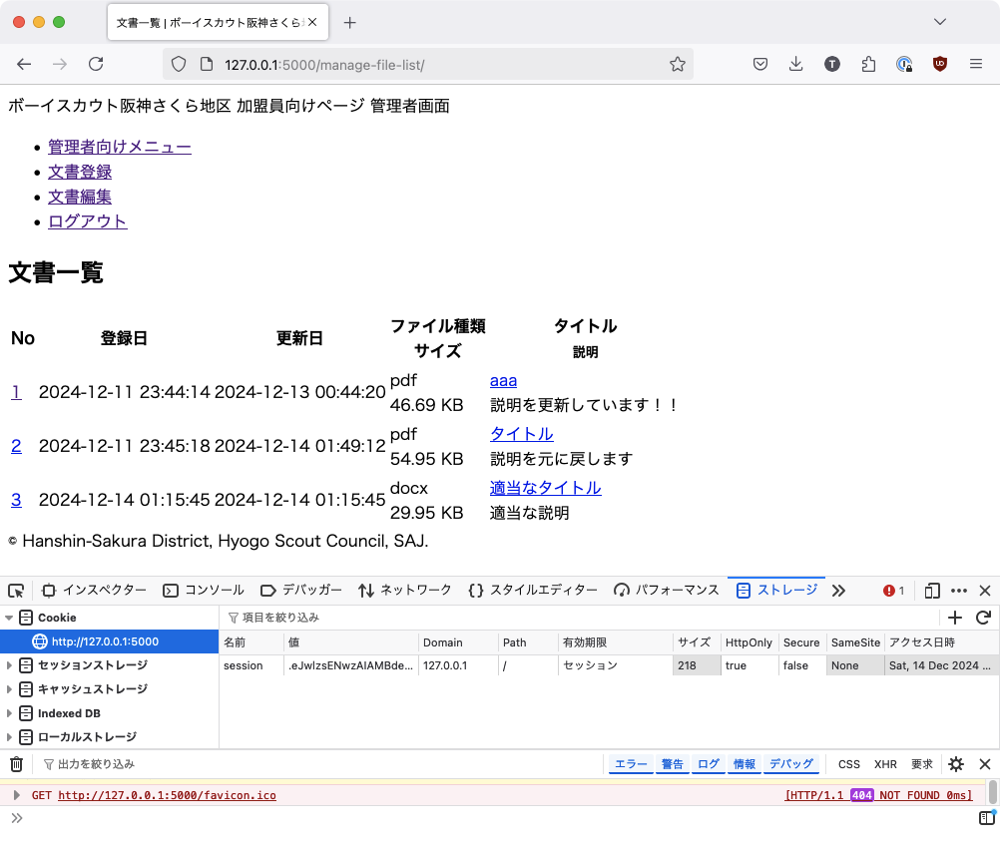

## はじめに

「OKAZAKI Shogo のひとりアドベントカレンダー2024」の13日目です。 
昨日整理を行なった各種ページですが、ようやく、ログイン機能を実装し、すでにあるページで認証済みでないと遷移できないページに設定を入れます。

## ログイン処理の実装

### `app/templates/login.html`

まずは、簡単にログイン画面のテンプレートを作成する。

```html



<body>
    <h2>{{ page_title }}</h2>
    <form action="/login" method="post">
        
        
        <ul>
          
          <li>{{ message }}</li>
          
        </ul>
        
        
        <label for="username">ユーザー名:</label>
        <input type="text" id="username" name="username" required><br><br>

        <label for="password">パスワード:</label>
        <input type="password" id="password" name="password" required><br><br>

        <button type="submit">ログイン</button>
    </form>
</body>

```

### `app/views/login.py`

実際のログイン処理を実装する。
- 入力されたユーザー名からユーザー情報を取得する。
- ユーザー情報があれば、入力されたパスワードの検証を行う
    - 前編で入れたように、パスワードはハッシュ値を元に検証を行う。

```python
from flask import Blueprint, flash, redirect, render_template, request, url_for
from flask_login import login_user

from app.models.manager_user import ManagerUser

login_bp = Blueprint("login", __name__, url_prefix="/login")


@login_bp.route("/", methods=["GET", "POST"])
def index():
    if request.method == "POST":
        username = request.form.get("username")
        password = request.form.get("password")
        # ManagerUserテーブルからusernameに一致するユーザを取得
        user = ManagerUser.query.filter_by(user_name=username).first()
        if user is None or not user.check_password(password):
            flash("無効なユーザー ID かパスワードです。")
            return redirect(url_for("login.index"))
        login_user(user)
        return redirect(url_for("manage_menu.index"))
    return render_template("login.html", page_title="管理者向けログイン")
```

## ログアウトの処理の実装

前編で解説した通り、Flask-Login の仕組みでは、クッキーにユーザーの情報を保存するので、それを消去するために `flask_login.logout_user()` を呼び出す。

```python
from flask import Blueprint, redirect, url_for
from flask_login import logout_user

logout_bp = Blueprint("logout", __name__, url_prefix="/logout")


@logout_bp.route("/", methods=["GET", "POST"])
def index():
    logout_user()
    return redirect(url_for("login.index"))
```

## ログインが必要なページへの設定

`@login_required` をつける

## 動作の確認




ログアウトすると、クッキーの情報が消える。


ログアウトした状態で認証が必要なページに遷移すると、 403 エラーが表示される。


