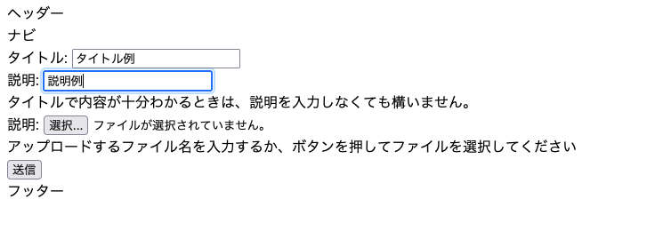

## はじめに
「OKAZAKI Shogo のひとりアドベントカレンダー2024」の7日目です。 
ファイルのアップロード機能を作るために、ブラウザ経由でリクエストを受け取り、それを処理する方法を確認します。

## フォームのエンドポイントとテンプレートの作成

### `views/regist_file_form.py`

まずは、フォームを表示するためのエンドポイントを定義する。

```python
from flask import Blueprint, render_template

regist_file_form_bp = Blueprint("regist_file_form", __name__, url_prefix="/regist-file-form")


@regist_file_form_bp.route("/", methods=["GET","POST"])
def index():
    return render_template("regist_file_form.html")
```

### `templates/regist_file_form.html`

先ほど作成したビューから呼び出されるテンプレートを以下のように作成する。

action にはこの後作成するエンドポイントをしておく。

```html



<form action="/regist-file" method="post" class="regist-file-form">
    <div class="regist-file-form">
      <label for="name">タイトル: </label>
      <input type="text" name="name" id="name" required />
    </div>
    <div class="regist-file-form">
      <label for="description">説明: </label>
      <input type="text" name="description" id="description" />
      <br>タイトルで内容が十分わかるときは、説明を入力しなくても構いません。
    </div>
    <div class="regist-file-form">
        <label for="description">説明: </label>
        <input type="file" name="file" id="file" />
        <br>アップロードするファイル名を入力するか、ボタンを押してファイルを選択してください
      </div>
    <div class="regist-file-form">
      <input type="submit" value="送信" />
    </div>
</form>

```

### `views/regist_file.py`

先ほど作成した画面で「送信」ボタンが押されたら、実際にファイルを登録する処理を書く。ただし、今はまだ単純にフォームで受け取ったタイトルを表示するだけ。

```python
from flask import Blueprint, render_template, request

regist_file_bp = Blueprint("regist_file", __name__, url_prefix="/regist-file")


@regist_file_bp.route("/", methods=["POST"])
def index():
    file_name = request.form['name']
    return f"ファイル名: {file_name}"
```

これで アプリを起動し、 `/refist_file_form` にアクセスすると下記のような画面が表示される。



上の内容を入力して「送信」を押すと画面遷移して以下のように表示される。


## 参考資料

- [クイックスタート — Flask Documentation (2.2.x)](https://msiz07-flask-docs-ja.readthedocs.io/ja/latest/quickstart.html#accessing-request-data)
- [とほほのFlask入門 - とほほのWWW入門](https://www.tohoho-web.com/ex/flask.html#receive_data)
