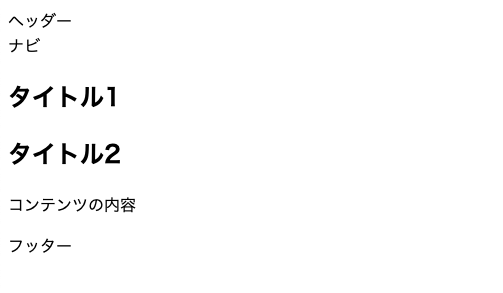
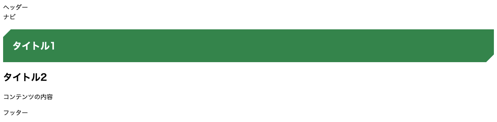

+++
title = 'Flask でテンプレート HTML を表示する'
date = 2024-12-04T23:46:14+09:00
tags = ['Python', 'Flask','ひとりアドベントカレンダー2024']
+++


## はじめに

「OKAZAKI Shogo のひとりアドベントカレンダー2024」の3日目です。
今回は Flask の基本的な使い方として、 HTML テンプレートを用いてページを表示します。

## HTML を表示する

Flask では [Jinja](https://jinja.palletsprojects.com/en/stable/) というテンプレートエンジンを用いている。
`templates` という名前をつけたフォルダの下を参照するようになっている。
まずは以下の場所に `index.html` を作成する。

```
.
|-- Makefile
|-- poetry.lock
|-- pyproject.toml
`-- src
    |-- __init__.py
    |-- app.py
    `-- templates
        `-- index.html  <-- 新規作成
```

`index.html` の中身はなんでも良いので、適当に以下のようにする。

````html
<!DOCTYPE html>
<html lang="ja">
	<head>
		<meta charset="utf-8">
		<title>ボーイスカウト阪神さくら地区　加盟員向けページ</title>
	</head>

	<body>
		<!----- ヘッダー ----->
		<header>ヘッダー</header>
		<nav>ナビ</nav>
		<!----- ヘッダー END ----->
		
		<!----- メインコンテンツ ----->
		<article>
			<h1>タイトル</h1>
			<section>
				<h2>タイトル</h2>
				<p>コンテンツの内容</p>
			</section>
		</article>
		<!----- メインコンテンツ END ----->
		
		<!----- フッター ----->
		<footer>フッター</footer>
		<!----- フッター END ----->
	</body>
</html>
````

`app.py` を以下のように変更する。

```python
from flask import Flask, render_template

app = Flask(__name__)


@app.route('/')
def index():
    return render_template('index.html')


if __name__ == "__main__":
    app.run(debug=True)
```

関数 `render_template` を import し、表示したい HTML ファイえうを引数に指定して呼び出す。これで、 Flask を起動し、アクセスすると HTML に書いた内容が表示される。



## CSS を入れて適用する

`static` フォルダを作成し、 CSS ファイルを入れる。 CSS ファイル（`default.css`）の中身は [コピペで使える見出しタイトルのCSSデザイン＆サンプルコード35選](https://www.naaavi.com/title-design-sample/) から拝借して作成。

```
.
|-- Makefile
|-- poetry.lock
|-- pyproject.toml
`-- src
    |-- __init__.py
    |-- __pycache__
    |   |-- __init__.cpython-38.pyc
    |   `-- app.cpython-38.pyc
    |-- app.py
    |-- static
    |   `-- css
    |       `-- default.css  <-- 新規作成
    `-- templates
        `-- index.html
```

```css
h1 {
    position: relative;
    padding: 1em;
    color: #ffffff;
    background-color: #009250;
}
h1::before {
    position: absolute;
    content: '';
    top: 0;
    left: 0;
    width: 0;
    height: 0;
    border-top: 0px solid transparent;
    border-right: 20px solid transparent;
    border-left: 20px solid #ffffff;
    border-bottom: 20px solid transparent;
}
h1::after {
    position: absolute;
    content: '';
    right: 0;
    bottom: 0;
    width: 0;
    height: 0;
    border-top: 20px solid transparent;
    border-right: 20px solid #ffffff;
    border-left: 20px solid transparent;
    border-bottom: 0px solid transparent;
}
```

`index.html` を以下のように変更する。スタイルシートの場所の指定は `{{ }}` で指定する。`{{ }}` の中が Jinja のテンプレートエンジンを用いて処理された結果が表示される。

```html
<!DOCTYPE html>
<html lang="ja">
	<head>
		<meta charset="utf-8">
		<title>ボーイスカウト阪神さくら地区　加盟員向けページ</title>
        <link rel="stylesheet" href="{{ url_for('static', filename='css/default.css') }}"/>
	</head>

	<body>
		<!----- ヘッダー ----->
		<header>ヘッダー</header>
		<nav>ナビ</nav>
		<!----- ヘッダー END ----->
		
		<!----- メインコンテンツ ----->
		<article>
			<h1>タイトル1</h1>
			<section>
				<h2>タイトル2</h2>
				<p>コンテンツの内容</p>
			</section>
		</article>
		<!----- メインコンテンツ END ----->
		
		<!----- フッター ----->
		<footer>フッター</footer>
		<!----- フッター END ----->
	</body>
</html>
```

これを適用すると以下のような表示となる。



## 共通部分を括り出す

ヘッダーやフッターなど、各ページに共通の箇所を括り出しておくことも可能。
以下の場所に `layout.html` を作成する。

```
.
|-- Makefile
|-- poetry.lock
|-- pyproject.toml
`-- src
    |-- __init__.py
    |-- app.py
    |-- static
    |   `-- css
    |       `-- default.css
    `-- templates
        |-- index.html
        `-- layout.html
```

`layout.html` の中身は以下の通り。

```html
<!DOCTYPE html>
<html lang="ja">
	<head>
		<meta charset="utf-8">
		<title>ボーイスカウト阪神さくら地区　加盟員向けページ</title>
        <link rel="stylesheet" href="{{ url_for('static', filename='css/default.css') }}"/>
	</head>

	<body>
        <!----- ヘッダー ----->
		<header>ヘッダー</header>
		<nav>ナビ</nav>
		<!----- ヘッダー END ----->

        
		
		<!----- フッター ----->
		<footer>フッター</footer>
		<!----- フッター END ----->
	</body>
</html>
```

`` と書いた箇所が、それぞれのテンプレートで違う部分が入る。。これを使うために、 `index.html` も変更する。

```html




<!----- メインコンテンツ ----->
<article>
    <h1>タイトル1</h1>
    <section>
        <h2>タイトル2</h2>
        <p>コンテンツの内容</p>
    </section>
</article>
<!----- メインコンテンツ END ----->


```

`` で共通のレイアウトを使うことを宣言し、`` と `` で囲った部分が、レイアウトに埋め込まれる部分となる。

これを適用しても先ほどと同じ表示になっていれば OK。


## 参考資料

- [Templates — Flask Documentation (3.1.x)](https://flask.palletsprojects.com/en/stable/tutorial/templates/)
- [【Python Flask】初心者プログラマーのWebアプリ#2 HTMLテンプレート表示 #Python3 - Qiita](https://qiita.com/Bashi50/items/9bb5ca4a519c17caf475)