Gatsby で作成したページを Firebase を使って公開します。独自ドメインで HTTPS で公開します。

## 準備

-   デプロイするための Gatsby のプロジェクトは作成済とします。
-   Google アカウントが必要なので、持っていない場合は作成します。
    -   [https://accounts.google.com/SignUp?hl=ja](https://accounts.google.com/SignUp?hl=ja)
-   [Firebase のページ](https://firebase.google.com/?hl=ja)にアクセスし、ログインしていない場合はログインします。

## プロジェクトの作成とホスティングの設定

-   ログインしたら、右上の「コンソールへ移動」か真ん中の「使ってみる」をクリックします。
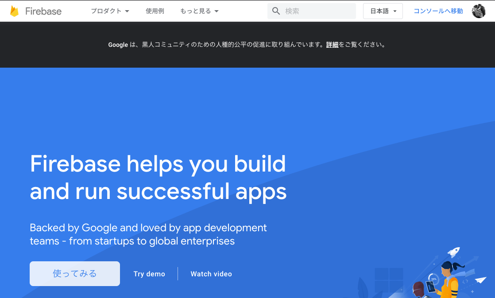
-   次のページで「プロジェクトの作成」をクリックします。

-   順にプロジェクトの設定をしていきます。
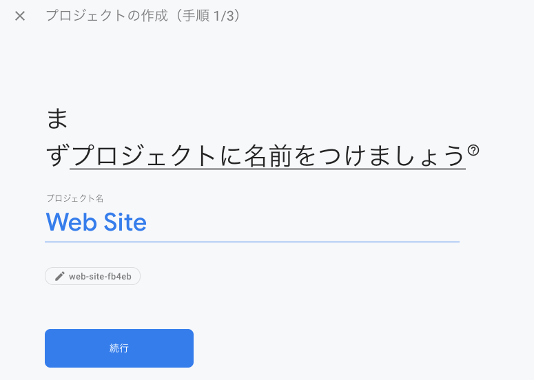

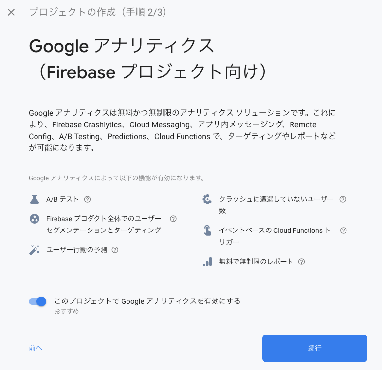

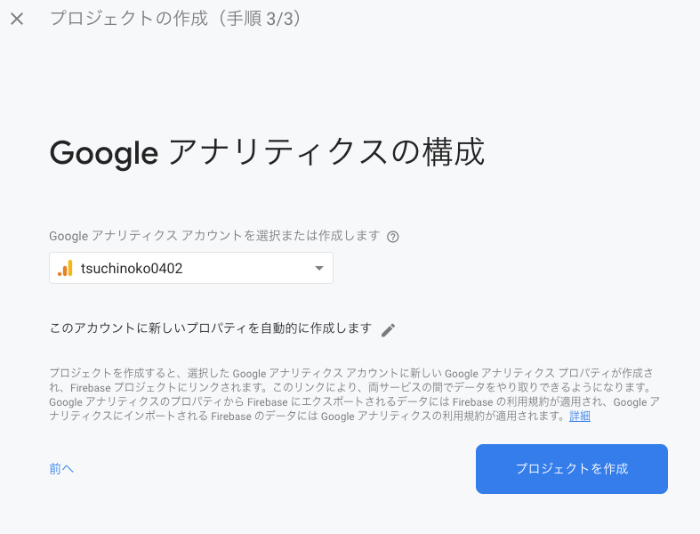

-   プロジェクトが作成できたら、左メニューから「Hosting」を選択します。移動したページで「始める」を選択します。

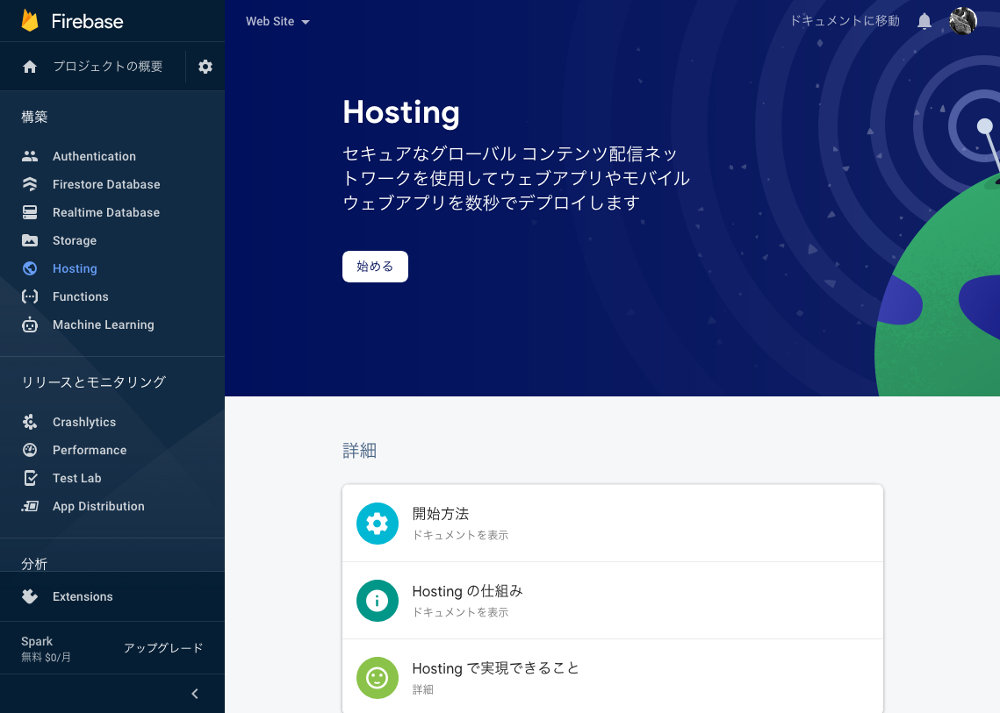

-   設定のためのステップがいろいろ表示されますが、ひとまずそのまま全て進めてホスティングの設定を完了させます。

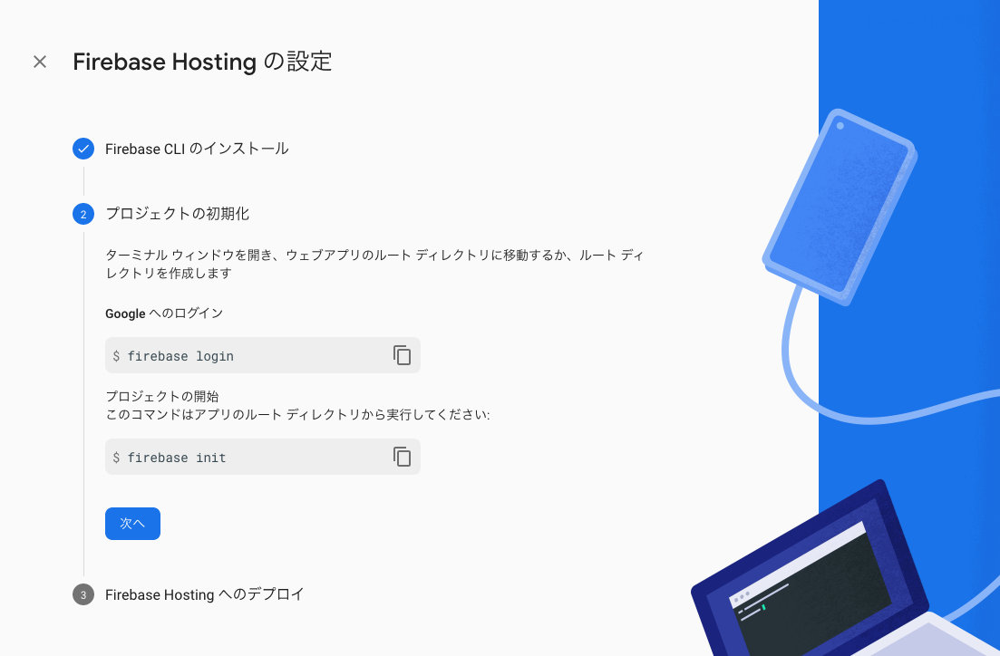

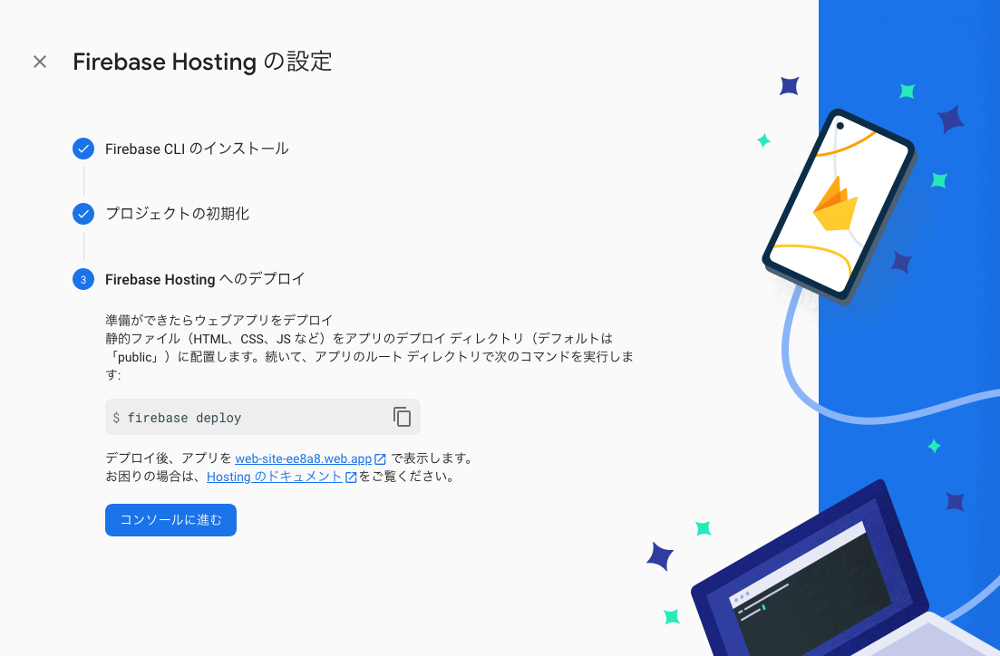

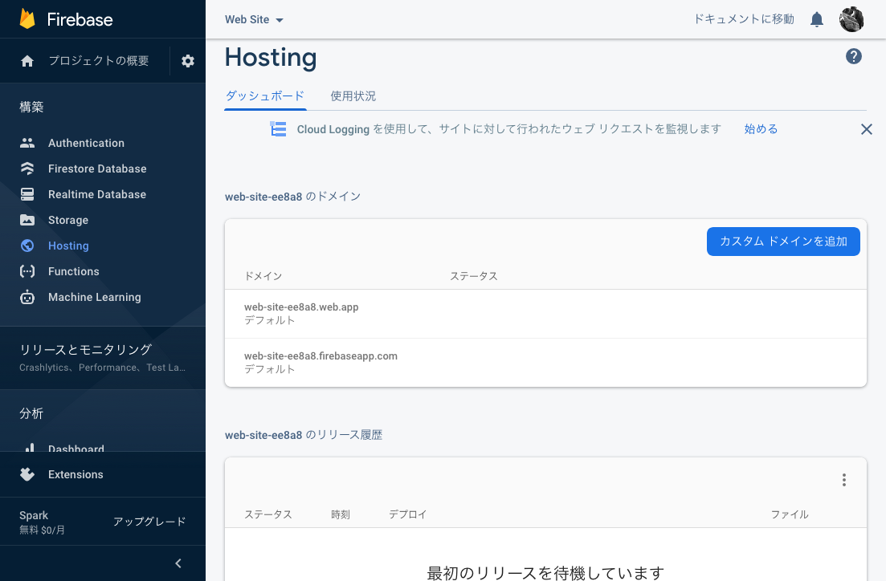

## Gatsby プロジェクトに Firebase の設定をする

-   作成した Gatsby のプロジェクトに移動し、 Firebase ツールのパッケージをインストールします。

```
$ yarn global add firebase-tools
```

-   ツールのインストールが終わったら、 `init` します。
    -   いくつかの質問に答えていきます。
        -   今回はホスティングの使用だけなので、「Hositing」にカーソルを合わせてスペースキーを押下して、Enter で次に進めます。
        -   既存のプロジェクトを使用しますので、「Use an existing project」にカーソルを合わせて Enter で次へ。
        -   先ほど作成したプロジェクト（今回の場合は、「 web-site-ee8a8 (Web Site)」）にカーソルを合わせて Enter で次へ。
        -   デプロイするディレクトリは「Public」。
        -   SSP かと聞かれるので「No」。
        -   GitHubを使った自動ビルドとデプロイの設定については、「No」。
    -   質問に答え終わると、`firebase.json` と `.firebaserc` が作成されます。

```
$ firebase init
...
? Which Firebase CLI features do you want to set up for this folder? Press Space to select features, then Enter to confi
rm your choices.
 ◯ Database: Configure Firebase Realtime Database and deploy rules
 ◯ Firestore: Deploy rules and create indexes for Firestore
 ◯ Functions: Configure and deploy Cloud Functions
❯◉ Hosting: Configure and deploy Firebase Hosting sites
 ◯ Storage: Deploy Cloud Storage security rules
 ◯ Emulators: Set up local emulators for Firebase features
 ◯ Remote Config: Get, deploy, and rollback configurations for Remote Config

? Please select an option: (Use arrow keys)
❯ Use an existing project
  Create a new project
  Add Firebase to an existing Google Cloud Platform project
  Don't set up a default project

? Select a default Firebase project for this directory: (Use arrow keys)
❯ web-site-ee8a8 (Web Site)

=== Hosting Setup

Your public directory is the folder (relative to your project directory) that
will contain Hosting assets to be uploaded with firebase deploy. If you
have a build process for your assets, use your build's output directory.

? What do you want to use as your public directory? public
? Configure as a single-page app (rewrite all urls to /index.html)? No
? Set up automatic builds and deploys with GitHub? No
✔  Wrote public/404.html
✔  Wrote public/index.html

i  Writing configuration info to firebase.json...
i  Writing project information to .firebaserc...
i  Writing gitignore file to .gitignore...

✔  Firebase initialization complete!
```

-   `firebase.json` の中身は以下のようになります：
    -   `public` にデプロイ対象のファイル・ディレクトリ名を指定します。
    -   `ignore` にデプロイから外す対象のファイル・ディレクトリ名を指定します。

```
{
  "hosting": {
    "public": "public",
    "ignore": [
      "firebase.json",
      "**/.*",
      "**/node_modules/**"
    ]
  }
}
```

-   `.firebaserc` は以下の内容で作成されます：

```
{
  "projects": {
    "default": "[プロジェクト ID]"
  }
}
```

## トークンの取得とデプロイ

-   Firebase アカウントのトークンを取得します。
    -   自動的にブラウザが立ち上がり、 OAuth の認可画面が表示されます。
    -   認可が完了すると、`1/...` から始まるトークンが発行されます。後に必要なので、メモしておきます。

```
$ yarn run firebase login:ci
Visit this URL on this device to log in: https://accounts.google.com/o/oauth2/auth?client_id=xxx&scope=xxx&response_type=xxxx&state=1234567890&redirect_uri=xxx 

Waiting for authentication...

✔ Success! Use this token to login on a CI server: 

1/xxxx Example: firebase deploy --token "$FIREBASE_TOKEN"
```

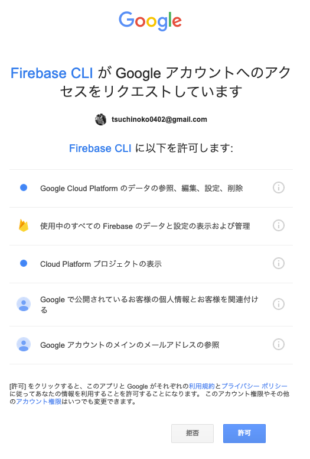

-   デプロイする前に、Gatsby のビルドをしておきます。
    -   `public` 配下にビルド済みのソースが生成されます。

```
$ yarn build
```

-   環境変数 `FIREBASE_TOKEN` に↑で取得したトークンの値を設定します。
-   以下のコマンドで、 Firebase にデプロイします：

```
$ yarn firebase deploy --token $FIREBASE_TOKEN
```

-   デプロイが完了したら、以下のいずれかのアドレスで Web サイトにアクセスし、ページが表示されたら OK です。
    -   `https://[プロジェクト ID].web.app/`
    -   `https://[プロジェクト ID].firebaseapp.com/`

## 独自ドメインの設定

-   [Firebase のドキュメント](https://firebase.google.com/docs/hosting/custom-domain?hl=ja)に沿って設定していきます。
-   独自ドメインを設定するには、 Firebase Hositing の画面で「カスタムドメインを追加」を押下して設定を進めます。


-   ドメインの DNS 管理ページに TXT レコードを設定し、「所有権を証明」を押下して次に進めます。
    -   TXT レコードが伝播されるまで最長で 24 時間かかります。

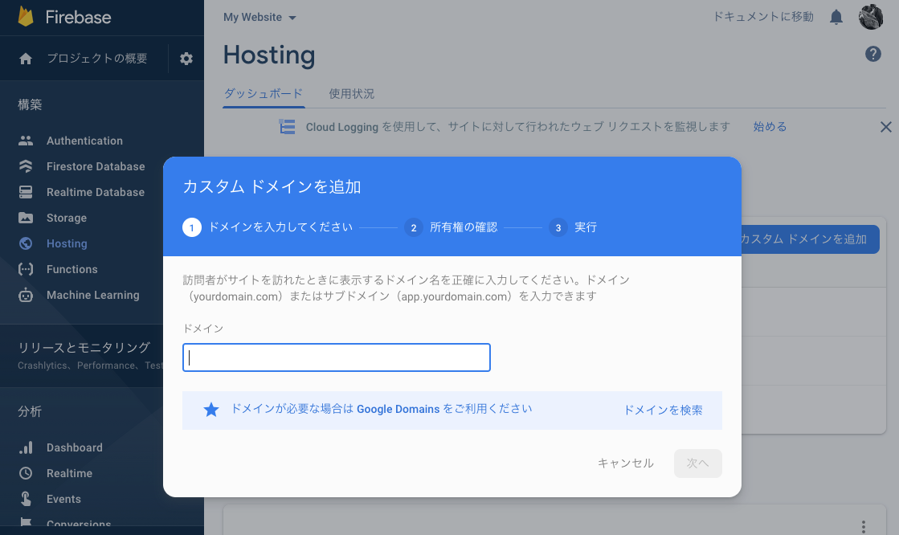

-   TXT レコードの伝播が完了して次のステップに進むと、 A レコードの設定をするよう表示されるので、再度、DNS 管理画面で設定をします。

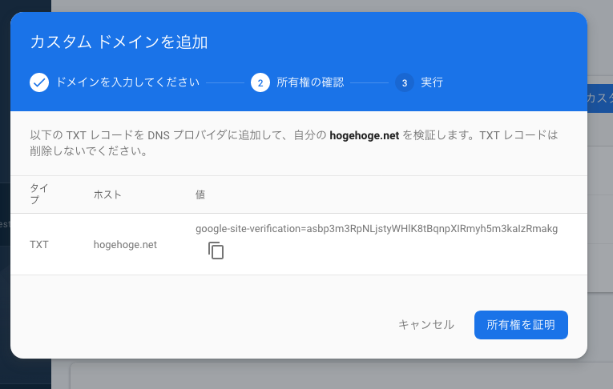

-   独自ドメインでアクセスできるようになったら成功です。

## まとめ

-   Gatsby で作成した Web サイトを Firebase にデプロイして独自ドメインで公開しました。
-   今のところ、Firebase の機能は Hosting しか利用してませんが、他の機能も機会があれば触っていきたいと思います。