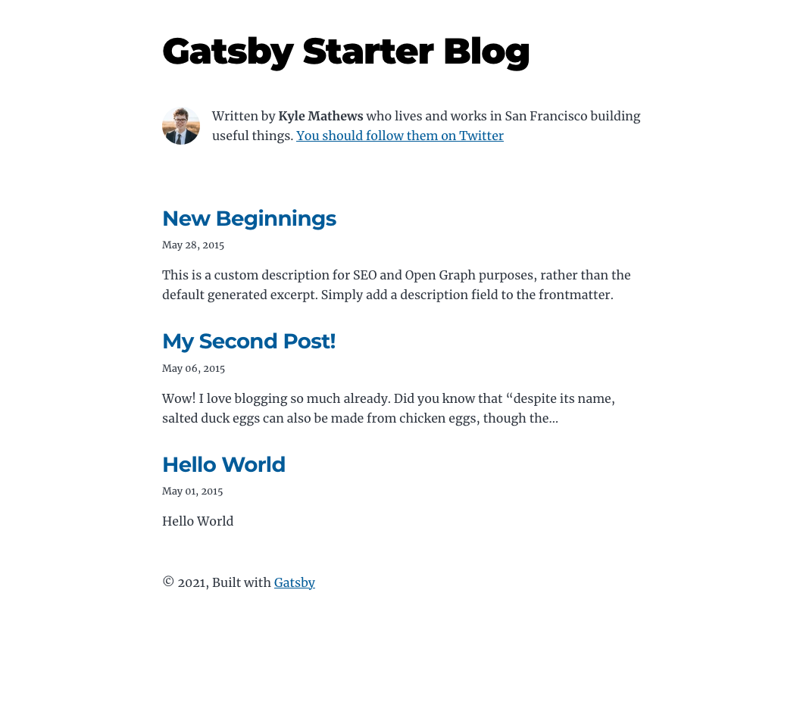
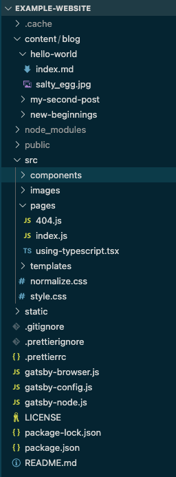
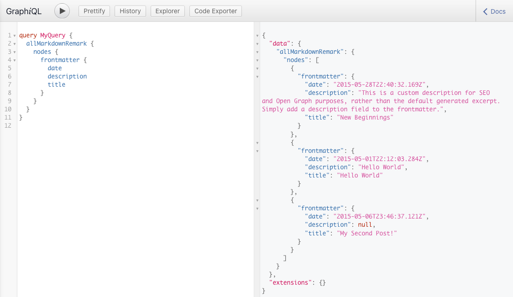
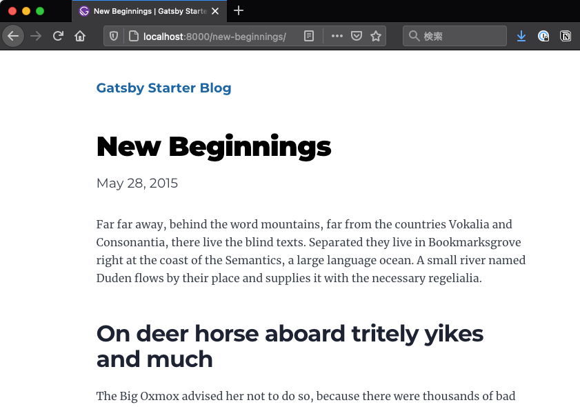

Gatsby は静的サイトジェネレータ（SSG）であることから、主な用途としてはブログやコーポレートサイトで利用されます。  
ブログ記事などは HTML をそのまま書いたりすることはしたくないので、 Markdown からページを生成する機能を実装します。  

## 前提と準備

-   Gatsby は導入済みとします。

```
$ gatsby --version
Gatsby CLI version: 3.3.0
```

-   シンプルなブログ機能が実装されているスターター（ [gatsby-starter-blog](https://www.gatsbyjs.com/starters/gatsbyjs/gatsby-starter-blog) ）からプロジェクトを作成しておきます。

```
$ gatsby new example-website https://github.com/gatsbyjs/gatsby-starter-blog
```

-   パッケージマネージャーは `yarn` を利用します。

## 設定内容を見る

-   作成したプロジェクトのディレクトリの下に行き、 `yarn develop` を実行すると、以下のような画面が立ち上がります。
    -   いくつかのブログ記事も作成されています。



-   作成されたソースは以下のようになっています。



-   順に設定方法を見ていきます。

### Markdown ファイルにメタ情報の記述：`*.md`

-   ブログ記事にする Markdown ファイルには、ファイルの冒頭に YAML 形式でメタ情報ブロック（ `Front-matter` ）を追加する必要があります。
-   以下のような感じです：
    -   自分で項目を追加することも可能です。

```
---
title: Hello World
date: "2015-05-01T22:12:03.284Z"
description: "Hello World"
---
# 以下、本文
```

-   これらの情報は後に RSS フィードの追加を行うと、以下の GraphQL クエリで取得可能になります：

```
query MyQuery {
  allMarkdownRemark {
    nodes {
      frontmatter {
        date
        description
        title
      }
    }
  }
}
```


  
静的ファイルを扱うための設定：`gatsby-config.js`

-   Markdown ファイルや画像ファイルなど、静的ファイルを扱うための設定は以下のように記述されています：

```
module.exports = {
//...
  plugins: [
    `gatsby-plugin-image`,
    {
      resolve: `gatsby-source-filesystem`,
      options: {
        path: `${__dirname}/content/blog`,
        name: `blog`,
      },
    },
    {
      resolve: `gatsby-source-filesystem`,
      options: {
        name: `images`,
        path: `${__dirname}/src/images`,
      },
    },
//...
  ],
}
```

-   `gatsby-source-filesystem` のプラグインを用いることで、 Gatsby でファイルを扱えるようになります。
-   今回は、以下の2箇所のディレクトリをプラグインで扱うところとして指定しています：
    -   `{$__dirname}/src/images` : 画像ファイルを格納する
    -   `${__dirname}/content/blog` : ブログ記事本文を書く Markdown ファイルと記事内に貼り付ける画像ファイルを格納する

### GraphQL のデータから RSS フィードを追加する設定：`gatsby-config.js`

-   再び、`gatsby-config.js`の以下の箇所の設定を確認します。
    -   以下の箇所で、 RSS フィードの追加を行なっています。
    -   これにより、 Markdown で作成した記事のデータを GraphQL 経由で取得可能になります。

```
module.exports = {
//...
  plugins: [
    {
      resolve: `gatsby-plugin-feed`,
      options: {
        query: `
          {
            site {
              siteMetadata {
                title
                description
                siteUrl
                site_url: siteUrl
              }
            }
          }
        `,
        feeds: [
          {
            serialize: ({ query: { site, allMarkdownRemark } }) => {
              return allMarkdownRemark.nodes.map(node => {
                return Object.assign({}, node.frontmatter, {
                  description: node.excerpt,
                  date: node.frontmatter.date,
                  url: site.siteMetadata.siteUrl + node.fields.slug,
                  guid: site.siteMetadata.siteUrl + node.fields.slug,
                  custom_elements: [{ "content:encoded": node.html }],
                })
              })
            },
            query: `
              {
                allMarkdownRemark(
                  sort: { order: DESC, fields: [frontmatter___date] },
                ) {
                  nodes {
                    excerpt
                    html
                    fields {
                      slug
                    }
                    frontmatter {
                      title
                      date
                    }
                  }
                }
              }
            `,
            output: "/rss.xml",
          },
        ],
      },
    },
//...
  ],
}
```

  

### 動的ページを作成するための設定：`gatsby-node.js`

-   `gatsby-node.js` に GraphQL を利用してページを作成する設定が記述されています。量が多いので順を追って見ていきます。
-   `createPages` 関数では、以下のことをしています：
    1.  ブログ記事のテンプレートファイルの指定
    2.  Markdown ファイルの日付順での取得
    3.  Markdown ファイルがある場合は、 `createPage` 関数を用いてページを作成
        -   `createPage` 関数には3つの引数を渡しています
            -   `path` ：ページの slug になる部分
            -   `component` ：適用されるテンプレート
            -   `context` ：テンプレートのコンポーネントに渡すデータ

```
//...
exports.createPages = async ({ graphql, actions, reporter }) => {
  const { createPage } = actions

  // Define a template for blog post
  const blogPost = path.resolve(`./src/templates/Memo/index.tsx`)

  // Get all markdown blog posts sorted by date
  const result = await graphql(
    `
      {
        allMarkdownRemark(
          sort: { fields: [frontmatter___updatedDate], order: ASC }
          limit: 1000
        ) {
          nodes {
            id
            fields {
              slug
            }
          }
        }
      }
    `
  )

  if (result.errors) {
    reporter.panicOnBuild(
      `There was an error loading your blog posts`,
      result.errors
    )
    return
  }

  const posts = result.data.allMarkdownRemark.nodes

  // Create blog posts pages
  // But only if there's at least one markdown file found at "content/blog" (defined in gatsby-config.js)
  // `context` is available in the template as a prop and as a variable in GraphQL

  if (posts.length > 0) {
    posts.forEach((post, index) => {
      const previousPostId = index === 0 ? null : posts[index - 1].id
      const nextPostId = index === posts.length - 1 ? null : posts[index + 1].id

      createPage({
        path: post.fields.slug,
        component: blogPost,
        context: {
          id: post.id,
          previousPostId,
          nextPostId,
        },
      })
    })
  }
}
//...
```

-   `onCreateNode` 関数は Gatsby で用意されている API で Markdown のファイル名を用いて、ページのパスの基になる `slug` の情報を作成します。

```
//...
exports.onCreateNode = ({ node, actions, getNode }) => {
  const { createNodeField } = actions

  if (node.internal.type === `MarkdownRemark`) {
    const value = createFilePath({ node, getNode })
    createNodeField({
      name: `slug`,
      node,
      value,
    })
  }
}
//...
```

#### `onCreateNode` 関数の動きを詳しく見てみる

-   `onCreateNode` の中身に以下のように変えて、再度ビルド（開発サーバー立ち上げ直し）してみます：

```
exports.onCreateNode = ({ node, actions, getNode }) => {
  const { createNodeField } = actions

  if (node.internal.type === `MarkdownRemark`) {
    console.log(node)
  }
}
```

-   エラーが出ますが、コンソールに以下のように出力されている箇所があります：
    -   ある1つの記事の node 情報です。

```
//...
{
  id: 'b12b70e7-a1fa-50b4-b747-32bf8365a086',
  children: [],
  parent: '13cf1990-6cef-56fb-86a0-449ae4d0ac7e',
  internal: {
    content: '\n' +
      'Wow! I love blogging so much already.\n' +
      '\n' +
      'Did you know that "despite its name, salted duck eggs can also be made from\n' +
      'chicken eggs, though the taste and texture will be somewhat different, and the\n' +
      'egg yolk will be less rich."?\n' +
      '([Wikipedia Link](https://en.wikipedia.org/wiki/Salted_duck_egg))\n' +
      '\n' +
      "Yeah, I didn't either.\n",
    type: 'MarkdownRemark',
    contentDigest: '9b43b6a5553a369243bbce630e5f4461',
    owner: 'gatsby-transformer-remark',
    counter: 51
  },
  frontmatter: { title: 'My Second Post!', date: '2015-05-06T23:46:37.121Z' },
  excerpt: '',
  rawMarkdownBody: '\n' +
    'Wow! I love blogging so much already.\n' +
    '\n' +
    'Did you know that "despite its name, salted duck eggs can also be made from\n' +
    'chicken eggs, though the taste and texture will be somewhat different, and the\n' +
    'egg yolk will be less rich."?\n' +
    '([Wikipedia Link](https://en.wikipedia.org/wiki/Salted_duck_egg))\n' +
    '\n' +
    "Yeah, I didn't either.\n",
  fileAbsolutePath: '/Users/tsuchinoko/example-website/content/blog/my-second-post/index.md'
}
//...
```

-   ブログの記事ページの URL は一意になれば良いので、 `slug` としては `id` を利用してもよいのですが、人間に優しくするには、 Markdown のファイル名を使います。
-   再度、以下のように`onCreateNode` の中身に以下のように変えて、ビルドしてみます：

```
exports.onCreateNode = ({ node, actions, getNode }) => {
  const { createNodeField } = actions

  if (node.internal.type === `MarkdownRemark`) {
    const fileNode = getNode(node.parent)
    console.log(`\n`, fileNode.relativePath)
  }
}
```

-   以下のように、 Markdown ファイルの相対パスが表示されます。

```
 my-second-post/index.md

 new-beginnings/index.md

 hello-world/index.md
```

-   拡張子 `md` など不必要な情報が含まれているので、`createFilePath` を用いて `/[ファイル名]/` のようにします。

```
//...
if (node.internal.type === `MarkdownRemark`) {
    console.log(createFilePath({ node, getNode }))
}
//...
```

-   再度出力を確認すると以下のようになります：
    -   元々書いてあった処理と同じになります。

```
/my-second-post/
/new-beginnings/
/hello-world/
```

-   Markdown の格納ディレクトリを src/data/blog などに変更した場合、親ディレクトリ名が slug には不要となるはずなので、その場合は、`createFilePath({ node, getNode, basePath: [親ディレクトリ名] })` とすると、不要な箇所が消えた slug が作成できます。
-   `createNodeField` で `node` に追加した slug は GraphQL で確認することができます。


### ページのテンプレートを確認・変更する：`src/templates/blog-post.js`

-   ページの見た目や内容に応じて変更箇所がある場合は変更します。
-   ブログページのデータ取得には以下のクエリが用いられています：
    -   変数 `$id` に一致する Markdown ファイルの情報を取得できます。
    -   日付順に並べた際の前の Markdown と次の Markdown の情報も取得できます。

```
  query BlogPostBySlug(
    $id: String!
    $previousPostId: String
    $nextPostId: String
  ) {
    site {
      siteMetadata {
        title
      }
    }
    markdownRemark(id: { eq: $id }) {
      id
      excerpt(pruneLength: 160)
      html
      frontmatter {
        title
        date(formatString: "MMMM DD, YYYY")
        description
      }
    }
    previous: markdownRemark(id: { eq: $previousPostId }) {
      fields {
        slug
      }
      frontmatter {
        title
      }
    }
    next: markdownRemark(id: { eq: $nextPostId }) {
      fields {
        slug
      }
      frontmatter {
        title
      }
    }
  }
```

-   ここまでのことが確認できれば、 `http://localhost:8000/[Markdownファイル名]/` にアクセスすると、Markdown ファイルの内容が HTML に整形されて表示される仕組みが理解できるのではないかと思います。



## まとめ

-   Gatsby で Markdown からページを動的に生成する仕組みを確認しました。
-   ブログ機能を持ったスターターを使えば、何の設定もなしに利用はできますが、自分で色々とカスタマイズするためには、この内容は理解しておかねばならないところでした。
    -   このサイトでも、 Markdown ファイルはブログの記事ではなく、メモを置いておく扱いにしているので…

## 参考資料

-   [Gatsby + Markdownでブログを作り直しました](https://diff001a.netlify.app/gatsby-blog-with-markdown/)
-   [GatsbyJSでの動的ページ自動作成方法を理解したい](https://reffect.co.jp/react/gatsby-basic-tutorial-for-beginners-3)
