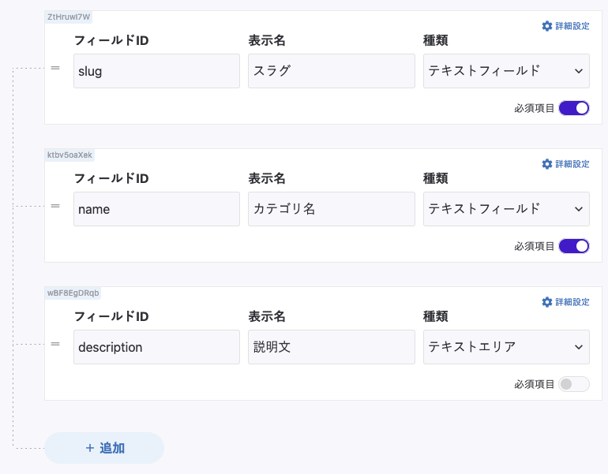
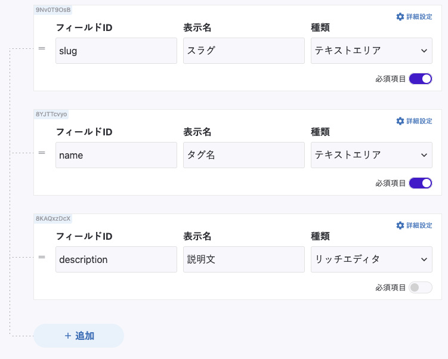
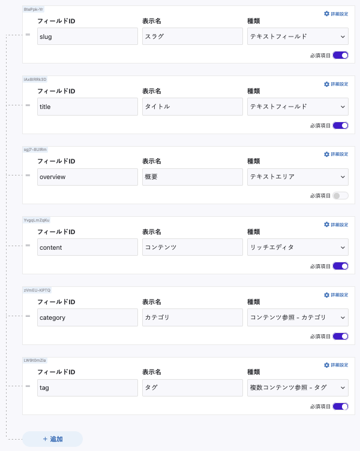
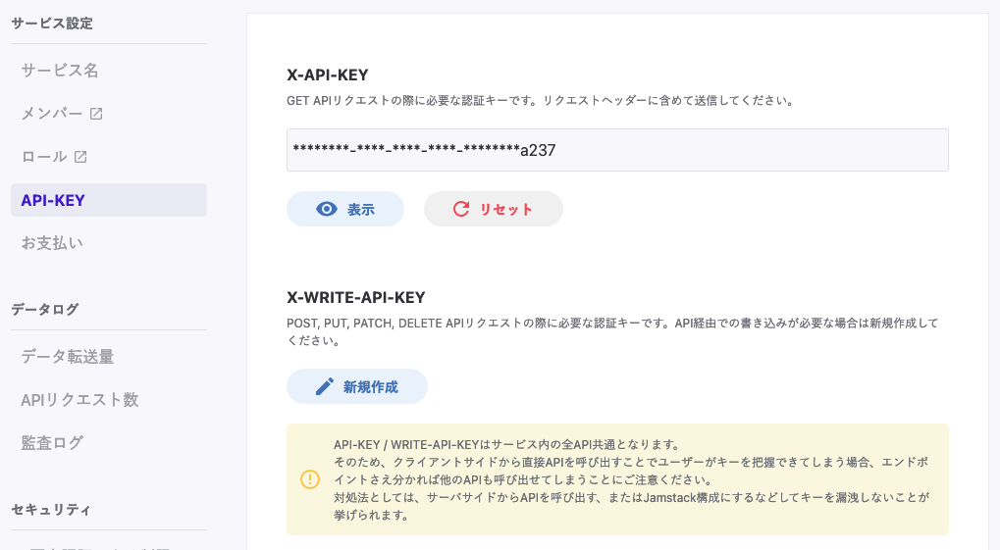

前の記事で紹介したように、 Markdown で書いた内容をブログ記事として扱うことも可能ですが、ヘッドレス CMS を利用すると、データ管理を別サービスに任せてビューの開発に集中できます。このサイトで利用している microCMS と Gatsby の連携方法を紹介します。  

## ヘッドレス CMS とは

-   CMS とは Content Manager System の略称で、コンテンツ管理を行うシステムです。
-   WordPress のようなこれまでの CMS は 、コンテンツの管理とビューの表示を同じサーバーで行う仕組みになっていました。
    -   表示画面（＝フロントエンド）は、裏側のシステム（＝バックエンド）のルールや使用するプログラム言語に合わせて、作成したり改修したりする必要があります。
-   ヘッドレス CMS は「ビューを持たない CMS」です。
    -   Web API 経由でコンテンツの提供を行います。
    -   HTML 以外のスマホアプリや IoT デバイスにもデータが提供できます。

## microCMS の紹介

-   [microCMS](https://microcms.io/) は日本製のヘッドレス CMS サービスです。
    -   非技術者でも管理画面がわかりやすい UI となっています。
    -   [ドキュメント](https://document.microcms.io/)も充実しています。
    -   Gatsby での利用にあたっては、[公式でプラグイン](https://www.gatsbyjs.com/plugins/gatsby-source-microcms/)が用意されてています。
    -   個人で利用する範囲では無料で利用することが出来ます。

## Gatsby と microCMS を連携する

[公式ドキュメントのチュートリアル](https://document.microcms.io/tutorial/gatsby)を参考に進めていきます。アカウントの作成からサービスの登録までは、[公式ブログの説明](https://blog.microcms.io/getting-started/)に沿って済ませている前提とします。

### API の作成

-   今回はブログを作成するので、以下のような API を作成します
    -   カテゴリ：「技術記事」「ブログ」等、大まかな分類。1つの記事に対して1つしか付けられないようにする。



-   タグ：記事に付与する具体的な技術名等。1つの記事に対して複数付けられることを想定。



-   ブログ記事：記事の内容。



-   ここで、いくらかテスト用のブログ記事やタグ、カテゴリの設定をしておきます。

### Gatsby に microCMS の設定を記述する

-   microCMS の API を利用するための API キーは サービス設定 > API-KEY から確認可能です。



-   API キーをソースコードに含めないように、環境変数 `MICROCMS_API_KEY` に API キーを設定しておきます。また、自身で決めたサービス ID も環境変数 `MICROCMS_API_ID` に設定しておきます。
-   Gatsby のプラグインをインストールします。

```
$ yarn add gatsby-source-microcms
```

-   `gatsby-config.js` に以下の内容を追記します。
    -   `apis` は利用する API のエンドポイントを列挙しておきます。

```
module.exports = {
//...
  plugins: [
//...
    {
      resolve: `gatsby-source-microcms`,
      options: {
        apiKey: process.env.MICROCMS_API_KEY,
        serviceId: process.env.MICROCMS_SERVICE_ID,
        apis: [
          {
            endpoint: "post",
          },
          {
            endpoint: "category",
          },
          {
            endpoint: "tag",
          },
        ],
      },
    },
//...
  ],
}
```

-   ここまで設定した上で、以下のコマンドで開発サーバが無事に立ち上がることを確認します。

```
MICROCMS_API_KEY=[API キー] MICROCMS_SERVICE_ID=[サービス ID] yarn develop
```

### GraphQL でデータが取得できることを確認する

-   開発サーバが立ち上がったら、 `http://localhost:8000/`_`_`_`_graphql` にアクセスして GraphQL でデータが取得できることを確認します。
    -   記事一覧を取得するクエリ

```
query  {
  allMicrocmsPost {
    nodes {
      slug
      tag {
        name
      }
      title
      updatedAt
      publishedAt
      category {
        name
      }
    }
  }
}
```

-   カテゴリ一覧

```
query {
  allMicrocmsCategory {
    nodes {
      name
      slug
      description
    }
  }
}
```

-   タグ一覧

```
query {
  allMicrocmsTag {
    nodes {
      name
      slug
      description
    }
  }
}
```

-   コンテンツの更新が反映されないときは、 `yarn clean` を実行して、キャッシュを削除して再度開発環境を立ち上げ直します。
-   あとは、このデータの内容を利用して記事詳細ページやカテゴリ詳細ページを作成します。

## データを利用した動的ページの作成

-   記事詳細ページやカテゴリ詳細ページ、タグ詳細ページはそれぞれ以下のようなパスで作成します：
    -   記事詳細ページ：`src/pages/blog/{MicrocmsPost.slug}.tsx`
    -   カテゴリ詳細ページ：`src/pages/categories/{MicrocmsGategory.slug}.tsx`
    -   タグ詳細ページ：`src/pages/tags/{MicrocmsTag.slug}.tsx`
-   ポイントは、ファイル名の拡張子より前を中括弧（ `{ }` ）で囲い、 `{MicrocmsXXX.slug}.tsx` とする点です。
    -   こうすれば、例えば、記事詳細ページであれば、 `https://xxx/blog/[スラグ名]/` でアクセスできるページが生成されます。

### 記事詳細ページの実装

-   クエリに変数 `$id` を入れておくことで、当該 ID のページの情報を取得します。

```
import * as React from "react"
import { graphql, PageProps } from "gatsby"

const PostPage: React.FC<PageProps<GatsbyTypes.BlogPageQuery>> = ({ data }) => {
  const post = data.microcmsPost
  return (
    // 表示するページの内容
  )
}

export const query = graphql`
  query BlogPage($id: String!) {
    microcmsPost(id: { eq: $id }) {
      slug
      title
      content
      publishedAt(formatString: "YYYY.DD.MM hh:mm")
      updatedAt(formatString: "YYYY.DD.MM hh:mm")
      category {
        slug
        name
      }
    }
  }
`

export default PostPage
```

### カテゴリ詳細ページの実装

-   指定したカテゴリの記事一覧を取得し、表示します。

```
import * as React from "react"
import { graphql, PageProps } from "gatsby"

const CategoryPage: React.FC<PageProps<GatsbyTypes.BlogCategoryPageQuery>> = ({ data }) => {
  const post = data.microcmsPost
  return (
    // 表示するページの内容
    // 当該カテゴリの記事一覧を表示する
  )
}

export const query = graphql`
  query BlogCategoryPage($slug: String!) {
    microcmsCategory(slug: { eq: $slug }) {
      slug
      name
      description
    }
    allMicrocmsPost(filter: { category: { slug: { eq: $slug } } }) {
      nodes {
        slug
        title
        content
        publishedAt(formatString: "YYYY.MM.DD hh:mm")
        category {
          slug
          name
        }
        thumbnail {
          url
        }
      }
    }
  }
`

export default CategoryPage
```

### タグ詳細ページの実装

-   指定したタグの記事一覧を取得し、表示します。

```
import * as React from "react"
import { graphql, PageProps } from "gatsby"

const TagPage: React.FC<PageProps<GatsbyTypes.BlogTagPageQuery>> = ({ data }) => {
  const post = data.microcmsPost
  return (
    // 表示するページの内容
    // 当該タグの記事一覧を表示する
  )
}

export const query = graphql`
  query BlogTagPage($slug: String!) {
    microcmsTag(slug: { eq: $slug }) {
      slug
      name
      description
    }
    allMicrocmsPost(filter: { tag: { elemMatch: { slug: { eq: $slug } } } }) {
      nodes {
        slug
        title
        content
        publishedAt(formatString: "YYYY.MM.DD hh:mm")
        category {
          slug
          name
        }
        thumbnail {
          url
        }
      }
    }
  }
`

export default TagPage
```

## まとめ

-   Gatsby で microCMS を利用したブログページの作成方法を紹介しました。
-   データ取得までを主に紹介し、ページの中身の実装については、これを基に実装していけると思います。

## 参考資料

-   竹本 雄貴「React & Gatsby開発入門」インプレスR&D（2021）
    -   [https://nextpublishing.jp/book/12958.html](https://nextpublishing.jp/book/12958.html)
-   microCMS のドキュメント：[https://document.microcms.io/](https://document.microcms.io/)