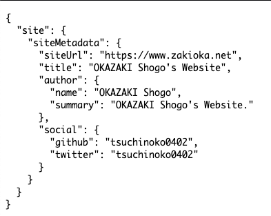

Gatsby は基本的に TypeScript 対応を謳っているため、

-   コンポーネントファイルを `.tsx` の認識
-   ページコンポーネント用の型定義
-   `gatsby-config.js` や `gatsby-node.js` の型定義
-   `@types/react` , `@types/react-dom` の利用

は何もせずとも出来ます。  
しかしながら、 GraphQL の実行結果が `any` になってしまうため、型対応のためにはプラグインを入れて対応します。

## 前提と準備

-   Gatsby は導入済みとします。

```
$ gatsby --version
Gatsby CLI version: 3.3.0
```

-   シンプルなスターターからプロジェクトを作成しておきます。

```
$ gatsby new example-website https://github.com/gatsbyjs/gatsby-starter-hello-world
```

-   パッケージマネージャーは `yarn` を利用します。
-   プロジェクトのディレクトリ配下に入り、以下のコマンドで `gatsby-plugin-typegen` のプラグインをインストールします。
    -   同様のプラグインとして [gatsby-plugin-graphql-codegen](https://www.gatsbyjs.com/plugins/gatsby-plugin-graphql-codegen/) がありますが、2021年5月時点では、`-typegen` のほうが推奨のようです。

```
$ yarn add gatsby-plugin-typegen
```

-   設定ファイル `gatsby-config.js` にプラグインを追記します。また、 GraphQL で扱うデータ（自サイトに関するメタデータ）も追記しておきます。

```
module.exports = {
  siteMetadata: {
      title: `OKAZAKI Shogo's Website`,
      author: {
        name: `OKAZAKI Shogo`,
        summary: `OKAZAKI Shogo's Website.`,
      },
      siteUrl: `https://www.zakioka.net/`,
      social: {
        twitter: `tsuchinoko0402`,
        github: `tsuchinoko0402`,
      },
    },
    plugins: [
      `gatsby-plugin-typegen`
    ],
  }
```

-   ここで記述したサイトのメタデータは、ビルド完了後、以下の GraphQL のクエリで取得できます：

```
query MyQuery {
  site {
    siteMetadata {
      siteUrl
      title
      author {
        name
        summary
      }
      social {
        github
        twitter
      }
    }
  }
}
```

## ビルドして型情報を見る

-   `stc/index.js` を `src/index.tsx` に変更し、以下の内容で作成します。

```
import React from "react"
import { graphql, PageProps } from "gatsby"

const IndexPage: React.FC<PageProps> = () => {
  return(
    <>
      <div>Hello, World!</div>
    </>
  )
}

export const query = graphql`
  query IndexPage {
    site {
      siteMetadata {
        siteUrl
        title
        author {
          name
          summary
        }
        social {
          github
          twitter
        }
      }
    }
  }
`

export default IndexPage
```

-   `yarn build` でビルドすると、 `src/__generated__/gatsby-types.ts` が生成されます。
    -   このファイル内に以下のような `IndexPageQuery` の型情報が作成されます。
    -   プラグインにより、ページコンポーネント内に `query XXX`を作成したら、`XXXQuery` という名前の型が自動的に作成されます。

```
type IndexPageQuery = { readonly site: Maybe<{ readonly siteMetadata: Maybe<(
      Pick<SiteSiteMetadata, 'siteUrl' | 'title'>
      & { readonly author: Maybe<Pick<SiteSiteMetadataAuthor, 'name' | 'summary'>>, readonly social: Maybe<Pick<SiteSiteMetadataSocial, 'github' | 'twitter'>> }
    )> }> };
}
```

-   これをページコンポーネントで利用します。下記のように `index.tsx` を変更します：
    -   `React.FC<PageProps<GatsbyTypes.[生成した型]>>` という指定の仕方をします。

```
import React from "react"
import { graphql, PageProps } from "gatsby"

const IndexPage: React.FC<PageProps<GatsbyTypes.IndexPageQuery>> = ({ data }) => {
  return(
    <>
      <pre>
        {JSON.stringify(data, null, 2)}
      </pre>
    </>
  )
}

export const query = graphql`
  query IndexPage {
    site {
      siteMetadata {
        siteUrl
        title
        author {
          name
          summary
        }
        social {
          github
          twitter
        }
      }
    }
  }
`

export default IndexPage
```

-   再ビルドが完了すると、以下のように表示されます。



## まとめ

-   Gatsby が TypeScript に対応しきれていない GraphQL の実行結果の型情報を自動生成するプラグインを利用しました。
-   これでだいたい Gatsby で問題なく TypeScript を利用できています。
    -   `gatsby-config.js` や `gatsby-node.js` も TypeScript 対応するためには一工夫しなければならないのですが、特に大きな問題もないので一旦そのままにしています。