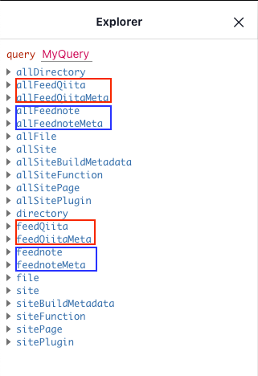
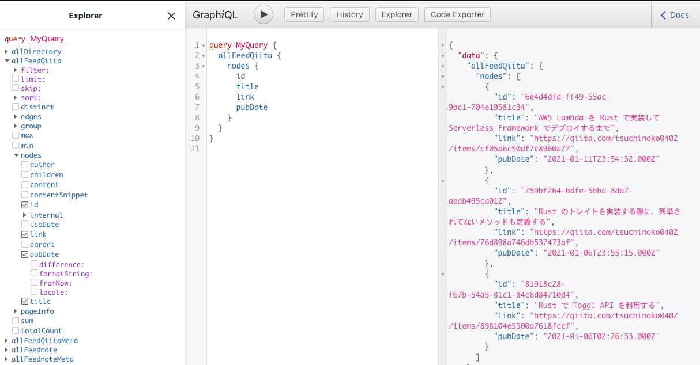
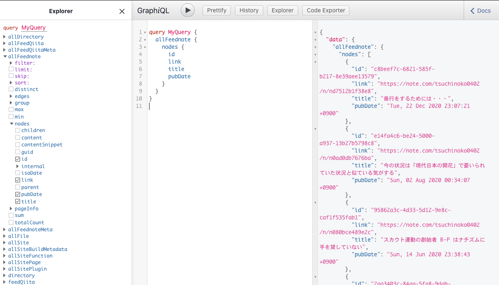
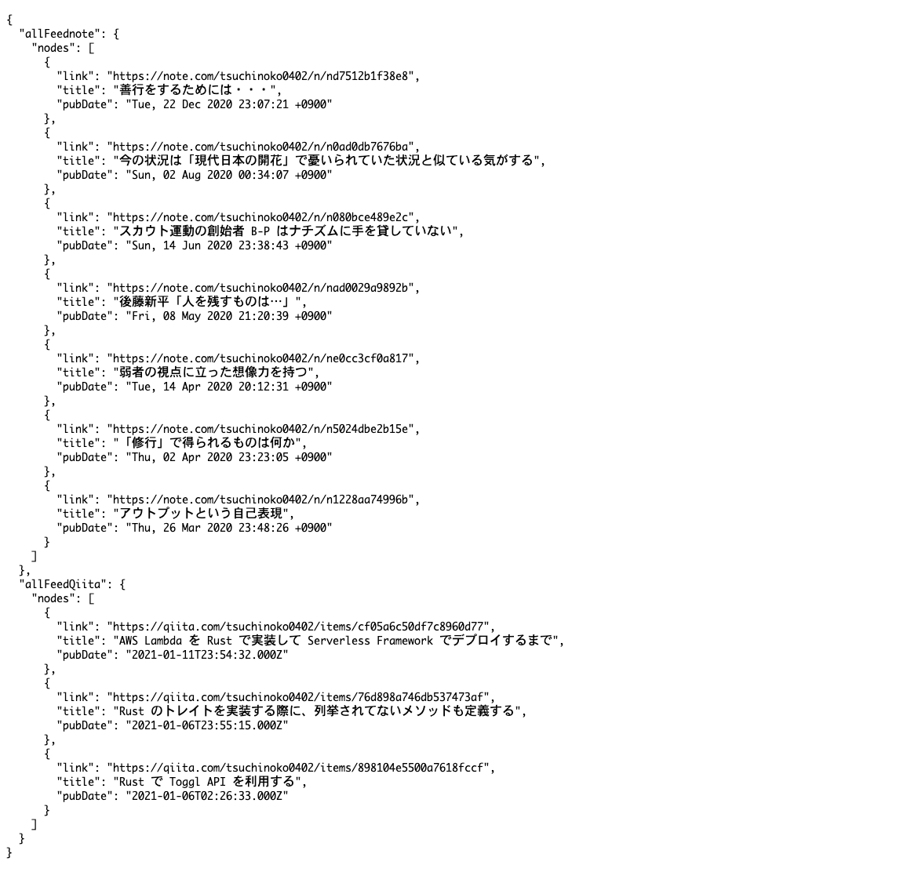

このサイトでは、私が Qiita や note に投稿した記事一覧を表示しています。  
Gatsby では GraphQL とプラグインを用いることで簡単に一覧の取得・表示ができるので紹介します。  
Qiita や note に限らず、RSS フィードが取得できるサービスなら応用可能です。  

## 前提と準備

-   Gatsby はインストール済みとします

```
$ gatsby --version
Gatsby CLI version: 3.3.0 
```

-   パッケージマネージャーは `yarn` を利用します。
-   以下のコマンドでスターターからサンプルのプロジェクトを作成し、ローカルサーバーが立ち上がることを確認します

```
$ gatsby new example-website https://github.com/gatsbyjs/gatsby-starter-hello-world
$ cd example-website
$ yarn develop
```

## 記事の一覧取得方法

-   Gatsby のプラグインである [gatsby-source-rss-feed](https://www.gatsbyjs.com/plugins/gatsby-source-rss-feed/) を利用します。
    -   RSS フィードからデータを取得するためのプラグインです。
    -   取得したデータは GraphQL で取得することが可能になります。
    -   データの取得は、ビルドが行われた際に行われます。
-   Qiita と note の個人が投稿した記事の RSS フィードの URL はそれぞれ以下のとおりです
    -   Qiita: `https://qiita.com/tsuchinoko0402/feed`
        -   私の場合、 `https://qiita.com/tsuchinoko0402/feed`
    -   note: `https://note.com/[ユーザーID]/rss`
        -   私の場合、 `https://note.com/tsuchinoko0402/rss`

  

## 記事の一覧取得処理を実装する

### GraphQL で記事に関する情報を取得する

-   まずは、プラグインをインストールします。

```
 $ yarn add gatsby-source-rss-feed
```

-   インストールが完了したら、 `gatsby-config.js` の `plugin` に追記します。

```
module.exports = {
     plugins: [
         //----- 追記内容ここから -----
       {
         resolve: `gatsby-source-rss-feed`,
         options: {
           url: `https://qiita.com/[ユーザーID]/feed`,
           name: `Qiita`,
         },
       },
       {
         resolve: `gatsby-source-rss-feed`,
         options: {
           url: `https://note.com/[ユーザーID]/rss`,
           name: `note`,
         },
       },
         //----- 追記内容ここまで -----
     ],
   }
```

  
-   設定したら、再び `yarn develop` で開発サーバを立ち上げ直し、GraphQL の画面 `http://localhost:8000/_graphql` を表示します。
-   Qiita に関する項目と note に関する項目が増えていることがわかります。
    -   追加される項目は、 `allFeedxxx`, `allFeedxxxMeta`, `feedxxx`, `feedxxxMeta`（ `xxx` は `gatsby-config.js` の `options.name` に指定した値）の4つ



-   Qiita の記事ID、タイトル、リンク先、公開日を取得するには、以下のクエリを実行します：

```
query MyQuery {
     allFeedQiita {
       nodes {
         id
         title
         link
            pubDate
       }
     }
   }
```



-   note の記事ID、タイトル、リンク先、公開日を取得するには、以下のクエリを実行します：

```
 query MyQuery {
     allFeednote {
       nodes {
         id
         link
         title
         pubDate
       }
     }
   }
```



### 記事一覧をページに表示する

-   `src/index.js` を以下のように編集します。
-   ページコンポーネントで `query` という名前を付けた GraphQL クエリを export すると、コンポーネントでデータを利用可能となる

       - 今回は、↑で実行して確認した2つのクエリを記述（ `id` は不要なので取得しない ）  
   - React コンポーネント側からは `[props.data](http://props.data)` でデータを取り出す  

```
import React from "react"
import { graphql } from "gatsby"
const IndexPage = (props) => {
  return (
    <div>
      <pre>
        {JSON.stringify(props.data, null, 2)}
      </pre>
    </div>
  )
}

export const query = graphql`
  query AllPostsPage {
    allFeednote {
      nodes {
        link
        title
        pubDate
      }
    }
    allFeedQiita {
      nodes {
        link
        title
        pubDate
      }
    }
  }
`

export default IndexPage
```

-   開発サーバを立ち上げ、 `http://localhost:8000/` を開くと、以下のように表示される：
-   `props.data.allFeedxxx.nodes` に配列形式で RSS の記事が入っている事がわかる



-   これを基に、Qiita と note の記事一覧のリンク集を作成。`src/index.js` を以下のように修正：

```
import React from "react"
import { Link, graphql } from "gatsby"
const IndexPage = (props) => {
  return (
    <>
    <h2>Qiita 記事一覧</h2>
    <ul>
      {(props.data.allFeedQiita.nodes).map(post => {
        return(
          <li>
            <small>{post.pubDate}</small>
            <Link
              to={post.link}
              rel="noreferrer noopener"
              target="_blank"
            >
              {post.title}
            </Link>
          </li>
        )
      })}
    </ul>
    <h2>note 記事一覧</h2>
    <ul>
      {(props.data.allFeednote.nodes).map(post => {
        return(
          <li>
            <small>{post.pubDate}</small>
            <Link
              to={post.link}
              rel="noreferrer noopener"
              target="_blank"
            >
              {post.title}
            </Link>
          </li>
        )
      })}
    </ul>
    </>
  )
}

export const query = graphql`
  query AllPostsPage {
    allFeednote {
      nodes {
        link
        title
        pubDate
      }
    }
    allFeedQiita {
      nodes {
        link
        title
        pubDate
      }
    }
  }
`

export default IndexPage
```

-   保存して、（再ビルド完了後、）`http://localhost:8000/`を開くと、以下のように表示される：


## まとめ

-   Gatsby のプラグインと GraphQL を用いて RSS フィードのデータを利用したページを作成することができました。
-   Gatsby のチュートリアルだけでは GraphQL の良さがあまりわからなかったのですが、実際のデータを扱ってみると便利さが良く分かった気がします。

## 参考資料

-   竹本 雄貴「React & Gatsby開発入門」インプレスR&D（2021）
    -   [https://nextpublishing.jp/book/12958.html](https://nextpublishing.jp/book/12958.html)