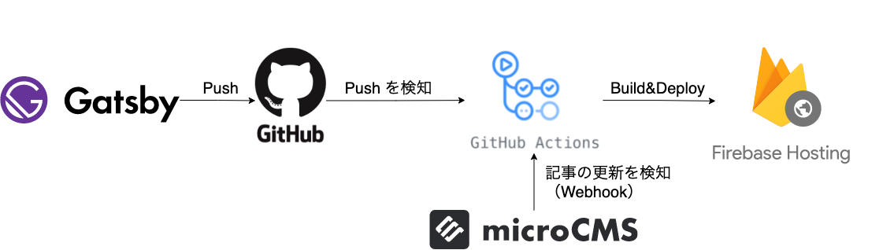
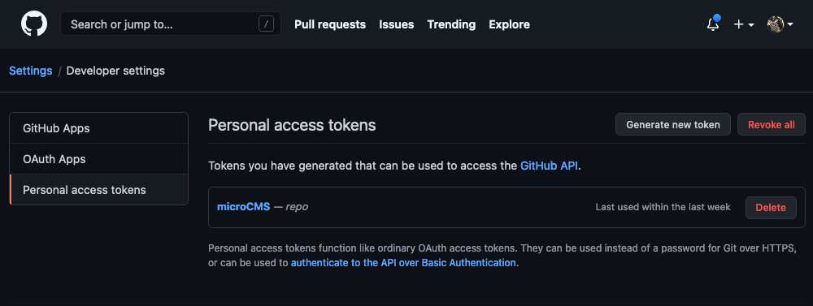
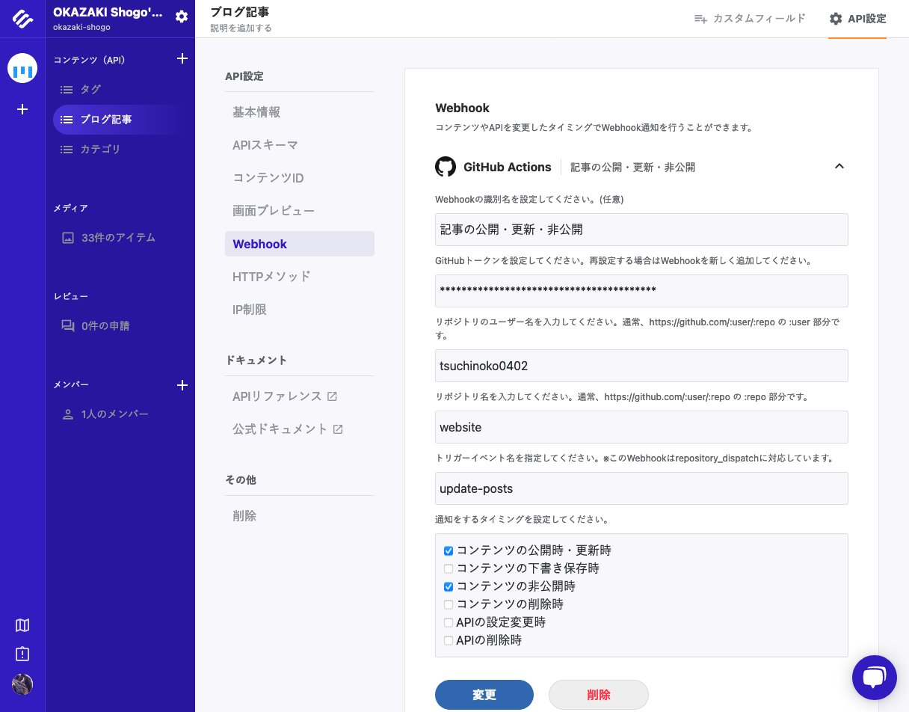
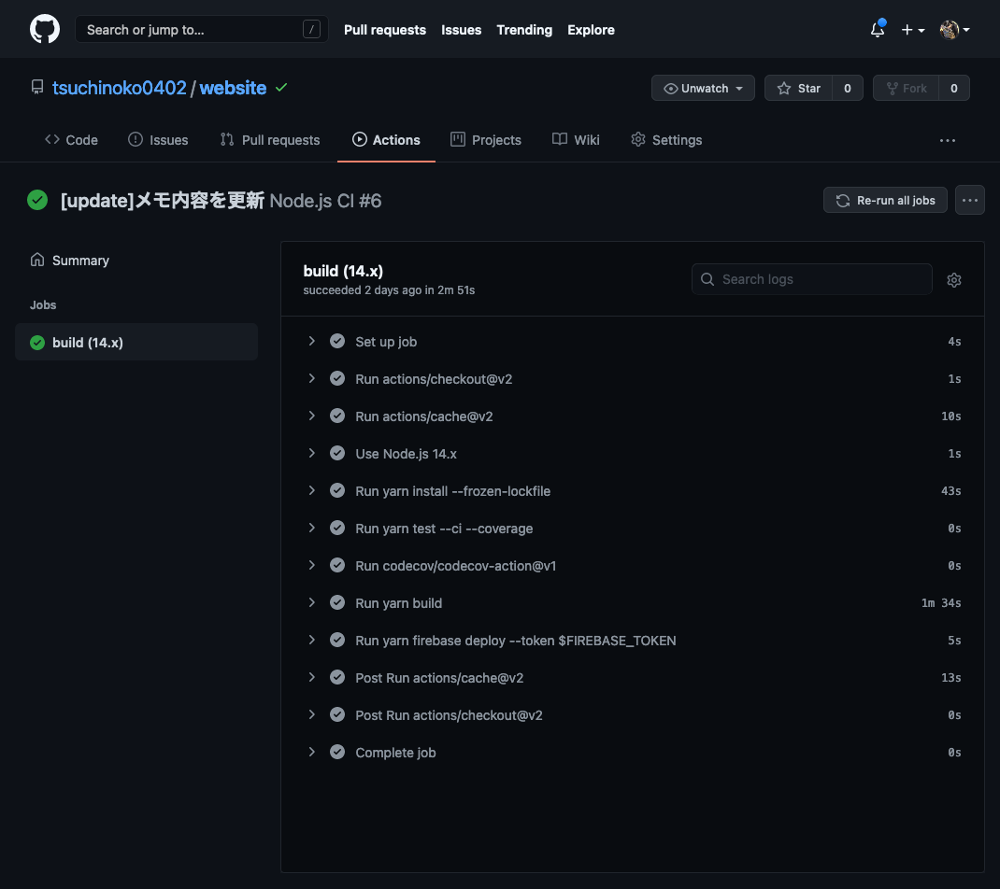

ここまでで、 Gatsby で静的コンテンツを作成し、 microCMS でコンテンツと API を作成し、 Firebase でホスティングして Jamstack な構成で Web を公開しました。  
Gatsby のソースを変更したり、 microCMS でコンテンツを追加・更新した場合に自動でデプロイできるよう、 GitHub Actions の設定をします。  

## 目標となる構成

-   前の記事でも示した以下の構成を完成させます。
    -   Gatsby のソースは GitHub のリポジトリに Push しているものとします。



## microCMS の Webhook の設定

-   microCMS でブログ記事を公開したり更新した場合に、 GitHub に Webhook で通知がいくように設定します。
-   予め、GitHub のトークンを取得しておきます。
    -   ユーザーメニューの「Settings」→「Developper Settings」→「Personal access token」から「Generate new token」を押下し、トークンを発行します。
        -   一度しか画面に表示されませんので、メモしておきます。



-   microCMS の管理画面から、ブログ記事のAPI を選択し、「API設定」→「Webhook」を選択し、「追加」で GitHub Actions を選択します。
-   以下のように、必要な設定を記入して「設定」で設定を完了します。
    -   トリガーイベント名は「update-posts」としておきます。
    -   通知のタイミングは「コンテンツの公開・更新時」と「コンテンツの非公開時」にしておきます。



## GitHub Actions の設定

-   Gatsby プロジェクトのルート配下に `.github/workflows/nodejs.yml` を作成し、以下の内容を記述します。
    -   `on` でワークフロー起動の契機を設定します。今回は、main ブランチへのプッシュと `update-posts` のトリガーイベント（=microCMS での更新）があった場合に起動します。

```
name: Node.js CI

on:
  push:
    branches: [main]
  repository_dispatch:
    types: [update-posts]

jobs:
  build:
    runs-on: ubuntu-latest
    strategy:
      matrix:
        node-version: [14.x]
    steps:
      - uses: actions/checkout@v2
      - uses: actions/cache@v2
        with:
          path: ~/.cache/yarn
          key: ${{ runner.os }}-yarn-${{ hashFiles('yarn.lock') }}
          restore-keys: |
            ${{ runner.os }}-yarn-
      - name: Use Node.js ${{ matrix.node-version }}
        uses: actions/setup-node@v1
        with:
          node-version: ${{ matrix.node-version }}
      - run: yarn install --frozen-lockfile
      - run: yarn build
        env:
          MICROCMS_API_KEY: ${{ secrets.MICROCMS_API_KEY }}
          MICROCMS_SERVICE_ID: ${{ secrets.MICROCMS_SERVICE_ID }}
      - if: github.ref == 'refs/heads/main'
        run: yarn firebase deploy --token $FIREBASE_TOKEN
        env:
          FIREBASE_TOKEN: ${{ secrets.FIREBASE_TOKEN }}
```

-   GitHub のリポジトリに環境変数を設定します。リポジトリの「Settings」→「Secrets」から以下の3つを設定します：
    -   `FIREBASE_TOKEN`：Firebase のトークン
    -   `MICROCMS_API_KEY`：microCMS のAPI キー
    -   `MICROCMS_SERVICE_ID`：microCMS のサービス ID
-   ここまで設定したら、Gatsby のプロジェクトをPush します。
-   リポジトリメニューの Actions でビルド・デプロイ処理が走っているのを確認します。
    -   無事に成功したら、 Web サイトにアクセスし、内容が反映されることを確認します。



-   また、microCMS でブログ記事を更新した場合も、 Actions が無事に動作し、デプロイできることも確認します。

## まとめ

-   今回は CI の役割を GitHub Actions に担ってもらう設定をしました。
    -   Jamstack な構成で自動的にデプロイできるようになったので、更新が楽になりました。
-   テスト等はまだ入れていないため、ワークフローについては改善の余地がありそうです。
-   個人的には、GitHub Actions にあまり慣れていないので、CircleCI 等が利用できないか検討してみます。

## 参考資料

-   [GitHub Actions ドキュメント](https://docs.github.com/ja/actions)
-   [GitHub ActionsへのWebhook通知に対応しました](https://blog.microcms.io/webhook-for-github-actions/)
-   [Gatsby+Firebase環境をGitHubActionsでDeploy](https://qiita.com/resqnet/items/8ab03ff706ca613a4ecf)