## はじめに

「OKAZAKI Shogo のひとりアドベントカレンダー2024」の17日目です。 
ファイルのアップロード機能に、 Google Drive へのアップロード機能をつけていきます。

## サービスアカウント経由で Google ドライブにファイルをアップロードするための準備

ボーイスカウトでは、 Google Workspace のアカウントが配布されているので、そこに割り当てられている Google Drive を利用する。

普通のユーザーではなく、アプリケーションなどの人以外のシステムが使う IAM ユーザーである「サービスアカウント」を作成して利用する。

### Google Cloud Project を作成する

[Google 公式のドキュメント](https://developers.google.com/workspace/guides/create-project?hl=ja)に沿って、今回のアプリで利用するプロジェクトを作成する。

今回は、プロジェクト ID を `bshssa-member-system` としている。

### Google Drive の API を有効化

プロジェクトが作成できたら、左メニューの「すべてのプロダクト」を選択

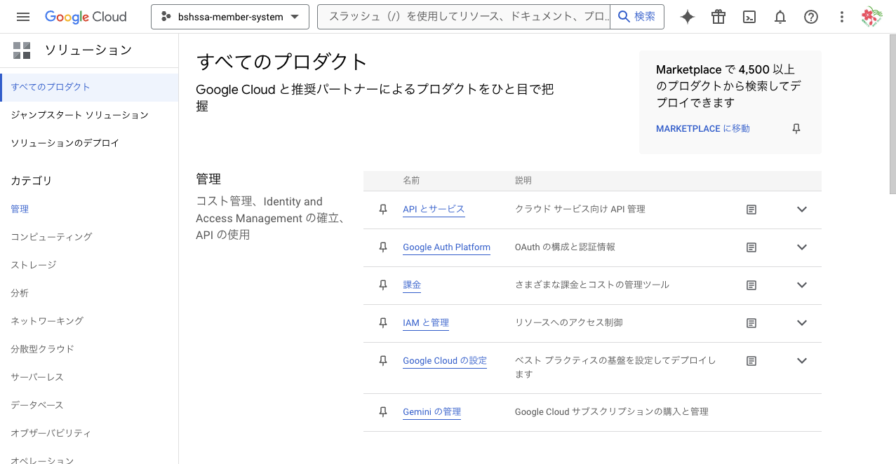

「API とサービス」を選択する

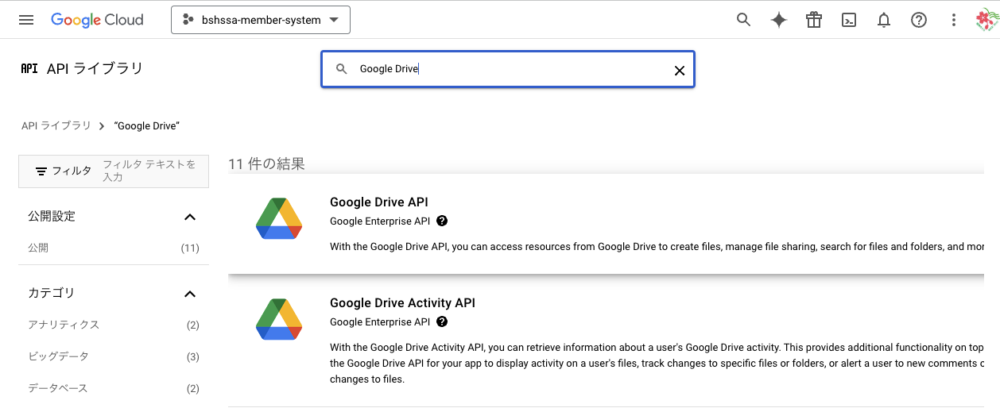

検索欄から「Google Drive」と検索し、「Google Drive API」を選択

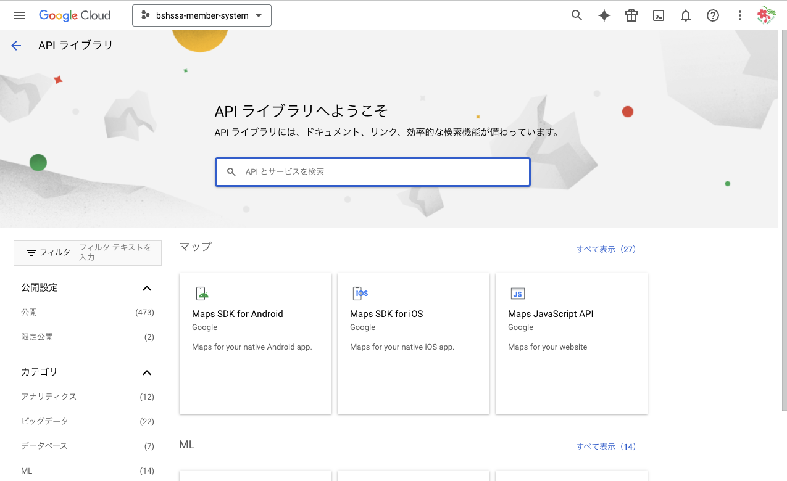

「有効にする」を押して、 API を有効化する。

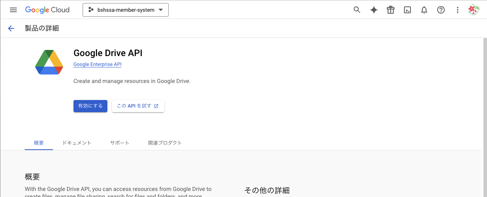

### サービスアカウントを作成する

再度、「API とサービス」の画面に戻り、上の「認証情報を作成」>「サービスアカウント」を選択。

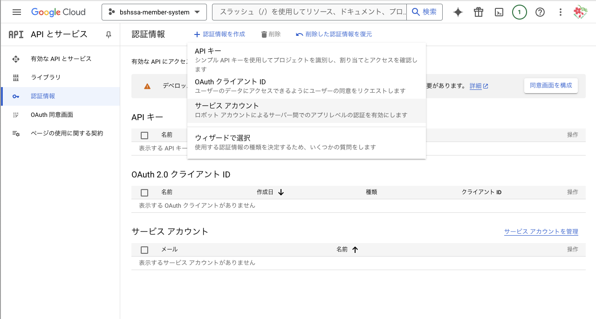

内容を適当に埋めていく。

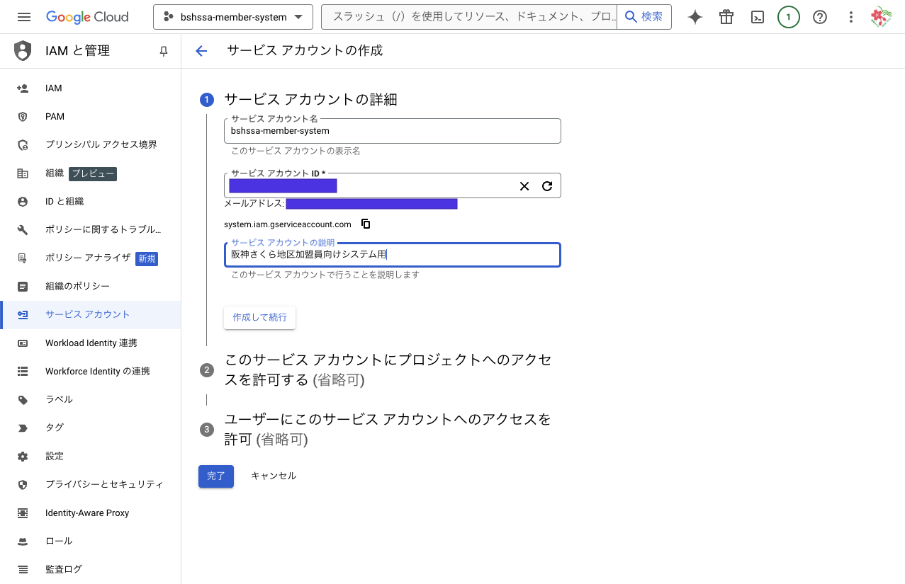

「ロールを選択」から「基本」>「編集者」を選択

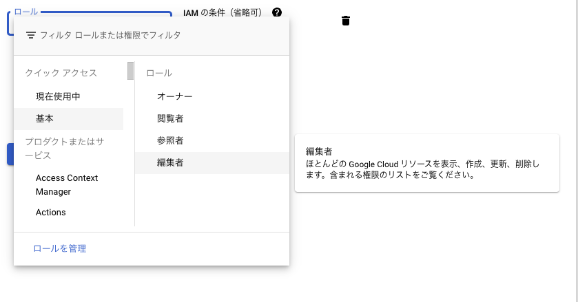

最後に「完了」を押してサービスアカウントの作成を完了する。

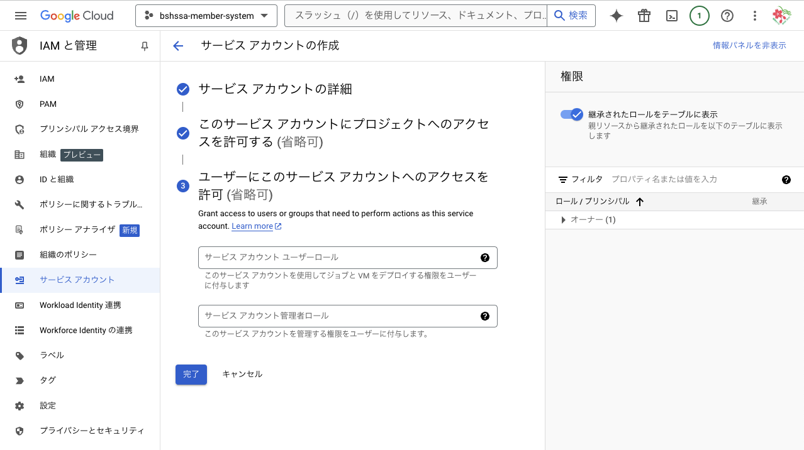

### 秘密鍵生成

再度、「API とサービス」の画面に戻り、「認証情報」を選択。先ほど作成したサービスアカウントを選択する。

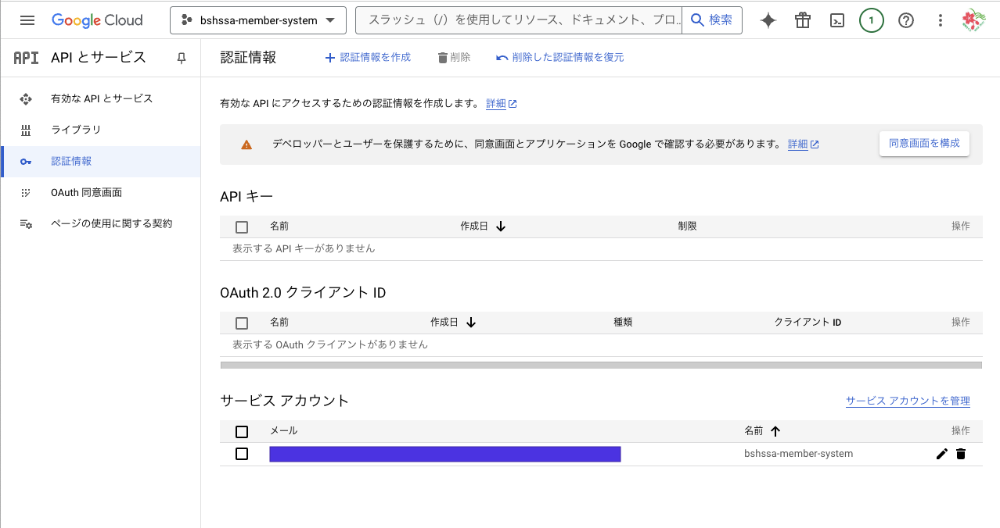

「鍵」のタブを選択し、「キーを追加」を選択。

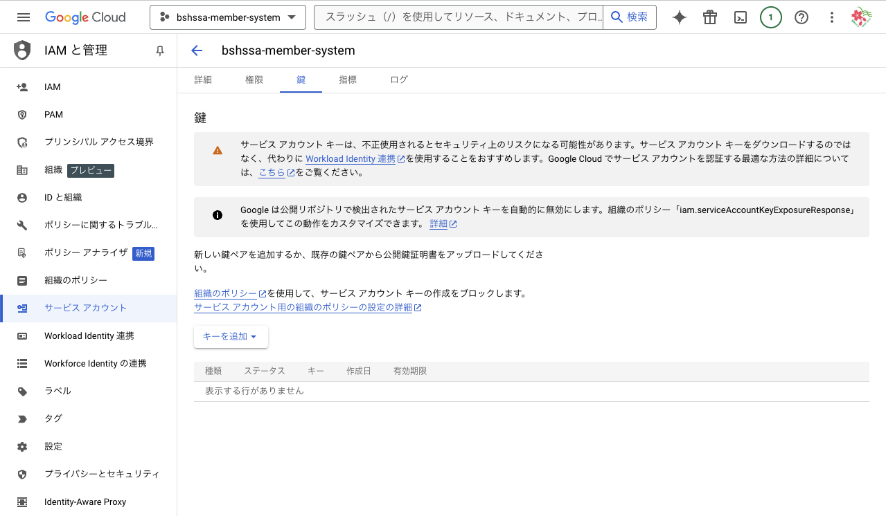

秘密鍵は JSON のものを選択して作成する。

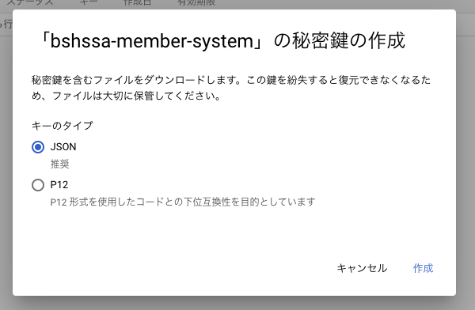

JSON がダウンロードされたら、`client_email:` の後に記述されているメールアドレスをコピーしておく。

Google Drive の画面に行き、サービスアカウントで利用したいフォルダを選択し、「共有」を押す。

先ほど作成したメールアドレスを編集者として追加して共有する。

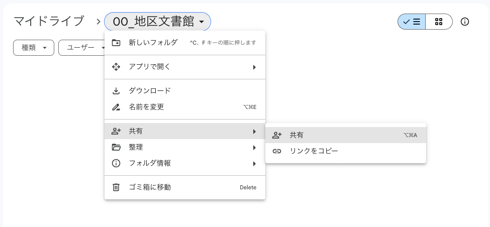
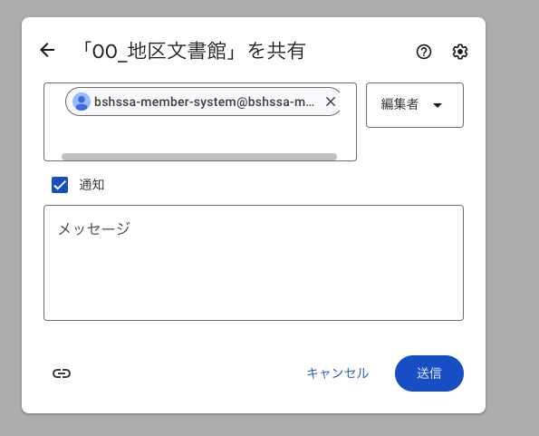
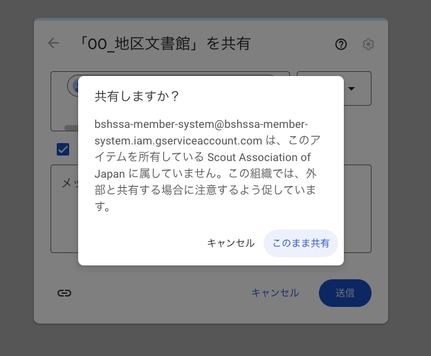

これで、 JSON に書かれた秘密鍵をリヨすいて、先ほど共有設定をしたフォルダを操作することができるようになる。

## Google Drive を操作する

## 参考資料

- [Google Cloud プロジェクトを作成する  |  Google Workspace  |  Google for Developers](https://developers.google.com/workspace/guides/create-project?hl=ja)
- [Python のクイックスタート  |  Google Drive  |  Google for Developers](https://developers.google.com/drive/api/quickstart/python?hl=ja)
- [GoogleDrive のファイル操作（アップロード／ダウンロード）を自動化する #Python - Qiita](https://qiita.com/saurus12/items/b4c851211d768a0f1212)
- [\[Python\] Googleドライブ上のファイルをダウンロードする｜こはた](https://note.com/kohaku935/n/nd7e984e8676c)
- [\[Python\] Googleドライブにファイルをアップロードする｜こはた](https://note.com/kohaku935/n/n99779e59561b)
- [PythonからGoogleDriveにファイルをアップロード #PyDrive2 - Qiita](https://qiita.com/sey323/items/875c0ab1585044772ab2)

### x. Markdown CheetSheet

#### Text Format

_Italic（斜体）_
*Italic（斜体）*

__Emphasis（強調）__
**Emphasis（強調）**

~~Strikethrough（取り消し線）~~

これは詳細表示の例です。
詳細をこっちに書きます。

This is `inline`.

### List
* text
    * test
    * test

- text
    - test
    - test

1. text
1. test
    1. test

#### Horizontal rules
* * *
***
*****
- - -
---------------------------------------

#### Blockquotes（引用）
> This is Blockquotes

#### Links（参照）
[yonehub blog](https://yonehub.y10e.com/)

#### Images（画像）

#### Tables（表）
| id     | name    | date       |
| ------ | ------- | ---------- |
| 1      | test    | 2019-01-01 |
| 2      | test    | 2019-01-02 |
| 3      | test    | 2019-01-03 |
