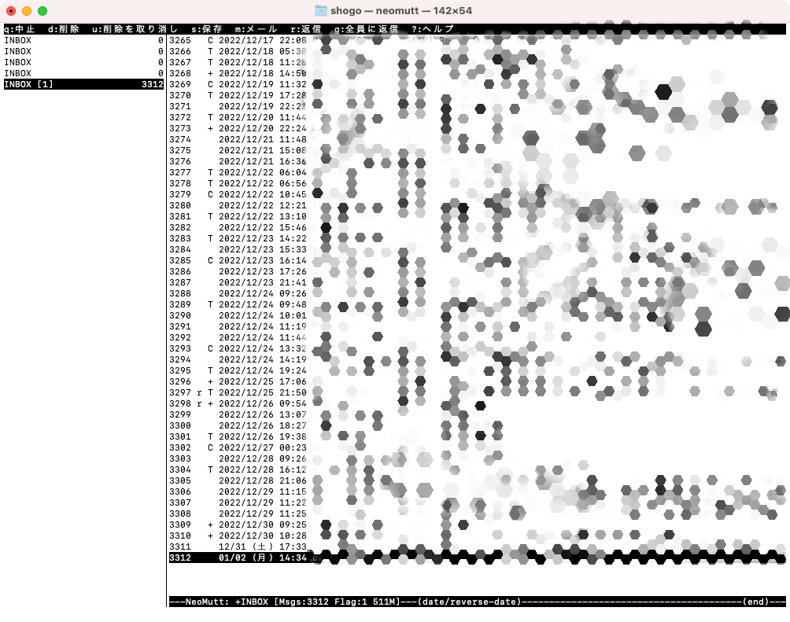

[メールのやりとりをシンプルに。メール専用アプリへの“回帰”のすすめ](https://wired.jp/article/email-clients-are-bad-so-use-vivaldi-mail/) という記事を読んでターミナルで動作するメーラー [NeoMutt](https://neomutt.org/) の存在を知りました。  
ひとまず、メールが読めるようになるまでの設定を行いました。

## NeoMutt とは

-   NeoMutt はターミナル上で動作するメーラーです。MUA（Mail User Agent）に分類されるソフトウェアです。
-   メールに関わるサブシステム MxA については [mutt + notmuch でコマンドラインメール送受信環境を構築する(Mac OS X編)](https://blog.tai2.net/mutt-and-notmuch.html#mxa) が詳しいです。

## 必要なソフトのインストール

```
$ brew install neomutt w3m gnupg
```

本筋とは異なりますが、パスワードを書き込んだファイルを削除するためのコマンドを利用するために以下もインストール：

```
$ brew install coreutils
```

## 設定手順

### ディレクトリの作成

以下の3つのディレクトリを作成ししておきます：

-   メールヘッダ用のキャッシュディレクトリ: `~/.mutt/cache/headers/`
-   メール本文用のキャッシュディレクトリ: `~/.mutt/cache/bodies/`
-   CA証明書を格納するディレクトリ: `~/.mutt/certificates/`

### パスワードファイルの作成

メールのパスワード設定を設定ファイルに直接書き込むわけにはいかないので、暗号化しておきます。  
平文でパスワードを passwds ファイル（ファイル名は任意）に記載します：

```
$ mkdir -p ~/.config/neomutt/
$ touch ~/.config/neomutt/passwds
```

passwd ファイルの中身は以下のような感じです：

```
set imap_pass="パスワードを記載"
set smtp_pass="パスワードを記載"
```

Gmail を利用する場合は、[こちらの記事](https://support.google.com/accounts/answer/185833?hl=ja)を参考に作成した**アプリパスワードを利用**します。

### 暗号化のための鍵の作成

gpg コマンドを利用して、上記パスワードファイルを暗号化するための鍵を作成します。

-   鍵の名前は適当に見分けがつくものをつけておきます（「本名」とありますが、本名でなくて良いです）。
-   メールアドレスも適当に入力してOKです（実際に設定するメールアドレスでなくても良いです）。
-   パスフレーズの入力を求められます。入力した場合は、 neomutt のセッションごとの初回起動時にパスフレーズの入力を求められるようになります。省略することも可能です。

```
$ gpg --gen-key
gpg (GnuPG) 2.3.8; Copyright (C) 2021 Free Software Foundation, Inc.
This is free software: you are free to change and redistribute it.
There is NO WARRANTY, to the extent permitted by law.

注意: 全機能の鍵生成には "gpg --full-generate-key" を使います。

GnuPGはあなたの鍵を識別するためにユーザIDを構成する必要があります。

本名: [ユーザーID]
電子メール・アドレス: [メールアドレス（適当に）]
次のユーザIDを選択しました:
    "[ユーザーID] <[メールアドレス]>"

名前(N)、電子メール(E)の変更、またはOK(O)か終了(Q)? o
たくさんのランダム・バイトの生成が必要です。キーボードを打つ、マウスを動か
す、ディスクにアクセスするなどの他の操作を素数生成の間に行うことで、乱数生
成器に十分なエントロピーを供給する機会を与えることができます。
たくさんのランダム・バイトの生成が必要です。キーボードを打つ、マウスを動か
す、ディスクにアクセスするなどの他の操作を素数生成の間に行うことで、乱数生
成器に十分なエントロピーを供給する機会を与えることができます。
gpg: 失効証明書を '/Users/[ユーザー名]/.gnupg/openpgp-revocs.d/XXXXXXXXXXXXXXXXXXXXXXXX.rev' に保管しました。
公開鍵と秘密鍵を作成し、署名しました。

pub   ed25519 202x-xx-xx [SC] [有効期限: 202x-0x-0x]
      84E05B17D857C0081B27A73D3E9FB07D995CDF94
uid                     [ユーザーID] <[メールアドレス]>
sub   cv25519 202x-xx-xx [E] [有効期限: 202x-xx-xx]
```

### 鍵を利用してパスワードファイルを暗号化

以下のコマンドを実行します。「ユーザーID」は上記で作成した鍵のユーザーIDを利用します。

```
$ gpg -r [ユーザーID] -e ~/.config/neomutt/passwds
gpg: 信用データベースの検査
gpg: marginals needed: 3  completes needed: 1  trust model: pgp
gpg: 深さ: 0  有効性:  11  署名:   0  信用: 0-, 0q, 0n, 0m, 0f, 11u
gpg: 次回の信用データベース検査は、202x-xx-xxです
```

暗号化されたファイルが作成されていることを確認します（ `passwds.gpg` が暗号化されたファイル）：

```
$ ls ~/.config/neomutt/
neomuttrc  passwds  passwds.gpg
```

平文でパスワードが記載された passwds は不要なので、以下のコマンドでランダム文字列にを書き込んでから削除する（gshred コマンドは coreutils を入れると付いてきます）：

```
$ gshred -u ~/.config/neomutt/passwds
```

### NeoMutt の設定ファイルを作成

NeoMutt の設定ファイルを以下のような構成にします。今回は、複数アカウント（アカウント1は Gmail, アカウント2は一般のメールアドレスとします）の設定をします：

```
~/.config
`-- neomutt
    |-- neomuttrc                       # NeoMutt 全体の設定
    |-- account1                         # アカウント1（Gmail）固有の設定を記述するファイル
    |-- account1_passwds.gpg    # アカウント1のパスワードファイル（暗号化済み）
    |-- account2                         # アカウント2（一般）固有の設定を記述するファイル
    `-- account2_passwds.gpg    # アカウント2のパスワードファイル（暗号化済み）
```

#### 全体の設定内容（`~/.config/neomutt/neomuttrc` ）

```
########################
#   メーラー基本設定   #
########################
# サイドバーの表示
set sidebar_visible  = yes

# サイドバーの書式
set sidebar_format = "%B%?F? [%F]?%* %?N?%N/?%S"

# 定期的にメールの状態をチェック
set mail_check_stats

# 日付の降順でメール一覧を表示
set sort_aux = reverse-date

# メールのFromヘッダを自動生成ON
set use_from = yes

# メールを書く時のエディタ
# 環境変数EDITORに従う場合、`echo \$EDITOR`と記載
set editor = "nvim"

# Terminal(およびメール送信時)で使用する文字コード
set charset = "utf-8"

# 文字コード指定がない場合のため、優先順位を設定
set assumed_charset = "utf-8:iso-2022-jp:euc-jp:shift_jis"
set attach_charset = "utf-8:iso-2022-jp:euc-jp:shift_jis"

# メールの保存形式の指定
# mbox=複数のメッセージが連結した形式で保存
# maildir=mail1通がファイル1個
set mbox_type = "maildir"

# CAの証明書の格納先(接続先の認証ファイル)
set certificate_file = "~/.mutt/certificates"

# mailcapには、w3mを使ってHTMLメールを読む設定を記載
set mailcap_path = "~/.mutt/mailcap"
auto_view text/html
set new_mail_command="notify-send --icon='/usr/share/icons/hicolor/48x48/apps/neomutt.png' 'New Email' '%n new messages, %u unread.' &"

# インデックスフォーマット デフォルト"%4C %Z %{%b %d} %-15.15L (%?l?%4l&%4c?) %s"
set index_format="%4C %Z %<[y?%<[d?%[%H:%M           ]&%[%m/%d (%a) %H:%M]>&%[%Y/%m/%d %H:%M]> %-15.15L (%?l?%4l&%4c?) %s"

##############################################################
# キャッシュ設定(キャッシュ先ディレクトリを事前に作成する事) #
##############################################################
set header_cache = "~/.mutt/cache/headers" # headerキャッシュのPATHを指定
set message_cachedir = "~/.mutt/cache/bodies" # IMAP経由で受信したメッセージのキャッシュPATHを指定

##############################################################
# アカウント別設定
##############################################################

# ---
# アカウント1の設定
source "~/.config/neomutt/account1"
# Here we use the $folder variable that has just been set in the sourced file.
# We must set it right now otherwise the 'folder' variable will change in the next sourced file.
folder-hook $folder 'source ~/.neomutt/account1'

# ---
# アカウント2の設定
source "~/.config/neomutt/account2"
folder-hook account2/ 'source ~/.neomutt/account2'
```

#### アカウント1の設定内容（`~/.config/neomutt/account1`）

```
source "gpg -d ~/.config/neomutt/account1_passwds.gpg |" # 暗号化したパスワードを読み込み

## Receive options.
set imap_user = "hoge@gmail.com"      # 受信設定(IMAP=メールをサーバ管理)
set folder    = "imaps://hoge@gmail.com@imap.gmail.com:993"    # 受信メールの読み込み先(993番ポート=SSL対応)
set spoolfile = "+INBOX"
mailboxes     = "+INBOX"
set postponed = "+Drafts"
unset record

## Send options.
set smtp_url  = "smtps://hoge@gmail.com@smtp.gmail.com:465"
set realname  = "hoge"
set from      = "hoge@gmail.com"
set hostname  = "gmail.com"
set signature = "[署名]"

# Connection options
set ssl_starttls      = yes # 受送信メールサーバまでの通信を暗号化
set ssl_force_tls     = yes # SSLを次世代規格のTLSに強制的に変更

## Hook -- IMPORTANT!
account-hook $folder "set imap_user=hoge@gmail.com"
```

#### アカウント2の設定内容（`~/.config/neomutt/account2`）

```
source "gpg -d ~/.config/neomutt/account2_passwds.gpg |" # 暗号化したパスワードを読み込み

my_hdr From: [表示名] <[メールアドレス]>

## Receive options.
set imap_user = "[メールサーバーのユーザー名]"                             # 受信設定(IMAP=メールをサーバ管理)
set folder    = "imaps://[メールサーバーのアドレス]:993"  # 受信メールの読み込み先(993番ポート=SSL対応)
set spoolfile = "+INBOX"
mailboxes     = "+INBOX"
set postponed = "+Drafts"
set record    = "+Sent"

## Send options.
set smtp_url  = "smtps://[メールサーバーのアドレス]:587"
set realname  = "[本名]"
set from      = "[メールアドレス]"
set hostname  = "[ホスト名]"
set signature = "[署名]"

# Connection options
set ssl_starttls      = yes # 受送信メールサーバまでの通信を暗号化
set ssl_force_tls     = yes # SSLを次世代規格のTLSに強制的に変更

## Hook -- IMPORTANT!
account-hook $folder "set imap_user=[メールサーバーのユーザー名]"
```

-   メールサーバーのドメインはレンタルサーバー会社によって異なりますので、各自で確認して設定してください。
    -   私が利用しているレンタルサーバーで独自ドメインを設定している場合は `[ユーザー名]@[独自ドメイン]@[レンタルサーバーの初期ドメイン]` のようになりました。
-   メールサーバーのユーザー名もレンタルサーバー会社によって異なりますので、各自で確認して設定してください。

## 起動

ここまで設定できたら、 `neomutt` コマンドでメーラーが起動できます。  
初回起動時はキャッシュの取得のため起動に時間がかかります。  
`c ?` でアカウントの切り替えが可能です。  
基本的な操作については割愛します。  



## 課題

メールの受信・削除などはできますが、メールの送信をすると文字コードの設定がうまくいっておらず、受信側で文字化けしてしまいますので、今後修正したいと思います。

## 参考資料

-   [端末(ターミナル)で動くメーラーNeoMuttを使ってみる](https://debimate.jp/2019/06/01/%E7%92%B0%E5%A2%83%E6%A7%8B%E7%AF%89%EF%BC%9Aterminalcli%E5%90%91%E3%81%91%E3%83%A1%E3%83%BC%E3%83%A9%E3%83%BCneomutt%E3%81%A7gmail%E3%82%92%E9%80%81%E5%8F%97%E4%BF%A1%E3%81%99%E3%82%8B%E3%81%9F/)
    -   基本的な設定方法（特にパスワード設定方法）を参考にしました。
-   [mutt + notmuch でコマンドラインメール送受信環境を構築する(Mac OS X編)](https://blog.tai2.net/mutt-and-notmuch.html#mxa)
    -   mutt の概要や考え方について参考にしました。
-   [環境構築：Terminal(CLI)向けメーラー”Neomutt”でGmailを送受信するための設定](https://debimate.jp/2019/06/01/%E7%92%B0%E5%A2%83%E6%A7%8B%E7%AF%89%EF%BC%9Aterminalcli%E5%90%91%E3%81%91%E3%83%A1%E3%83%BC%E3%83%A9%E3%83%BCneomutt%E3%81%A7gmail%E3%82%92%E9%80%81%E5%8F%97%E4%BF%A1%E3%81%99%E3%82%8B%E3%81%9F/)
    -   設定ファイルの内容について大いに参考にしました。
-   [Mutt - Arch Linux Wiki](https://wiki.archlinux.jp/index.php/Mutt)
    -   設定や操作方法について参考にしました。