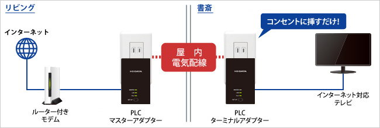

家の光コンセントが私の部屋から遠い場所にあるので、ONU兼Wi-FIルーターからの距離が遠く、電波が弱かったので、中継機を使って自室に電波を飛ばしていました。  
  
しかし、それでもネットへの接続が不安定になることがしばしばあり、テレワークでビデオ会議をしてたら落ちてしまったり、諸々の作業がネット不安定の為止まってしまったりと、若干仕事に支障をきたしていました。  
  
そこで、会社の同僚から紹介してもらった **PLC** (Power Line Communication, 電力線搬送通信)を使って部屋のネット環境の改善を図りました。  

## そもそも PLC って？

  
要は、電気配線を使ってデータ通信ができるという技術。LANケーブルを這わせることなく、安定したネットワーク通信を実現可能。私の部屋のように無線 LAN が届きにくい場所や LAN ケーブルをONU/モデムから引っ張ってくるのが難しい場所に有効です。  

※図はアイ・オー・データのHPより。  
  
ただし、家の中で分電盤が分かれていると電波が大きく減衰してしまったり、他の電気機器の稼働状況によっては通信速度が低下してしまうこともあるとのこと。  

## とりあえず、やってみた

  
とは言え・・・買ってみて実際に繋げてみないことにはわからない、ということで、以下の製品を購入↓  
  
  
[製品ページ](https://www.iodata.jp/product/lan/plcadapter/plc-hd240er/)  
  
アイ・オー・データのこの製品は、万が一 PLC ネットワーク接続ができなかった場合、購入代金を返金してくれる「ペイバックシステム」があるので、ダメなら返金してもらえば良いか、という気持ちで購入しました。あとは（家で有線接続なんてするの初めてなので）LAN ケーブルを何本か。  
  
届いたらまず、ONU兼WI-Fiルーターと PLC のマスターを LAN ケーブルで接続。そして、コンセントに直挿し。次に、自室のコンセントにターミナルを挿して、LAN ケーブルを PC の近くまで伸ばす。  

  
今は Mac mini だけしかつないでないけど、成功したら MacBook Pro にも繋ぐつもりやったので、スイッチングハブも買っておきました。ターミナルから伸ばしてきた LAN ケーブルをスイッチングハブに繋ぐ。別口からスイッチングハブと Mac mini を繋ぎます。  

  
特に難しい設定は要らず、Mac mini が無事に有線 LAN に接続できました。  

## 結果
  
Mac mini がそもそも Wi-Fi の受信能力が低いのか、 Wi-Fi で接続した場合の Google のスピードテストでは以下のような散々な結果。  
  

  
これやとホンマにネットサーフィンはなんとかできるけど、って程度（上り速度がそこそこ出てるのは謎）。  
  
で、PLC 経由で繋いだ場合のスピードテストの結果が以下：  

  
ちょっと速度が落ちるときもあるけど、概ね 10 Mbps より下がることはなく安定しています。PLC 機器自体で実施可能なスピードテストでも 20 Mbps はだいたい出ています。  
  
時々速度が落ちるのはプロバイダーのせいかな？とにかく、以前よりは安定しているのは確かなので、普段仕事で使っている MacBook Pro でも使えるように、 USB ハブを買い足しました↓  
[Anker の LAN ポート付きのハブ](https://www.ankerjapan.com/collections/usbhub/products/a8365)  
  
そこそこの出費やけど、まぁ良しとします。  

## 参考資料

-   [【知識】コンセント経由でネットにつながる「PLC」って今どうなってるの？](https://www.goodspress.jp/columns/252779/)
-   [電力線搬送通信 - Wikipedia](https://ja.wikipedia.org/wiki/%E9%9B%BB%E5%8A%9B%E7%B7%9A%E6%90%AC%E9%80%81%E9%80%9A%E4%BF%A1)