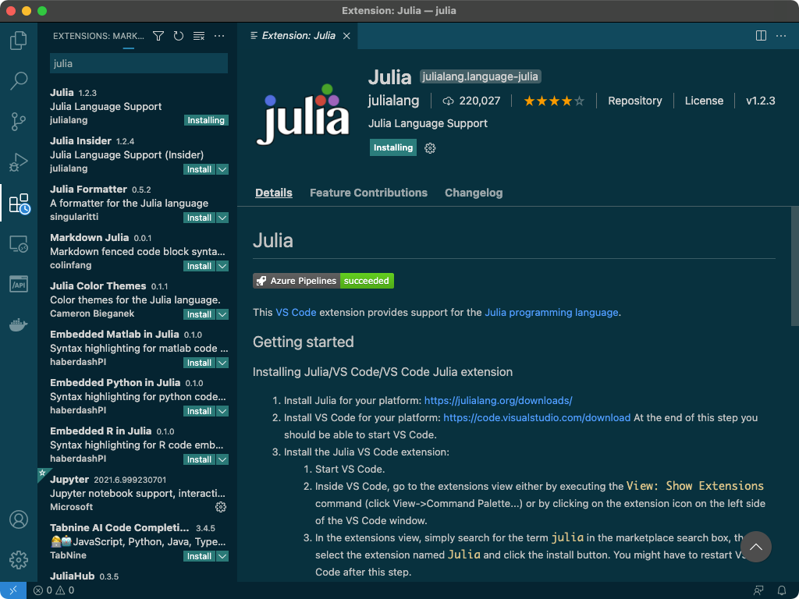
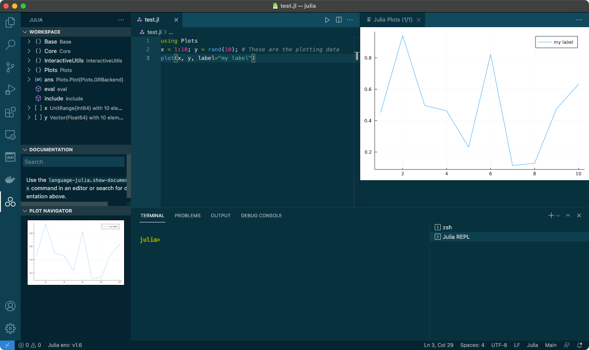

大学・大学院のときは Fortran を使って数値計算・シミュレーションをしていたのですが、最近また妙に数値計算をしたくなったので、最近流行りの Julia に入門しようという気になりました。  
まずは、 「Julia ってどんなの？」とか「何が良いの？」ということをひと通り見た後に、手元の開発環境を整えます。  

## Julia とは


-   [公式サイト](https://julialang.org/)
-   [日本語のコミュニティのサイト（Julia Tokyo）](http://julia.tokyo/)
-   Julia はマサチューセッツ工科大学の研究者 Jeff Bezanson らによって2009年に開発され、2012年にオープンソース化された言語です。
-   **数値計算やデータ解析に対応**できるように設計されて開発されました。
-   公式サイトにも挙げられている特徴をざっくり挙げてみます：
    -   高速であること
        -   Julia のプログラムは、JIT コンパイラと [LLVM](https://ja.wikipedia.org/wiki/LLVM) を介して複数のプラットフォームに対応した効率的なネイティブコードにコンパイルされる。
        -   C 言語並みに高速とのこと。
    -   動的型付け
    -   多重ディスパッチ
        -   引数の型の組み合わせに応じて関数の振る舞いを定義できる仕組み
    -   他言語との連携（これまで蓄積されたライブラリが使える）
        -   Python の関数呼び出し
        -   C 言語と Fortran のコードの呼び出し
    -   パッケージマネージャが組み込まれている

## Julia のインストール

-   どのプラットフォームであっても、[公式のダウンロードページ](https://julialang.org/downloads/) からダウンロードしてきてインストール可能です。
-   mac の場合、 Homebrew 経由でインストールできます。

```
$ brew install --cask julia
```

-   下記のようにコマンドを打って表示されればインストール成功です。
    -   REPL が立ち上がります。`command + d` または `exit()` 入力で終了します。

```
$ julia
               _
   _       _ _(_)_     |  Documentation: https://docs.julialang.org
  (_)     | (_) (_)    |
   _ _   _| |_  __ _   |  Type "?" for help, "]?" for Pkg help.
  | | | | | | |/ _` |  |
  | | |_| | | | (_| |  |  Version 1.6.1 (2021-04-23)
 _/ |\__'_|_|_|\__'_|  |  Official https://julialang.org/ release
|__/                   |

julia>
```

## VSCode での開発環境構築

-   エディタとして VSCode を利用するので、 Julia の開発環境を整えます。
-   拡張機能として [Julia for VSCode](https://www.julia-vscode.org/) があるので導入します。
    -   [こちら](https://www.julia-vscode.org/docs/stable/setup/) の内容を基にインストールします。
-   拡張機能の検索欄に「julia」と入れると一番上に出て来るのでインストールします。



-   適当に `test.jl` ファイルを作成し、「Hello world!」を出力するプログラムを記述します。

```
println("Hello World")
```

-   ファイル編集中に `Shift + Enter` を押下すると、REPL が起動し、プログラムが実行されます。


-   `Plot` を利用してグラフを描いてみます。下記のようなプログラムを作成して、`Shift + Enter` で実行します。

```
using Plots
x = 1:10; y = rand(10); # These are the plotting data 
plot(x, y, label="my label")
```

-   以下のようにグラフが表示されます。



## 参考資料

-   [VSCode で Julia-1.4 を動かすまで](https://qiita.com/Mizuto_Kadowaki/items/b95e4b7db4a1dfb59863)
-   [進藤 裕之, 佐藤 建太「1から始める Juliaプログラミング」コロナ社(2020)](https://www.coronasha.co.jp/np/isbn/9784339029055/)
-   [Juliaの速さの核心に迫る〜インタプリタ、コンパイラ、JITコンパイラ〜](https://muuumin.net/julias-speed/)