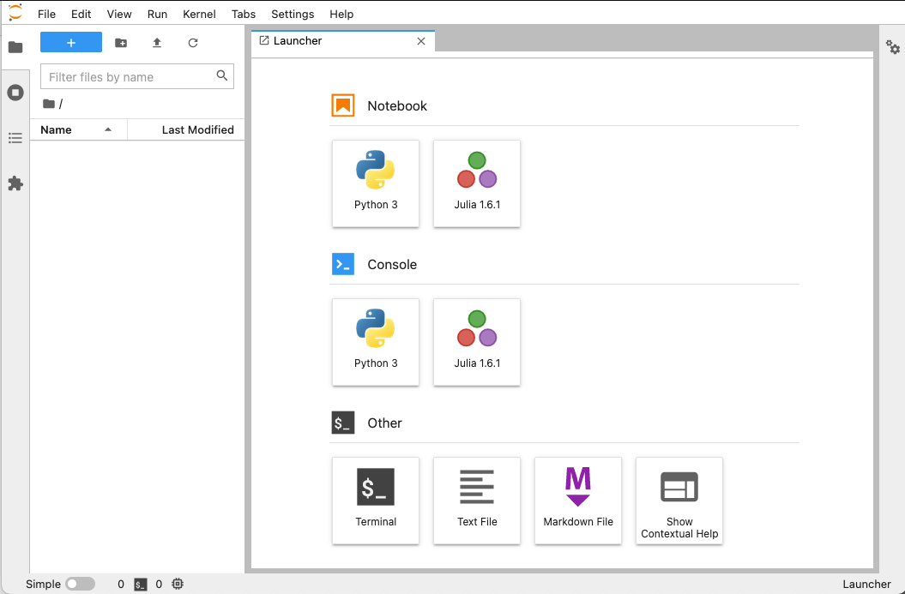
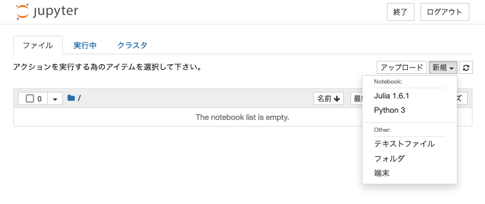
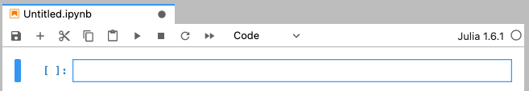
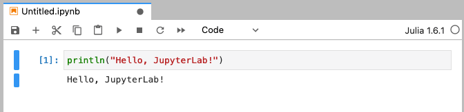
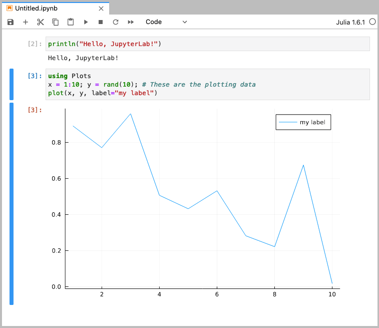
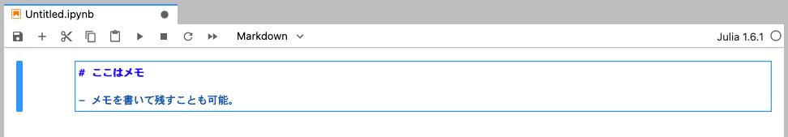
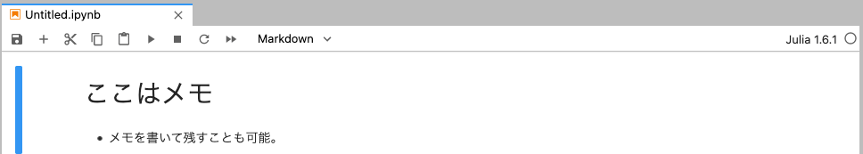
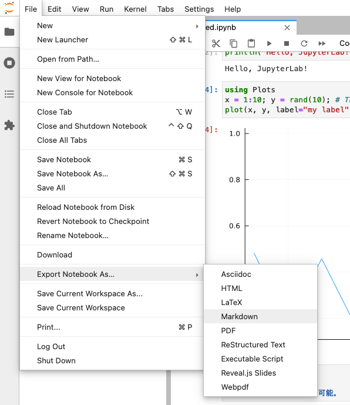

前回、Julia の導入をしましたが、Python ではおなじみの JupyterLab を導入して、Julia が使えるように設定します。  

## JupyterLab とは


-   [JupyterLab](https://github.com/jupyterlab/jupyterlab) とは、[Project Jupyter](https://jupyter.org/) の一環として開発された、ブラウザ上で動作するプログラムの対話型実行環境です。
    -   ブラウザ上で Python やその他のプログラミング言語のプログラムを実行したり、実行した結果を保存したり、共有したりすることができるツールです。
    -   データ解析等で広く使われている [Jupyter Notebook](https://github.com/jupyter/notebook) の進化版です。

## JupyterLab をインストールする

-   Julia をインストールした環境で、 JupyterLab をインストールします。
    -   よく紹介されているのは、Python が入っている前提で、`pip` を利用するかインストールする方法ですが、今回は、 Julia がインストールされていれば OK です。
    -   mac なので、 Python が標準で入ってはいますが、それがどう響いているのかは未検証です。
-   JupyterLab で Julia を利用するためには、`IJulia.jl` というパッケージを入れる必要があります。
-   Julia の REPL を起動し、直後に`]` を入力して、パッケージマネージャにいきます。
-   その後、 `add IJulia` で IJulia を入れます。

```
$ julia  # REPL 起動

julia> # ここで、 ] を入力

(@v1.6) pkg> add IJulia
... # インストールが進みます

(@v1.6) pkg> # Ctrl+C で終了
```

-   作業した場所にディレクトリを作成し、以下のコマンドを実行します。

```
julia> using IJulia
julia> jupyterlab()
```

-   ブラウザで、以下のような画面が表示されます。
    -   Julia のアイコンが出ていれば OK です。



-   （参考）旧来の Jupyter Notebook を起動したい場合は以下のようにします。

```
julia> using IJulia
julia> notebook()
```

-   右上の「新規」を押して Julia の選択肢が出ていれば OK です。



## Notebook を作成してみる

-   実際に、Notebook を作成してみます。
-   JupyterLab のランチャートップ画面から「Notebook」の下の「Julia」を選択すると、新規タブが開き `Untitled.ipynb` ファイルの編集画面が開きます。
    -   `XXXX.ipynb` ファイルは Notebook ファイルと呼ばれるものです。



-   `[ ]:` のテキストエリア（「セル」と呼ばれます）にJuliaのコードを入力し、`Ctrl + Enter`を入力すると、そのコードが評価され、結果が下に表示されます。



-   `Shift + Enter` で下にセルを追加することが出来ます。
    -   前回の記事でやったようなグラフのプロットも出来ます。



-   セルを入力状態にした上で、上の真ん中あたりのプルダウンから「Markdown」を選択すると、Markdown 形式でメモを残すことも可能です。
    -   `Shift + Enter` で評価すると、整形されます。




-   作成した Notebook は HTML, Markdown 等にエクスポートが可能です。



## 参考資料

-   [JuliaでJupyter Notebook(JupyterLab)をセットアップした](https://nnnamani.com/blog/try-using-jupyter-with-julia/)
-   [Jupyter Notebook を使ってみよう](https://pythondatascience.plavox.info/python%E3%81%AE%E9%96%8B%E7%99%BA%E7%92%B0%E5%A2%83/jupyter-notebook%E3%82%92%E4%BD%BF%E3%81%A3%E3%81%A6%E3%81%BF%E3%82%88%E3%81%86)
-   [進藤 裕之, 佐藤 建太「1から始める Juliaプログラミング」コロナ社(2020)](https://www.coronasha.co.jp/np/isbn/9784339029055/)