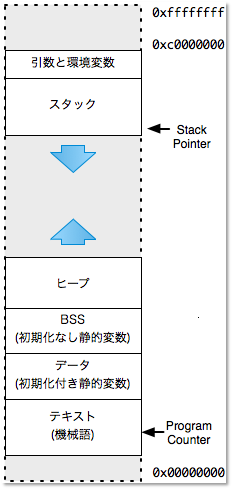
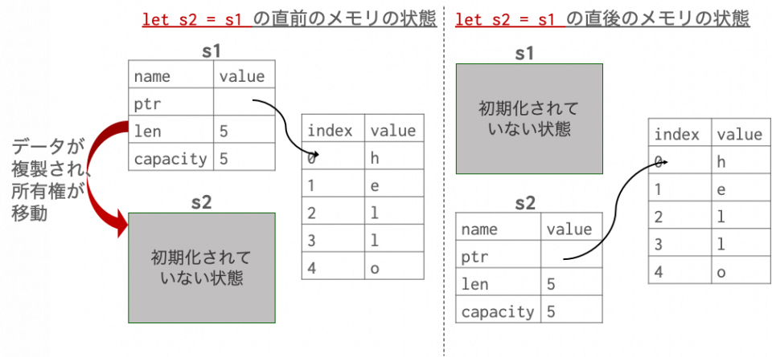
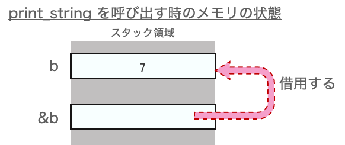
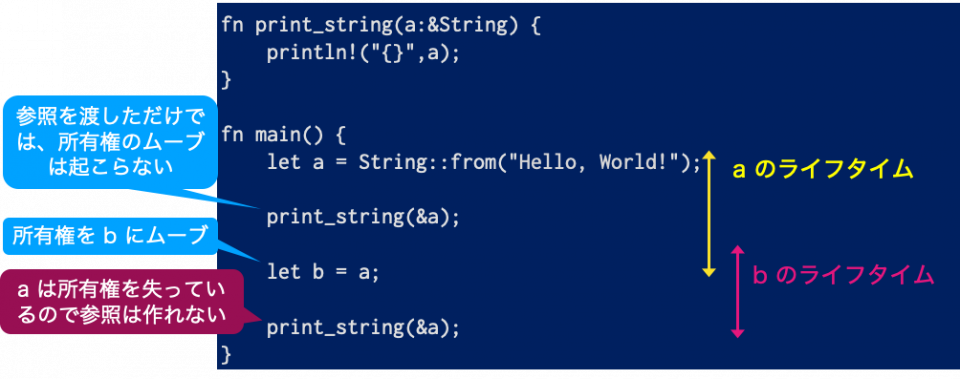

Julia を触っていたと思ったら、 Rust を勉強しています。[The Book](https://doc.rust-jp.rs/book-ja/) をザーッとやったものの、 Rust のメモリ管理に関してすぐには理解できなかったので、いろいろな資料を見ながらじっくり勉強したのでまとめてみます。  

## Rust はどんな言語？（ざっくり）

-   [公式サイト](https://www.rust-lang.org/ja/)
-   （私が愛用している）Firefox の開発元である Mozzila が中心となってオープンソースで開発されている汎用プログラミング言語
-   2015年に安定版であるバージョン 1.0 が公開
-   Rust は英語で「錆」という意味
-   Rust はメモリ安全性と卓越した実行性能を重視する一方で、GCや軽量スレッドなどの複雑なランタイムを持たない言語
-   非公式マスコットキャラクターは[フェリス（Ferris）](https://rustacean.net/)


## Rust の強み

公式サイトには以下のように掲載されています：  


「パフォーマンス」と「信頼性」のところに記載がある通り、メモリ管理の方法に特徴があり、強みとされています。が、これがなかなか理解しにくい点であります。  

## メモリ管理のお話　

Rust のメモリ管理の話をする前に、プログラミング言語におけるメモリ管理について述べます。

### スタックとヒープ



※図は [http://www.coins.tsukuba.ac.jp/~yas/coins/os2-2010/2011-01-25/](http://www.coins.tsukuba.ac.jp/~yas/coins/os2-2010/2011-01-25/) より。

-   スタック
    -   一時データ（ローカル変数、関数からの戻り先、引数等）を保持する
    -   コンパイラが勝手にスタックの操作部分を生成：実装者は意識しない
-   ヒープ
    -   明示的に開放するまで使い続けられるメモリ領域
    -   領域管理にはそこそこコストがかかる

### そもそも・・・「メモリ管理」って何をするの？

-   メモリリソースの生存期間を****適切に**こと
    -   必要なとき/なる前に、プログラムに割り当てる
    -   不要になったとき/なる前に、プログラムから解放する
-   特に、**「いつヒープ領域のメモリを解放するか」**が問題
    -   手動で解放（C言語）
    -   使われなくなったメモリ領域を自動で解放（Java, Go 等）

### メモリ管理が不適切だったら何が起こるのか

-   **メモリリーク**
    -   メモリ解放処理の入れ忘れにより、ヒープ領域を使い切ってしまう
-   **ダングリングポインタの参照** 
    -   解放済みだったり、他のことに使われている領域へのアクセス
    -   未定義動作、クラッシュ、脆弱性の原因
-   **解放済みのメモリ領域を誤ってもう一度解放**しまう
    -   未定義動作、クラッシュ、脆弱性の原因

## Rust 以前のメモリ管理

Rust 以前のプログラミング言語ではどのようにメモリ管理を行っていたのか整理します。  
※本項のコード例は C++

### 大域変数（グローバル変数）、静的変数（static 変数）

-   大域変数
    -   プログラムの実行中、ずっと生存し続ける
    -   メモリ領域確保のタイミングは、プログラム開始直後
    -   メモリ解放のタイミングは、プログラム終了直前

```
std::string answer = “42”

const std::string &calculate(void) {
  return answer;
}
```

-   静的変数
    -   大域変数との違いは、メモリ領域確保のタイミング：変数定義のコードに最初に実行が到達したとき

```
const std::string &calculate(void) {
  static std::string answer = “42”
  return answer;
}
```

-   利点
    -   挙動が想像しやすい
    -   実行時のコストが低い
    -   作ったポインタや参照が無効になってしまう恐れがない
-   欠点
    -   使わなくてもメモリ領域を専有する
    -   確保するサイズが固定

### 自動変数

-   static ではないローカル変数や関数の引数
-   定義された場所が実行された時点で変数が誕生
-   スコープを抜けると消滅

```
void foo(void) {
  // まだ ans は存在しない
  {
    // ここで ans 誕生
    int ans = 42;
    printf(“%d\n”, ans);
  }
  // ブロックを抜けると ans 消滅
}
```

-   利点
    -   単純
    -   使わなくなったリソースがメモリ領域を専有しない
    -   スタックを使うため、実行時コストが安い
-   欠点
    -   リソースの延命が出来ず、ダングリングポインタを発生させる可能性がある
    -   ダングリングポインタを発生させるコード例：ローカル変数を呼び出し元に返している

```
 const BigStruct &calculate(void) {
   BigStruct result;
   …
   return result
 }
```

### 動的確保（手動）

-   リソース確保と開放のタイミングを手動で好きな時点に指定
-   C言語の場合は `malloc` でメモリ確保、`free` でメモリ解放

```
// 文字列を新規メモリ領域に複製する
char *strdup(const char *src) { 
   size_t len = strlen(src); 
   char *dest = malloc((len + 1) * sizeof( char));   
   strncpy(dest, src, len + 1); 

   return dest; 
} 

int main(void) { 
   char *buf = strdup("hello"); 
   printf("%s\n", buf);
   free(buf);

   return 0;
}
```

-   利点
    -   ブロックなどにとらわれず、必要になった時点でメモリリソースを確保でき、不要になったときに解放できる
-   欠点
    -   リソースの開放を忘れるとメモリリークになる
    -   多重に解放すると深刻なバグとなる
    -   解放のタイミングを決めるのが難しいときがある
    -   ヒープを利用するので、実行時コストがかかる

### スマートポインタ

-   メモリ管理機能（特に参照先のメモリリソースの自動開放機能）を持つポインタ
-   自身が破棄されるときに、デストラクタ内でリソース解放の必要性を判断する
-   リソース解放用の情報を持つ

```
#include <cassert>
#include <memory>
using std::shared_ptr; 

void foo(void) { 
 shared_ptr<int> a = std::make_shared<int>(42); 
 assert(*a == 42); 

 shared_ptr<int> b = a;
 assert(*b == 42); 
 a.reset(); 
 assert(a.get() == nullptr); 

 assert(*b == 42); 
 //ブロック末尾でbが破棄される 
 //最後のスマートポインタのため、当該リソースを解放する
}
```

-   利点
    -   メモリリークの可能性が低い
    -   リソースが必要な間はずっと生存させられる
    -   リソース開放のタイミングを指定せずに済む：解放忘れや多重解放の心配がない
-   欠点
    -   生ポインタではなく、特別なポイント型を使用する
    -   特殊な状況下（循環参照など）ではメモリリークの可能性あり
    -   ヒープを利用するので、実行時コストがかかる

### ガベージコレクション（GC）

-   ガベージコレクタが変数から（直接または間接的に）参照されているリソースと孤立してしまったリソースを自動で区別し、孤立したリソースを自動で開放する（=トレーシングGC）
-   Java や Python, Ruby では言語機能として GC を実装している
-   変数は基本的にスマートポインタ（ような存在）
-   利点
    -   メモリリークの心配がほとんどない
    -   特別な参照型を使う必要がない
-   欠点
    -   ヒープを利用する。
    -   実行時コストが高い。
    -   負荷の見積もり、予測が難しい。
    -   プログラム外のガベージコレクタが必要。

### Rust 以前のメモリ管理手法の特徴

-   Rust 以前のメモリ管理手法では、**ポインタや参照は、基本的に自由な生存期間を持つ**
    -   オブジェクトへの参照は、ユーザーが「そのオブジェクトを必要としている」という意思表示とみなす
-   **参照先のメモリリソースの生存期間をどのように適切に調整するか**いう観点
    -   可能なら、自動的に調整する

## Rust のメモリ管理

上記を踏まえて、 Rust のメモリ管理方法について述べます。  
※本項のソースコード例は全て Rust  
※Playground のリンク先で実際に動作させることが可能

## 基本的な考え方

-   これまでのプログラミング言語とは発送を逆転させ、参照先の生存期間ではなく、<mark>参照自体の寿命</mark>を調整する
-   **参照の生存期間が参照先リソースよりも長くなることを認めない**（コンパイルエラーとする）という方針
    -   寿命制限付きの参照
-   ポインタを使って値にアクセスすることは基本的にない

### 所有権（ownership）

-   Rust のメモリ管理における最重要概念
-   Rust における値には**唯一の所有者**（owner）が存在
    -   変数に値を代入すると、その変数が値の所有者
    -   同じ値に対して複数の所有者は存在できない
-   所有者である変数のスコープが終了すると、その値は解放される

```
fn main() {
   {
       let a = String::from("hello");
   }
   // ここで a にはアクセス不能に。
   // a の持っていた値は解放される

   println!("{}", a);   // コンパイルエラー
}
```

[Playgroundで実行](https://play.rust-lang.org/?version=stable&mode=debug&edition=2018&code=fn%20main()%20%7B%0A%20%20%20%20%7B%0A%20%20%20%20%20%20%20%20let%20a%20%3D%20String%3A%3Afrom(%22hello%22)%3B%0A%20%20%20%20%7D%0A%20%20%20%20%2F%2F%20%E3%81%93%E3%81%93%E3%81%A7%20a%20%E3%81%AB%E3%81%AF%E3%82%A2%E3%82%AF%E3%82%BB%E3%82%B9%E4%B8%8D%E8%83%BD%E3%81%AB%E3%80%82%0A%20%20%20%20%2F%2F%20a%20%E3%81%AE%E6%8C%81%E3%81%A3%E3%81%A6%E3%81%84%E3%81%9F%E5%80%A4%E3%81%AF%E8%A7%A3%E6%94%BE%E3%81%95%E3%82%8C%E3%82%8B%0A%0A%20%20%20%20println!(%22%7B%7D%22%2C%20a)%3B%09%2F%2F%20%E3%82%B3%E3%83%B3%E3%83%91%E3%82%A4%E3%83%AB%E3%82%A8%E3%83%A9%E3%83%BC%0A%7D%0A)

-   所有権を渡す（**ムーブする）**ことも可能
    -   その場合、もともとの変数は所有権を失うため、使えなくなる
    -   以下は、値の所有権が異なる所有者の間でムーブされる振る舞い=「ムーブセマンティクス」

```
fn main() {
   let s1 = String::from("hello");
   let s2 = s1;

   println!("{}, world!", s1);
}
```

[Playgroundで実行](https://play.rust-lang.org/?version=stable&mode=debug&edition=2018&code=fn%20main()%20%7B%0A%20%20%20%20let%20s1%20%3D%20String%3A%3Afrom(%22hello%22)%3B%0A%20%20%20%20let%20s2%20%3D%20s1%3B%0A%0A%20%20%20%20println!(%22%7B%7D%2C%20world!%22%2C%20s1)%3B%0A%7D%0A)

-   上記で起こっていることを図示すると以下の通り：



### 所有権と関数

-   **関数に変数を渡すと、代入のように所有権はムーブされる**  
    -   戻り値を渡すことでも所有権はムーブされる
-   以下、上記の規則のためめんどくさくなっている例
    -   文字数をカウントする関数（`calculate_length`）に渡した引数を後の処理でも使用したい
    -   関数の引数に渡してしまうと、所有権を失うので、後の処理で使えない
    -   所有権を取り戻すために、`calculate_length` の戻り値で長さのみならず、引数で渡した文字列も返してもらう。
    -   `(xxx, yyy)` はタプル。

```
fn main() {
   let s1 = String::from("hello");
   let (s2, len) = calculate_length(s1);
   //'{}'の長さは、{}です
   println!("The length of '{}' is {}.", s2, len); 
} 

fn calculate_length(s: String) -> (String, usize) { 
   let length = s.len(); 
   (s, length) 
}
```

[Playgroundで実行](https://play.rust-lang.org/?version=stable&mode=debug&edition=2018&code=fn%20main()%20%7B%0A%20%20%20%20let%20s1%20%3D%20String%3A%3Afrom(%22hello%22)%3B%0A%20%20%20%20let%20(s2%2C%20len)%20%3D%20calculatelength(s1)%3B%0A%20%20%20%20%2F%2F'%7B%7D'%E3%81%AE%E9%95%B7%E3%81%95%E3%81%AF%E3%80%81%7B%7D%E3%81%A7%E3%81%99%0A%20%20%20%20println!(%22The%20length%20of%20'%7B%7D'%20is%20%7B%7D.%22%2C%20s2%2C%20len)%3B%20%0A%7D%20%0A%0Afn%20calculatelength(s%3A%20String)%20-%3E%20(String%2C%20usize)%20%7B%20%0A%20%20%20%20let%20length%20%3D%20s.len()%3B%20%0A%20%20%20%20(s%2C%20length)%20%0A%7D)

### 参照と借用

-   上記の場合のように、所有権を渡さずに値を利用するための仕組み
-   一時的に値を**借用**（borrow）するときに作成されるのが **参照**（reference）

```
fn print_string(a: &i32) {
   println!("{}", a);
}

fn main() {
   let b = 7;
   print_string(&b);
}
```

[Playgroundで実行](https://play.rust-lang.org/?version=stable&mode=debug&edition=2018&code=fn%20print_string(a%3A%20%26i32)%20%7B%0A%20%20%20%20println!(%22%7B%7D%22%2C%20a)%3B%0A%7D%0A%0Afn%20main()%20%7B%0A%20%20%20%20let%20b%20%3D%207%3B%0A%20%20%20%20print_string(%26b)%3B%0A%7D%0A)  



### ライフタイム

-   **その参照が有効となる期間**のこと
-   不正な値への参照がないようにコンパイラが保証するための概念
-   参照のライフタイムは値のスコープより短くなければならない（「借用規則」の1つ目）
-   Rust の参照は全てライフタイムを保持する



-   関数の引数と戻り値に参照が現れるとき、それらの関係を示すためにライフタイム指定子をつけることができる

```
fn longest<'a>(x: &'a str, y: &'a str) -> &'a str {
   if x.len() > y.len() {
       x
   } else {
       y
   }
}

fn main() {
   println!("{}", longest("hoge", "hogehoge"));
}
```

[Playground で実行](https://play.rust-lang.org/?version=stable&mode=debug&edition=2018&code=fn%20longest%3C%27a%3E(x%3A%20%26%27a%20str%2C%20y%3A%20%26%27a%20str)%20-%3E%20%26%27a%20str%20%7B%0A%20%20%20%20if%20x.len()%20%3E%20y.len()%20%7B%0A%20%20%20%20%20%20%20%20x%0A%20%20%20%20%7D%20else%20%7B%0A%20%20%20%20%20%20%20%20y%0A%20%20%20%20%7D%0A%7D%0A%0Afn%20main()%20%7B%0A%20%20%20%20println!(%22%7B%7D%22%2C%20longest(%22hoge%22%2C%20%22hogehoge%22))%3B%0A%7D)

-   以下、不適切なライフタイムが理由でコンパイルエラーになる例：
    -   スコープを抜けると破棄されてしまうローカル変数の参照を返しているため、コンパイルエラー

```
fn biggest<'a>() -> &'a i32 {
   let x = 1;
   let y = 3;

   if x > y {
       &x
   } else {
       &y
   }
}

fn main() {
   println!("{}", biggest());
}
```

[Playground で実行](https://play.rust-lang.org/?version=stable&mode=debug&edition=2018&code=fn%20biggest%3C'a%3E()%20-%3E%20%26'a%20i32%20%7B%0A%20%20%20%20let%20x%20%3D%201%3B%0A%20%20%20%20let%20y%20%3D%203%3B%0A%0A%20%20%20%20if%20x%20%3E%20y%20%7B%0A%20%20%20%20%20%20%20%20%26x%0A%20%20%20%20%7D%20else%20%7B%0A%20%20%20%20%20%20%20%20%26y%0A%20%20%20%20%7D%0A%7D%0A%0Afn%20main()%20%7B%0A%20%20%20%20println!(%22%7B%7D%22%2C%20biggest())%3B%0A%7D)

-   戻り値とは異なるライフタイムの参照を返しているため、コンパイルエラー
    -   コンパイラが戻り値と引数のライフタイムが同じであることがわからない

```
fn longest<'a,'b>(x: &'a str, y: &'b str) -> &'a str {
   if x.len() > y.len() {
       x
   } else {
       y
   }
}

fn main() {
   println!("{}", longest("hoge", "hogehoge"));
}
```

[Playground で実行](https://play.rust-lang.org/?version=stable&mode=debug&edition=2018&code=fn%20longest%3C'a%2C'b%3E(x%3A%20%26'a%20str%2C%20y%3A%20%26'b%20str)%20-%3E%20%26'a%20str%20%7B%0A%20%20%20%20if%20x.len()%20%3E%20y.len()%20%7B%0A%20%20%20%20%20%20%20%20x%0A%20%20%20%20%7D%20else%20%7B%0A%20%20%20%20%20%20%20%20y%0A%20%20%20%20%7D%0A%7D%0A%0A%0Afn%20main()%20%7B%0A%20%20%20%20println!(%22%7B%7D%22%2C%20longest(%22hoge%22%2C%20%22hogehoge%22))%3B%0A%7D)

### 可変参照

-   ここまでの参照は参照先の値を変更できない
-   参照先の値を変更したい場合は、 `&` ではなく、 `&mut` を使う

```
fn add_one(a:&mut Vec<i32>) {
   for i in 0..a.len() {
       a[i]+=1;
   }
}

fn main() {
   let mut a = vec![0,1,2];
   add_one(&mut a);
   println!("{}{}{}",a[0],a[1],a[2]);
}
```

[Playground で実行](https://play.rust-lang.org/?version=stable&mode=debug&edition=2018&code=fn%20add_one(a%3A%26mut%20Vec%3Ci32%3E)%20%7B%0A%20%20%20%20for%20i%20in%200..a.len()%20%7B%0A%20%20%20%20%20%20%20%20a%5Bi%5D%2B%3D1%3B%0A%20%20%20%20%7D%0A%7D%0A%0Afn%20main()%20%7B%0A%20%20%20%20let%20mut%20a%20%3D%20vec!%5B0%2C1%2C2%5D%3B%0A%20%20%20%20add_one(%26mut%20a)%3B%0A%20%20%20%20println!(%22%7B%7D%7B%7D%7B%7D%22%2Ca%5B0%5D%2Ca%5B1%5D%2Ca%5B2%5D)%3B%0A%7D%0A)

#### 可変参照に関する規則

-   **可変な参照の場合、その値に対しては他の参照は存在できない**という規則がある（「借用規則」の2つ目）
-   同時に値の更新が発生したときに、値が予期せず壊れてしまう可能性があるため

```
fn main() {
   let mut x = 5;
   {
       let y = &mut x; // 1回目の可変な参照渡し
       let z = &mut x; // 2回目の可変な参照渡し（コンパイルエラー）

       println!("{}", y);
       println!("{}", z);
   }
}
```

[Playground で実行](https://play.rust-lang.org/?version=stable&mode=debug&edition=2018&code=fn%20main()%20%7B%0A%20%20%20%20let%20mut%20x%20%3D%205%3B%0A%20%20%20%20%7B%0A%20%20%20%20%20%20%20%20let%20y%20%3D%20%26mut%20x%3B%20%2F%2F%201%E5%9B%9E%E7%9B%AE%E3%81%AE%E5%8F%AF%E5%A4%89%E3%81%AA%E5%8F%82%E7%85%A7%E6%B8%A1%E3%81%97%0A%20%20%20%20%20%20%20%20let%20z%20%3D%20%26mut%20x%3B%20%2F%2F%202%E5%9B%9E%E7%9B%AE%E3%81%AE%E5%8F%AF%E5%A4%89%E3%81%AA%E5%8F%82%E7%85%A7%E6%B8%A1%E3%81%97%EF%BC%88%E3%82%B3%E3%83%B3%E3%83%91%E3%82%A4%E3%83%AB%E3%82%A8%E3%83%A9%E3%83%BC%EF%BC%89%0A%20%20%20%20%20%20%20%20%0A%20%20%20%20%20%20%20%20println!(%22%7B%7D%22%2C%20y)%3B%0A%20%20%20%20%20%20%20%20println!(%22%7B%7D%22%2C%20z)%3B%0A%20%20%20%20%7D%0A%7D%0A)

-   **可変参照と不変参照を同時に存在させることもできない**   
    -   不変参照の変数にとっては、可変参照の変数によって値が変更されることを予期していないため

```
fn main() {
   let mut x = 5;
   {
       let y = &x;    // 不変な参照渡し
       let z = &mut x; // 可変な参照渡し（コンパイルエラー）

       println!("{}", y);
       println!("{}", z);
   }
}
```

[Playground で実行](https://play.rust-lang.org/?version=stable&mode=debug&edition=2018&code=fn%20main()%20%7B%0A%20%20%20%20let%20mut%20x%20%3D%205%3B%0A%20%20%20%20%7B%0A%20%20%20%20%20%20%20%20let%20y%20%3D%20%26x%3B%20%20%20%20%20%2F%2F%20%E4%B8%8D%E5%A4%89%E3%81%AA%E5%8F%82%E7%85%A7%E6%B8%A1%E3%81%97%0A%20%20%20%20%20%20%20%20let%20z%20%3D%20%26mut%20x%3B%20%2F%2F%20%E5%8F%AF%E5%A4%89%E3%81%AA%E5%8F%82%E7%85%A7%E6%B8%A1%E3%81%97%EF%BC%88%E3%82%B3%E3%83%B3%E3%83%91%E3%82%A4%E3%83%AB%E3%82%A8%E3%83%A9%E3%83%BC%EF%BC%89%0A%20%20%20%20%20%20%20%20%0A%20%20%20%20%20%20%20%20println!(%22%7B%7D%22%2C%20y)%3B%0A%20%20%20%20%20%20%20%20println!(%22%7B%7D%22%2C%20z)%3B%0A%20%20%20%20%7D%0A%7D%0A)  

### コンスリストを書いてみる

-   `cons` とは2つの値のペアから作られるリスト
    -   "to cons x onto y": コンテナ `y` の先頭に要素 `x` を置くことで新しいコンテナのインスタンスを生成する
    -   関数型言語では次のような書き方をする：

```
(2, (5, 3, nil)))
```

-   単純に、以下のように `List` で定義して実行してもコンパイルエラーになる
    -   List 内に List 型のメンバーが入っているため、必要なメモリサイズの大きさがわからないため

```
enum List {
   Cons(i32, List),
   Nil,
}

use crate::List::{Cons, Nil};

fn main() {
   let list = Cons(1, Cons(2, Cons(3, Nil)));
}
```

[Playground で実行](https://play.rust-lang.org/?version=stable&mode=debug&edition=2018&code=enum%20List%20%7B%0A%20%20%20%20Cons(i32%2C%20List)%2C%0A%20%20%20%20Nil%2C%0A%7D%0A%0Ause%20crate%3A%3AList%3A%3A%7BCons%2C%20Nil%7D%3B%0A%0Afn%20main()%20%7B%0A%20%20%20%20let%20list%20%3D%20Cons(1%2C%20Cons(2%2C%20Cons(3%2C%20Nil)))%3B%0A%7D)

-   メモリの使い方を図示すると以下のようになる（図は "The Book" より）：


-   下記のようにメンバーの List を参照にし、ライフタイムを明示的にするとコンパイルが通る。
    -   参照は内部的にはその値を指すアドレスを持つだけなので、 確保されるメモリリソースの大きさは List 型のサイズによらずアドレス値の分で一定。

```
enum List<'a> {
   Cons(i32, &'a List<'a>),
   Nil,
}

use crate::List::{Cons, Nil};

fn main() {
   let list = Cons(1, &Cons(2, &Cons(3, &Nil)));
}
```

[Playground で実行](https://play.rust-lang.org/?version=stable&mode=debug&edition=2018&code=enum%20List%3C'a%3E%20%7B%0A%20%20%20%20Cons(i32%2C%20%26'a%20List%3C'a%3E)%2C%0A%20%20%20%20Nil%2C%0A%7D%0A%0Ause%20crate%3A%3AList%3A%3A%7BCons%2C%20Nil%7D%3B%0A%0Afn%20main()%20%7B%0A%20%20%20%20let%20list%20%3D%20Cons(1%2C%20%26Cons(2%2C%20%26Cons(3%2C%20%26Nil)))%3B%0A%7D)

-   リストの出力関数を実装してみる

```
enum List<'a> {
   Cons(i32, &'a List<'a>),
   Nil,
}

use crate::List::{Cons, Nil};

fn print_list(list:&List) {
   match list {
       Cons(val, ls) => {
           println!("val:{}",val);
           print_list(ls);
       }
       Nil => {}
   }
}

fn main() {
   let list = Cons(2, &Cons(5, &Cons(3, &Nil)));
   print_list(&list);
}
```

[Playground で実行](https://play.rust-lang.org/?version=stable&mode=debug&edition=2018&code=enum%20List%3C'a%3E%20%7B%0A%20%20%20%20Cons(i32%2C%20%26'a%20List%3C'a%3E)%2C%0A%20%20%20%20Nil%2C%0A%7D%0A%0Ause%20crate%3A%3AList%3A%3A%7BCons%2C%20Nil%7D%3B%0A%0Afn%20print_list(list%3A%26List)%20%7B%0A%20%20%20%20match%20list%20%7B%0A%20%20%20%20%20%20%20%20Cons(val%2C%20ls)%20%3D%3E%20%7B%0A%20%20%20%20%20%20%20%20%20%20%20%20println!(%22val%3A%7B%7D%22%2Cval)%3B%0A%20%20%20%20%20%20%20%20%20%20%20%20print_list(ls)%3B%0A%20%20%20%20%20%20%20%20%7D%0A%20%20%20%20%20%20%20%20Nil%20%3D%3E%20%7B%7D%0A%20%20%20%20%7D%0A%7D%0A%0Afn%20main()%20%7B%0A%20%20%20%20let%20list%20%3D%20Cons(2%2C%20%26Cons(5%2C%20%26Cons(3%2C%20%26Nil)))%3B%0A%20%20%20%20print_list(%26list)%3B%0A%7D)

-   リストを新たに作成する処理を書いてみる：
    -   関数はリストを受け取って、空リストならその新たな要素1つのみを含むリストを返す
    -   `cons` なら残りのリストに対して関数を再帰的に呼び出して、その結果を `cdr` にした新しい `cons` を返す

```
enum List<'a> {
   Cons(i32, &'a List<'a>),
   Nil,
}

use crate::List::{Cons, Nil};

fn print_list(list:&List) {
   match list {
       Cons(val, ls) => {
           println!("val:{}",val);
           print_list(ls);
       }
       Nil => {}
   }
}

fn append<'a>(list:&'a List, val:i32) -> List<'a> {
   match list{
       Cons(x,ls) => {
           Cons(*x, &append(ls,val))
       },
       Nil => {
           Cons(val,&Nil)
       }
   }
}

fn main() {
   let list = Cons(2, &Cons(5, &Cons(3, &Nil)));
   let list2 = append(&list, 7);
   print_list(&list2);
}
```

[Playground で実行](https://play.rust-lang.org/?version=stable&mode=debug&edition=2018&code=enum%20List%3C'a%3E%20%7B%0A%20%20%20%20Cons(i32%2C%20%26'a%20List%3C'a%3E)%2C%0A%20%20%20%20Nil%2C%0A%7D%0A%0Ause%20crate%3A%3AList%3A%3A%7BCons%2C%20Nil%7D%3B%0A%0Afn%20print_list(list%3A%26List)%20%7B%0A%20%20%20%20match%20list%20%7B%0A%20%20%20%20%20%20%20%20Cons(val%2C%20ls)%20%3D%3E%20%7B%0A%20%20%20%20%20%20%20%20%20%20%20%20println!(%22val%3A%7B%7D%22%2Cval)%3B%0A%20%20%20%20%20%20%20%20%20%20%20%20print_list(ls)%3B%0A%20%20%20%20%20%20%20%20%7D%0A%20%20%20%20%20%20%20%20Nil%20%3D%3E%20%7B%7D%0A%20%20%20%20%7D%0A%7D%0A%0Afn%20append%3C'a%3E(list%3A%26'a%20List%2C%20val%3Ai32)%20-%3E%20List%3C'a%3E%20%7B%0A%20%20%20%20match%20list%7B%0A%20%20%20%20%20%20%20%20Cons(x%2Cls)%20%3D%3E%20%7B%0A%20%20%20%20%20%20%20%20%20%20%20%20Cons(*x%2C%20%26append(ls%2Cval))%0A%20%20%20%20%20%20%20%20%7D%2C%0A%20%20%20%20%20%20%20%20Nil%20%3D%3E%20%7B%0A%20%20%20%20%20%20%20%20%20%20%20%20Cons(val%2C%26Nil)%0A%20%20%20%20%20%20%20%20%7D%0A%20%20%20%20%7D%0A%7D%0A%0Afn%20main()%20%7B%0A%20%20%20%20let%20list%20%3D%20Cons(2%2C%20%26Cons(5%2C%20%26Cons(3%2C%20%26Nil)))%3B%0A%20%20%20%20let%20list2%20%3D%20append(%26list%2C%207)%3B%0A%20%20%20%20print_list(%26list2)%3B%0A%7D)  

-   しかし、上記はコンパイルエラーになる：
    -   再帰呼び出しして作った値が関数内でしか存在しないので、ライフタイムが合わないためエラーとなる
    -   このように、参照のみを用いてデータ構造を定義しようとするのは非常に困難：次項の「スマートポインタ」を利用する

### スマートポインタ：ヒープ領域の活用

-   Box は Rust で一番スタンダードなスマートポインタ。
    -   ↓のプログラムでは、 `x` を用いて `boxed` という値を作成
-   `boxed`はヒープ上に確保されて、参照のように利用する事ができる
-   [Deref トレイトと型強制](https://doc.rust-jp.rs/book-ja/ch15-02-deref.html) の仕組みで行われる
-   `x`の値はコピーされるので、 `boxed` を変更しても `x` の値は変化しない

```
fn main() {
   let x = 5;
   let mut boxed = Box::new(x);
   println!("boxed={}", boxed);
   *boxed += 3;
   println!("x={}, boxed={}", x, boxed)
}
```

-   先ほどコンパイルエラーになったプログラムで Box を利用する：
    -   今回は、借用ではなく、 `Box::new()`で作られた値を所有権ごと渡されているため、コンパイルエラーにならない。
    -   内部的には値の中身はヒープ領域にあるので、関数のスコープを外れても値は保持されたまま。

```
enum List {
   Cons(i32, Box<List>),
   Nil,
}

use crate::List::{Cons, Nil};

fn print_list(list: &List) {
   match list {
       Cons(val, ls) => {
           println!("val:{}",val);
           print_list(ls);
       }
       Nil => {}
   }
}

fn append(list:&List, val:i32) -> List {
   match list{
       Cons(x,ls) => {
           Cons(*x, Box::new(append(ls,val)))
       },
       Nil => {
           Cons(val, Box::new(Nil))
       }
   }
}

fn main() {
   let list = Cons(2,
       Box::new(Cons(5, 
           Box::new(Cons(3, 
               Box::new(Nil))))));

   let list2 = append(&list, 7);
   print_list(&list2);
}
```

[Playground で実行](https://play.rust-lang.org/?version=stable&mode=debug&edition=2018&code=enum%20List%20%7B%0A%20%20%20%20Cons(i32%2C%20Box%3CList%3E)%2C%0A%20%20%20%20Nil%2C%0A%7D%0A%0Ause%20crate%3A%3AList%3A%3A%7BCons%2C%20Nil%7D%3B%0A%0Afn%20print_list(list%3A%20%26List)%20%7B%0A%20%20%20%20match%20list%20%7B%0A%20%20%20%20%20%20%20%20Cons(val%2C%20ls)%20%3D%3E%20%7B%0A%20%20%20%20%20%20%20%20%20%20%20%20println!(%22val%3A%7B%7D%22%2Cval)%3B%0A%20%20%20%20%20%20%20%20%20%20%20%20print_list(ls)%3B%0A%20%20%20%20%20%20%20%20%7D%0A%20%20%20%20%20%20%20%20Nil%20%3D%3E%20%7B%7D%0A%20%20%20%20%7D%0A%7D%0A%0Afn%20append(list%3A%26List%2C%20val%3Ai32)%20-%3E%20List%20%7B%0A%20%20%20%20match%20list%7B%0A%20%20%20%20%20%20%20%20Cons(x%2Cls)%20%3D%3E%20%7B%0A%20%20%20%20%20%20%20%20%20%20%20%20Cons(*x%2C%20Box%3A%3Anew(append(ls%2Cval)))%0A%20%20%20%20%20%20%20%20%7D%2C%0A%20%20%20%20%20%20%20%20Nil%20%3D%3E%20%7B%0A%20%20%20%20%20%20%20%20%20%20%20%20Cons(val%2C%20Box%3A%3Anew(Nil))%0A%20%20%20%20%20%20%20%20%7D%0A%20%20%20%20%7D%0A%7D%0A%0Afn%20main()%20%7B%0A%20%20%20%20let%20list%20%3D%20Cons(2%2C%0A%20%20%20%20%20%20%20%20Box%3A%3Anew(Cons(5%2C%20%0A%20%20%20%20%20%20%20%20%20%20%20%20Box%3A%3Anew(Cons(3%2C%20%0A%20%20%20%20%20%20%20%20%20%20%20%20%20%20%20%20Box%3A%3Anew(Nil))))))%3B%0A%0A%20%20%20%20let%20list2%20%3D%20append(%26list%2C%207)%3B%0A%20%20%20%20print_list(%26list2)%3B%0A%7D%0A)  

-   メモリの使い方のを図示すると以下のようになる（図は "The Book" より）：


### メモリ解放

Rust のメモリ管理における概念は以上のとおりです。では、これらを用いてどうメモリ解放をするのかを述べます。

#### スタック領域

-   関数内のローカル変数の場合、その関数が終わるときにスタックが破棄され、値も解放

#### ヒープを使う場合

-   例えば、`Box`, `Vec`, `String`, `Process` 等
-   値がスコープから出たときにメモリが解放される
-   `Drop`トレイト（インタフェースのようなもの）が実装されている
    -   詳細は [こちら](https://doc.rust-jp.rs/rust-by-example-ja/trait/drop.html)
-   **所有権システムにより、その値に紐づく変数は複数存在しないことが保証されて**いる。
    -   借用規則により、参照が値より長く生存することもない。
    -   同じインスタンスに対してメモリ解放の動作が働くことはない
-   自分たちでメモリ解放を明示する必要もない

### Rust のメモリ解放の弱点

-   可変参照を考慮すると問題が複雑になる
    -   可変参照は複数作れないため
-   メモリリークが起こらない保証をしているわけではない
-   自動的にメモリ解放するする仕組みを意図的に無効にする関数もある

  

## まとめ

-   Rust はそれ以前のプログラム言語とは異なるメモリ管理の仕組みにより、メモリ安全性を強力なものにしている
    -   キーワード：所有権、参照と借用、ライフタイム
-   GCを使わないので高速
-   とは言え、万能ではない

  

## 参考資料

-   [The Rust Programming Language 日本語版](https://doc.rust-jp.rs/book-ja/title-page.html)
    -   所謂"The Book"。これを読まないと Rust を勉強したとは言わない。
    -   今回のお話は、主に4章と10.3章
-   [Software Design 2021年9月号](https://gihyo.jp/magazine/SD/archive/2021/202109)
    -   なんと今月号が Rust のメモリ管理特集。
    -   話の大筋の流れを大いに参考にしました。
-   [実践Rust入門［言語仕様から開発手法まで］](https://gihyo.jp/book/2019/978-4-297-10559-4)
    -   "The Book" とあわせて読むと理解が深まる。
    -   メモリの使い方の図示が理解の助けになりました。
-   [実践Rustプログラミング入門](https://www.shuwasystem.co.jp/book/9784798061702.html)
    -   上の本と名前がややこしいが、こちらのほうが実践向け（Webサーバーの作り方とか、組込みシステムの書き方等が載っている）。
    -   基本的な内容や言語仕様に関する記述は少なめだが、参考になる。
    -   更に噛み砕いた説明が載っているのでわかりやすいです。ライフタイムを図示する際の表現を主に参考にしました。
-   [メモリとスタックとヒープとプログラミング言語 - κeenのHappy Hacκing Blog](https://keens.github.io/blog/2017/04/30/memoritosutakkutohi_puto/)
    -   「実践Rust入門」の筆者の一人のブログ記事より。
    -   スタックとヒープ、メモリ管理について、イメージを掴むために参考にしました。