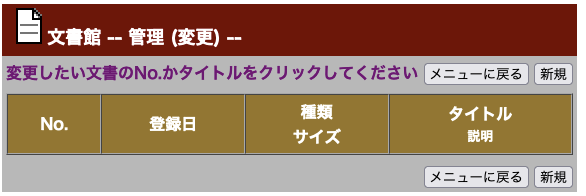
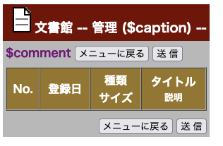

ちょっと思い立ったので、今年は「ひとりアドベントカレンダー」に挑戦してみます。
ということで、「OKAZAKI Shogo のひとりアドベントカレンダー」の1日目です。

まずは、長いことやろうとしてやれてなかったことで妄想してることを吐き出してみます。

## はじめに
ボーイスカウト阪神さくら地区の内部向け HP に [文書館](https://member.bs-hanshin-sakura.org/Document/main.cgi) というものがあり、今でも現役で動いている。
これを私ひとりでリニューアルしようという試み。

## 概要

- 元は Perl で書かれた cgi 
    - とある人が1人で作った
- アップロードされたファイルを地区内の一般の指導者が閲覧することができる
- アップロードすることができる指導者は登録されたもののみ
- ファイルは地区のアカウントのGoogleドライブにアップし、文書館ページからはGoogleドライブのリンクを掲載することとする
- 文書にはタグ付けを行い、ジャンルを分けて表示することができる
    - 1つの文書にタグは複数つけることが可能
- ファイルタイプに応じたアイコンを表示する

## As-Is の確認

### 一般利用者向け画面

### 管理者画面

- 管理者認証はBASIC認証のみ
- 文書データはサーバーに直置き
    - 文書データは `item.dat` として DAT ファイルで管理
    - レコード例： `001096		令和6年度　宗教章（仏教章第一教程）講習会 参加申込書		xls`
        - ID　文書名　ファイル種別
- 年度方針の機能は使われていない

### インフラ

- さくらのレンタルサーバースタンダードプラン
    - Python 3.8.12 がデフォルトでインストールされているので、Python ベースの Web アプリを動かすことは可能
    - MySQL が使える
        - ただし、ローカルホスト接続は無理。インターネット経由で。
- ボーイスカウトで Google WorkSpace のアカウントを持っている
    - ファイル自体は Google ドライブに置くのが良さそう
- ファイルのアップロードは FTP 経由
- ソースの git 管理はされてない

##  要件検討

- 処理の詳しい中身はわからない（Perlは読めない）ので、必要そうな機能を洗い出しながら作っていってみる
- 実装は Python で行う
    - Flask ベースのWebシステムにす
- ファイルと管理ユーザーの管理は MySQL の DB を使う

### ER 図

### ユースケース図

### システム構成

とってもざっくりだが。

