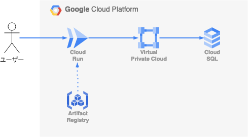
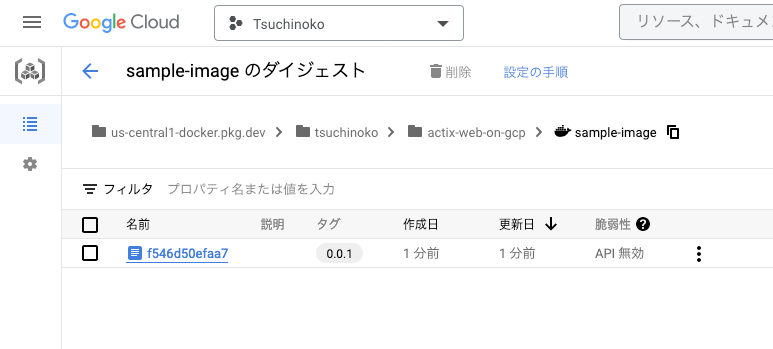
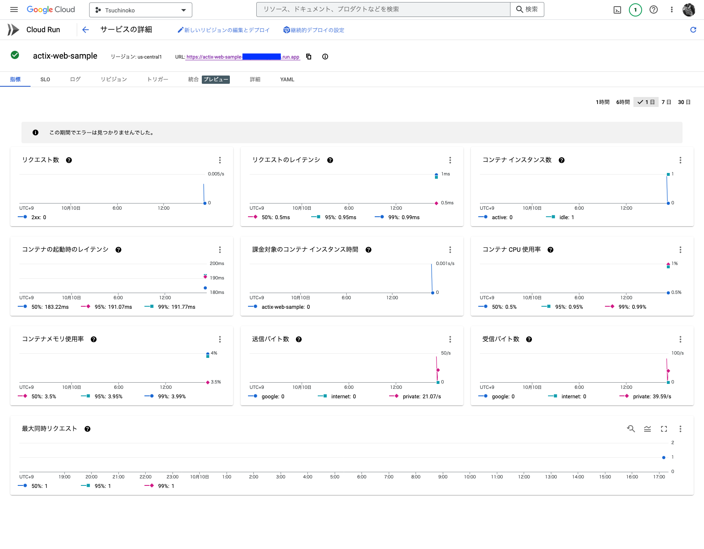

Heroku の無料プランが終わるということで、個人開発で使うための代替のサービスを検討してました。  
どうせなら全部クラウドにしてしまえ、ということで[以前作った Rust で実装した API サーバー](https://www.zakioka.net/blog/api-server-on-rust-develop-deploy)を GCP に載せてみました。  
GCP を始めて触る機会のもなったかな、と。とは言え、 Cloud SQL が高いので、他にもっと良い手はないか検討中です。  

## 今回のソース

今回作ったものは [GitHub のリポジトリ](https://github.com/tsuchinoko0402/actix-web-on-cloud-run)に置いておきました。

## 構成

今回の構成は以下のような感じです（GCPのリソースの構成図書くの初めてなのでこれでお作法的にあってるか不安ですが）：  



ユーザーからのリクエストを Cloud Run に載せた Rust で実装した API サーバーで受け付けます。  
Cloud Run で動かすコンテナのイメージは Artifact Registry から取得します。  
データは Private な VPC 上にある Cloud SQL に格納します。  
Cloud Run から Cloud SQL にアクセスする際には[サーバーレス VPC コネクタを作成する](https://cloud.google.com/run/docs/configuring/shared-vpc-host-project?hl=ja)必要があります。

## 動かすものを実装

まずは、以前作った Rust の API サーバーのソースを基に、 API サーバーを実装します。  
（[GitHub のリポジトリの](https://github.com/tsuchinoko0402/actix-web-on-cloud-run/tree/main/app/src) [`app/src`](https://github.com/tsuchinoko0402/actix-web-on-cloud-run/tree/main/app/src) [ディレクトリ配下](https://github.com/tsuchinoko0402/actix-web-on-cloud-run/tree/main/app/src)）  
以前と同様に、Docker Compose でローカルで立ち上がるようにしておきます。

## Artifact Registry に Docker イメージに push する

[こちら](https://cloud.google.com/artifact-registry/docs/docker/store-docker-container-images#gcloud)の内容を参考に Docker を Artifact Registry に push します。

### Artifact Registry に Docker リポジトリを作成する

以下のコマンドを実行します：

```
gcloud artifacts repositories create [リポジトリ名] --repository-format=docker \
--location=us-central1 --description="[リポジトリの説明]"
```

### 認証を構成

以下のコマンドで、Artifact Registry へのリクエストを認証するように Docker を構成します。これで、GCR イメージを push または pull することができるようになります。  
以下は、リージョンは us-central1 とする場合のコマンドです：

```
$ gcloud auth configure-docker us-central1-docker.pkg.dev
```

### Dockerfile を build

`app/src` ディレクトリ配下で次のコマンドど実行し、 Dockerfile を build します。

```
$ docker build -t sample-app/actix-web-sample:latest .
```

### イメージにレジストリ名をタグ付けする

以下のコマンドで先ほど build したイメージをタグ付けします。

```
$ docker tag sample-app/actix-web-sample:latest us-central1-docker.pkg.dev/[プロジェクト ID]/[リポジトリ名]/[イメージ名]:[タグ名]
```

例えば、こんな感じです：

```
docker tag sample-app/actix-web-sample:latest us-central1-docker.pkg.dev/tsuchinoko/actix-web-on-gcp/sample-image:0.0.1
```

### イメージを Artifact Registry に push

以下の形式のコマンドを実行しイメージを push します：

```
$ docker push us-central1-docker.pkg.dev/[プロジェクト ID]/[リポジトリ名]/[イメージ名]:[タグ名]
```

具体的にはこんな感じです：

```
$ docker push us-central1-docker.pkg.dev/tsuchinoko/actix-web-on-gcp/sample-image:0.0.1
```

成功すれば、以下のように Artifact Registry でイメージが確認できます：  



## インフラコードの作成

あとは、インフラコードを作成していきます。[こちらの内容](https://komi.dev/post/2022-05-04-rust-from-cloud-run/)を大いに参考にさせていただきました。  
作成したインフラコードは [`infra`](https://github.com/tsuchinoko0402/actix-web-on-cloud-run/tree/main/infra) [ディレクトリ以下](https://github.com/tsuchinoko0402/actix-web-on-cloud-run/tree/main/infra)に格納しています。  
以下、ポイントを絞ってコードを解説します（バックエンドの設定などの解説は省略）

### Secret Manager の設定

DB のパスワードなどの機密情報を格納するためのハコを用意します。  
Terraform のコードに機密情報を書くわけにはいかないので、 Terraform のコマンド実行後、手動で値を設定します。

```
# -----
# シークレットに関する定義
# https://registry.terraform.io/providers/hashicorp/google/latest/docs/resources/secret_manager_secret
# -----

# データベース名
resource "google_secret_manager_secret" "db_name" {
  secret_id = local.secret_id_db_name

  labels = {
    label = var.service_name
  }

  replication {
    automatic = true
  }
}

# データベースユーザー名
resource "google_secret_manager_secret" "db_user" {
  secret_id = local.secret_id_db_user

  labels = {
    label = var.service_name
  }

  replication {
    automatic = true
  }
}

# データベースのパスワード
resource "google_secret_manager_secret" "db_password" {
  secret_id = local.secret_id_db_password

  labels = {
    label = var.service_name
  }

  replication {
    automatic = true
  }
}
```

### VPC の設定

Cloud SQL を配置する Private な VPC の作成と、 Cloud Run から接続するために必要な設定を記述します。

```
# ----------
# ネットワークの設定
# ----------

# ----- 以下、Terraform の公式の example を参考にネットワークの設定作成 -----
# https://registry.terraform.io/providers/hashicorp/google/latest/docs/resources/vpc_access_connector#example-usage---cloudrun-vpc-access-connector

# Serverless VPC Access API の有効化
resource "google_project_service" "vpcaccess_api" {
  provider = google-beta

  service            = "vpcaccess.googleapis.com"
  disable_on_destroy = false
}

# VPC の作成
# https://registry.terraform.io/providers/hashicorp/google/latest/docs/resources/compute_network
resource "google_compute_network" "vpc" {
  name                    = local.vpc_name
  project                 = var.project_id
  auto_create_subnetworks = false
}

# サブネットの作成
# https://registry.terraform.io/providers/hashicorp/google/latest/docs/resources/compute_subnetwork
resource "google_compute_subnetwork" "vpc" {
  name                     = local.subnet_name
  ip_cidr_range            = var.subnet_cidr_range
  network                  = google_compute_network.vpc.self_link
  region                   = var.region
  private_ip_google_access = true
}

# VPC アクセスコネクターの作成
# CloudRun からプライベートな Cloud SQL に接続するためには必須
# https://registry.terraform.io/providers/hashicorp/google/latest/docs/resources/vpc_access_connector
resource "google_vpc_access_connector" "connector" {
  provider = google-beta

  name          = local.vpc_connector_name
  region        = var.region
  ip_cidr_range = var.vpc_connector_cidr_range
  network       = google_compute_network.vpc.name
  machine_type  = var.vpc_connector_machine_type
  min_instances = 2
  max_instances = 10

  depends_on = [google_project_service.vpcaccess_api]
}

# Cloud Router の設定
# https://registry.terraform.io/providers/hashicorp/google/latest/docs/resources/vpc_access_connector
resource "google_compute_router" "router" {
  provider = google-beta

  name    = local.router_name
  region  = var.region
  network = google_compute_network.vpc.id
}

# NAT の設定
# https://registry.terraform.io/providers/hashicorp/google/latest/docs/resources/compute_router_nat
resource "google_compute_router_nat" "router_nat" {
  provider = google-beta

  name                               = local.nat_name
  region                             = var.region
  router                             = google_compute_router.router.name
  source_subnetwork_ip_ranges_to_nat = "ALL_SUBNETWORKS_ALL_IP_RANGES"
  nat_ip_allocate_option             = "AUTO_ONLY"
}
```

### Cloud SQL の設定

Cloud SQL のインスタンス、データベース、ユーザーを作成します。  
今回は、 プライベート IP アドレスのみをもつ構成とします。  
また、機密情報は先ほど作成した Secret Manager から取得することとします。  
インスタンスの構成は、なるべくお金のかからない構成になるように設定しています。

```
# -----
# Cloud SQL の設定
#-----

# Secret Manager から必要な情報を取得する
data "google_secret_manager_secret_version" "db_name" {
  secret = local.secret_id_db_name
}

data "google_secret_manager_secret_version" "db_user" {
  secret = local.secret_id_db_user
}

data "google_secret_manager_secret_version" "db_password" {
  secret = local.secret_id_db_password
}

# VPC の設定を取得
data "terraform_remote_state" "vpc" {
  backend = "gcs"

  config = {
    bucket = "dev-tsuchinoko-tfstate"
    prefix = "actix-web-sample/vpc"
  }
}

# -----
# Cloud SQL 用にプライベート サービス アクセスを構成する
# https://cloud.google.com/sql/docs/postgres/configure-private-services-access#terraform
# https://registry.terraform.io/providers/hashicorp/google/latest/docs/resources/sql_database_instance#private-ip-instance

# IP アドレス範囲を割り振る
# https://registry.terraform.io/providers/hashicorp/google/latest/docs/resources/compute_global_address
resource "google_compute_global_address" "private_ip_address" {
  name          = "private-ip-address"
  purpose       = "VPC_PEERING"
  address_type  = "INTERNAL"
  prefix_length = 16
  network       = data.terraform_remote_state.vpc.outputs.vpc_id
}

# プライベート接続の作成
# https://registry.terraform.io/providers/hashicorp/google/latest/docs/resources/service_networking_connection
resource "google_service_networking_connection" "private_vpc_connection" {
  network                 = data.terraform_remote_state.vpc.outputs.vpc_id
  service                 = "servicenetworking.googleapis.com"
  reserved_peering_ranges = [google_compute_global_address.private_ip_address.name]
}

# -----
# Cloud SQL のインスタンスの作成
# https://registry.terraform.io/providers/hashicorp/google/latest/docs/resources/sql_database_instance
resource "google_sql_database_instance" "app" {
  name             = local.cloud_sql_instance_name
  database_version = "POSTGRES_14"
  region           = var.region

  depends_on = [google_service_networking_connection.private_vpc_connection]

  settings {
    tier              = var.db_instance_machine_type
    disk_autoresize   = true
    availability_type = var.db_availability_type
    disk_type         = var.db_disk_type

    backup_configuration {
      enabled                        = var.db_backup_enabled
      point_in_time_recovery_enabled = var.db_point_in_time_recovery_enabled
    }

    ip_configuration {
      ipv4_enabled    = false
      private_network = data.terraform_remote_state.vpc.outputs.vpc_id // Specify VPC name
    }
  }

  deletion_protection = var.db_delete_protection
}

# データベースの作成
# https://registry.terraform.io/providers/hashicorp/google/latest/docs/resources/sql_database
resource "google_sql_database" "database" {
  name     = data.google_secret_manager_secret_version.db_name.secret_data
  instance = google_sql_database_instance.app.name
}

# ユーザーの作成
# https://registry.terraform.io/providers/hashicorp/google/latest/docs/resources/sql_user
resource "google_sql_user" "users" {
  name     = data.google_secret_manager_secret_version.db_user.secret_data
  instance = google_sql_database_instance.app.name
  password = data.google_secret_manager_secret_version.db_password.secret_data
}
```

### Cloud Run の設定

Artifact Refistry のイメージを利用するように設定します。また、環境変数についてもここで設定します。  
外部から、API に認証無しアクセスを許可する設定も入れてます。この設定をするためには、 Terraform を実行するサービスアカウントに Cloud Run の管理者権限を付与しておく必要があります。

```
# -----
# Cloud Run の設定
# -----

# VPC の設定を取得
data "terraform_remote_state" "vpc" {
  backend = "gcs"

  config = {
    bucket = "dev-tsuchinoko-tfstate"
    prefix = "actix-web-sample/vpc"
  }
}

# DB の設定を取得
data "terraform_remote_state" "cloud_sql" {
  backend = "gcs"

  config = {
    bucket = "dev-tsuchinoko-tfstate"
    prefix = "actix-web-sample/cloud-sql"
  }
}

# Secret Manager から必要な情報を取得する
data "google_secret_manager_secret_version" "db_name" {
  secret = local.secret_id_db_name
}

data "google_secret_manager_secret_version" "db_user" {
  secret = local.secret_id_db_user
}

data "google_secret_manager_secret_version" "db_password" {
  secret = local.secret_id_db_password
}

# Cloud Run のサービスの設定
# https://registry.terraform.io/providers/hashicorp/google/latest/docs/resources/cloud_run_service
resource "google_cloud_run_service" "app" {
  name     = var.service_name
  location = var.region

  template {
    spec {
      containers {
        image = var.gcr_image
        ports {
          container_port = 8080
        }
        env {
          name  = "SERVER_ADDRESS"
          value = "0.0.0.0"
        }
        env {
          name  = "DATABASE_URL"
          value = "postgres://${data.google_secret_manager_secret_version.db_user.secret_data}:${data.google_secret_manager_secret_version.db_password.secret_data}@${data.terraform_remote_state.cloud_sql.outputs.db_private_ip}:5432/${data.google_secret_manager_secret_version.db_name.secret_data}"
        }
      }
    }

    metadata {
      annotations = {
        # Use the VPC Connector
        "run.googleapis.com/vpc-access-connector" = data.terraform_remote_state.vpc.outputs.connector_name // Specify VPC connector
        # all egress from the service should go through the VPC Connector
        "run.googleapis.com/vpc-access-egress" = "all"
        # If this resource is created by gcloud, this client-name will be gcloud
        "run.googleapis.com/client-name" = "terraform"
        # Disallow direct access from IP
        # "run.googleapis.com/ingress" = "internal-and-cloud-load-balancing"
      }
    }
  }

  traffic {
    percent         = 100
    latest_revision = true
  }

  lifecycle {
    ignore_changes = [
      # For update of gcloud cli version
      template[0].metadata[0].annotations["run.googleapis.com/client-version"]
    ]
  }

  autogenerate_revision_name = true
}

# 認証なしアクセスを許可するためのポリシー
data "google_iam_policy" "noauth" {
  binding {
    role = "roles/run.invoker"
    members = [
      "allUsers",
    ]
  }
}

# 認証なしのアクセスを可能にする
# 実行には Terraform 実行するための IAM ロールに Cloud Run の管理者権限が必要
resource "google_cloud_run_service_iam_policy" "noauth" {
  location = google_cloud_run_service.app.location
  project  = google_cloud_run_service.app.project
  service  = google_cloud_run_service.app.name

  policy_data = data.google_iam_policy.noauth.policy_data
}
```

### Terraform のコマンド実行

リソースの依存関係の問題があるので、

1.  Secret Manager の設定反映
2.  Secret Manager に値を設定（コンソールかコマンドで手動で実施）
3.  VPC の設定反映
4.  Cloud SQL の設定反映
5.  Cloud Run の設定反映

の順に行います。3. 以降は Makefile に依存関係を記載したので、 `make all CMD="terraform init && terraform apply -auto-approve"` で実行可能です。  
Makefile の中身：

```
CMD = ls

RUN_CMD = @cd $@ && \
    echo "Run command in \"$@\"" && \
    ${CMD}

help:
    @echo "This is a Makefile for executing commands according to AWS resource dependencies."
    @echo ""
    @echo "To deploy all AWS resources, run make as follows:"
    @tput setaf 2 && \
     echo "make all CMD=\"terraform init && terraform apply -auto-approve\"" && \
     tput sgr0

usage: help

### Below, the target resources
.PHONY: cloud_run cloud_sql secret_manager vpc
cloud_run: cloud_sql
    ${RUN_CMD}

cloud_sql: secret_manager vpc
    ${RUN_CMD}

vpc:
    ${RUN_CMD}

all: cloud_run
```

Terraform の実行が成功すると、以下のように Cloud Run のアプリにアクセスするための URL が発行されるので、アクセスしたり curl できたら成功です。  



ただし、今回の設定だと、 diesel のマイグレーションが最初に走っていないため、アプリを動かすためには `src/migrations` 配下にある `up.sql` を流す必要があります。  
私の場合は、一旦、Cloud SQL の Public IP アドレスを有効にし、 [Cloud SQL Auth Proxy](https://cloud.google.com/sql/docs/mysql/sql-proxy#install) を利用してローカル環境の DB クライアントからアクセスし、 SQL を実行しました。  
この辺り、もうちょっとスマートなやり方（Dockerの設定か何かかな？）があるような気がしています。

## まとめ

Rust で実装した API サーバーを GCP Cloud Run で実行することに成功しました。  
GCP を触り始めたりする良いきっかけにもなりました。  
もうちょっと色々とスマートなやり方がある気がするので、その辺りは研究しておきたいと思います。