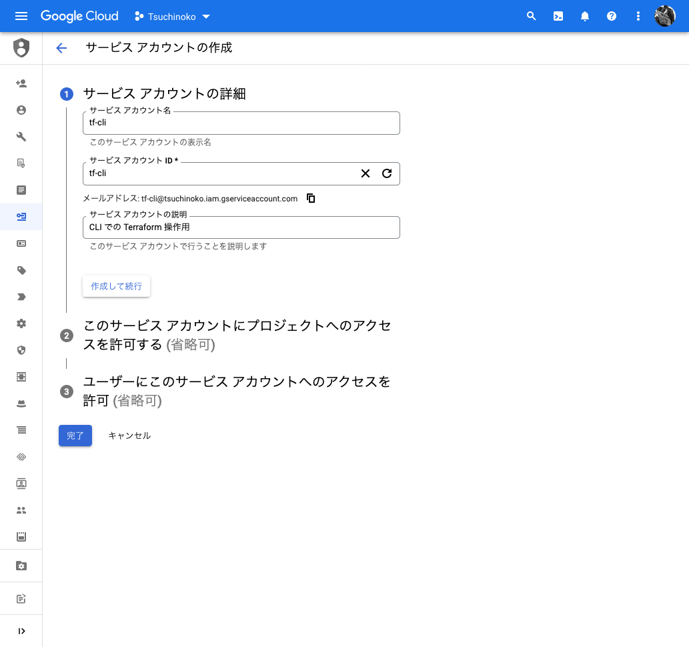

## 前提
Google アカウントは作成済みで、ブラウザ上のコンソールから GCP を使い始めたことがある状態であること。

## gcloud CLI の設定を行う
Homebrew 経由でサクッとインストール：
```shell
$ brew install --cask google-cloud-sdk
```
インストールが完了したら認証を行う：
```
$ gcloud auth login
```
ブラウザでログイン画面が出るので権限許可を出す。

## Terraform 用のサービスアカウントを作成する
Terraform 経由で操作するための権限を付与した[サービスアカウント](https://cloud.google.com/iam/docs/service-accounts?hl=ja)を
作成しておく。
GCP のコンソールから 「IAM と管理」→「」



権限は一旦「編集者」に設定しておけばOK（ただし、リソースによっては権限の追加が必要なものがある）。

完了後、クレデンシャル情報が記載された JSON を DL し、適切な場所に保存する。

### Terraform でのクレデンシャルの指定方法
#### 1. `provider` に直接ファイルの場所を記載する
```hcl
provider "google" {
  credentials = "${file("<your-credential-file-path>")}"
  project     = "${lookup(var.project_name, "${terraform.workspace}")}"
  region      = "asia-northeast1"
}
```

#### 2. 環境変数に設定する
```shell
$ export GOOGLE_APPLICATION_CREDENTIALS="<your-credential-file-path>"
```

## tfstate を保管するためのバケットを GCS に用意する

Terraform でバケットを作成するのはあんまり良くないという話を聞くので、ここは手動で作成する。
設定内容を Terraform で書くと以下のような感じ：
```hcl
resource "google_storage_bucket" "terraform-state-store" {
  name     = "my-terraform-bucket"
  location = "us-west1"
  storage_class = "REGIONAL"

  versioning {
    enabled = true
  }

  lifecycle_rule {
    action {
      type = "Delete"
    }
    condition {
      num_newer_versions = 5
    }
  }
}
```

## `backend` で tfstate の場所を GCS に指定する
以下のような感じ：

```hcl
terraform {
  # https://www.terraform.io/language/settings/backends/gcs
  backend "gcs" {
    bucket = "<バケット名>"
    prefix = "<適当なパス名>"
  }
}
```

## 参考資料

-   [GCPのgcloudコマンドのインストールと最初の認証までを初心者向けに細かく解説](https://qiita.com/G-awa/items/e6904b040caa0096fba0)
-   [Getting Started with the Google Provider | Terraform](https://registry.terraform.io/providers/hashicorp/google/latest/docs/guides/getting_started)
-   [Google Cloud の Terraform 関連ドキュメント | GCP](https://cloud.google.com/docs/terraform?hl=ja)