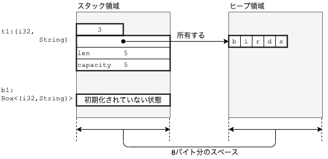
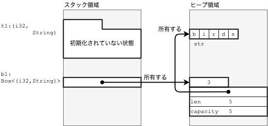
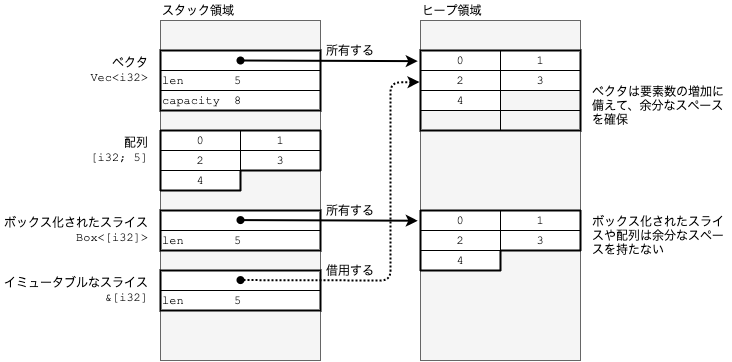
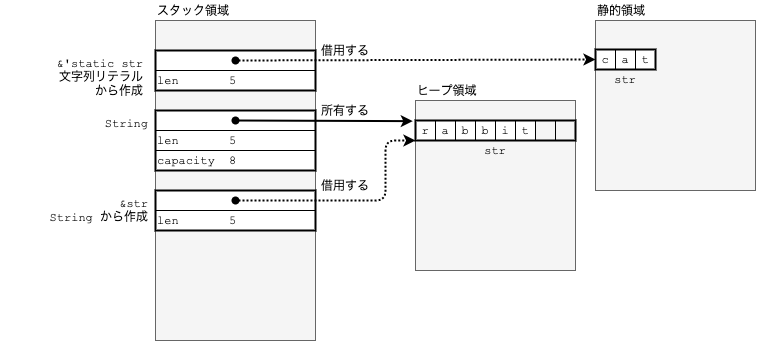

## 分類

- 大きく分けて2つ
    - **プリミティブ型(primitive type)**：言語組み込みの型
    - **ユーザー定義型(user defined type)**
- 更に、以下の2つに分かれる
    - **スカラ型(scalar type)**
        - 内部構造を持たない
        - `bool`, `f64`, `u32` 等
    - **複合型(compound type)**
        - 他の型を組み合わせて形成
        - アクセスできる内部構造を持つ
        - 例：`Vec<u32>`, `[u32]`, `Student`(自分で定義)

## プリミティブ型

### スカラ型

#### ユニット型（unit type）

- 空を表す型
- 唯一の値 `()`: からのタプル(=ユニット値)を持つ
- 型は `unit` ではなく、 `()` と書く
- 値を返さない関数の戻り値はユニット型
- サイズは 0 バイト
    - K-V のペアを格納するマップのようなデータ構造でキーだけ渡したいとき、値をユニット型にするとムダなメモリを使わずに済む

#### 真理値型(bool type)

- `true` か `false`

#### 固定精度の整数

- `iXX`: 符号付き整数型(integer)
- `uXX`: 符号なし整数型(unsigned integer)
- 指定可能なビット幅は 8, 16, 32, 64, 128
    - アーキテクチャなど、環境に依存しない
    - 128 のみ、 Rust 1.26.0 以前で使用できない
- アドレス幅指定の整数型は `isize`(符号付き) か `usize`(符号なし)
    - CPU のメモリアドレスのビット幅によって決定
- 整数リテラルはデフォルトでは `i32` と解釈される
- 型を指定したいときはサフィックスで型名を付与

    ```rust
    let n1 = 10_000; // i32 型
    let n2 = 0u8; // u8 型
    let n3 = -100_isize; // isize 型
    ```

- 以下のような場合、型推論が働く
    - 2行目で `n2` は一見 `i32` になるように見えるが、3行目で `isize` と加算しているため、 `n2` は `isize` となる。

    ```rust
    let n1 = -100_isize;
    let n2 = 10;
    let n3 = n1 + n2; 
    ```

- プレフィックスとして `0x`, `0o`, `0b` をつけると、それぞれ16進数、8進数、2進数として解釈される
- 以下のように書くと、 ASCII 文字に対応する文字コードが得られる
    - 型はデフォルトで `u8`

    ```rust
    let str =  b'A';
    assert_eq!(n1, 65u8); // => true
    ```

- 整数演算は以下の通り
    - べき乗をやりたいときは、 `pow()` メソッドを使う
    - インクリメント、デクリメントや三項演算子はない

### 固定精度の浮動小数点数

- `f32` と `f64`
- デフォルトで `f64`
- サフィックスで型を指定可能
- `578.6E+77` のように、指数部も指定可能

### 文字型

- `char` リテラルはシングルクォートで作れる
- 英数字であっても 4 バイト使用する
- Unicode で文字を表すコードポイントを `U+16進数` で表す
- 表示上1文字でも、複数のコードポイントを組み合わせて作られる文字（絵文字など）で `char` リテラルを作ろうとすると、コンパイルエラーになる

## 参照型(reference type)

- メモリ安全なポインタ
- 参照は、ポインタで指したい値に `&` や `&mut` をつけることで作成できる。
- 型は `&T` や `&mut T` のように表す
    - `&T`: イミュータブルな参照（不変の参照）・・・参照先の値の読み出しだけが可能
    - `&mut T`: ミュータブルな参照・・・参照先の値の読み出しと書き込みの両方が可能
- 参照外し：ポインタの先頭に `` をつける
    - ポインタが指す値を取り出したり、ポインタが指す値を変更するとき

### 生ポインタ型(raw pointer type)

- メモリ安全ではないポインタ
- 不変の生ポインタは `const T` 型, 可変の生ポインタは `mut T` 型になる
- 使い所は、ポインタを他の言語との間で受け渡したり、所有権システムの管理から外したいとき
- 安全性を保証しないため、参照外しや外のポインタ型への変換は `unsafe` ブロックで囲む必要がある

### 関数ポインタ型(fn pointer type)

- 関数を表すポインタ
    - 例： `fn double(n: i32) -> i32` を指す関数ポインタは `fn(i32) -> i32` と表記する
- サイズは `usize` 型と同じ

### プリミティブな複合型

#### タプル型(tuple type)

- `(88, true)` や `(0.0, -1.0, 1.0)` のようにカンマで区切った要素の組をもつ。
- 各要素の型は異なっていても構わない。
- 要素へのアクセスは、 0 始まりの要素番号で
    - フィールド名には定数のみ使える。変数を入れるとコンパイルエラー。

    ```rust
    let t1 = (88, true);
    assert_eq!(t1.0, 88);

    #[allow(unused_variables)]
    let i = 0;
    // let t1a = t1.i;
    //   → コンパイルエラー
    //       no field `i` on type `({integer}, bool)`
    ```

- 要素を書き換えるためには、タプルに `mut` をつけて可変にする
- パターンマッチで分解して参照も可能

    ```rust
    // 要素を書き換えるので、変数t1に`mut`を付けて可変にする
    let mut t1 = (88, true);
    // フィールド0の要素を書き換える
    t1.0 += 100;  // 現在の値に100を足す
    assert_eq!(t1, (188, true));

    // 不要な値はアンダースコアを使うと無視できる
    #[allow(unused_variables)]
    let ((x1, y1), _) = ((0, 5), (10, -1));

    // 要素を書き換えるので、変数t1に`mut`を付けて可変にする
    let mut t1 = ((0, 5), (10, -1));

    // 要素を指す可変の参照を得るためにref mutを追加する
    let ((ref mut x1_ptr, ref mut y1_ptr), _) = t1;

    // *を付けることでポインタが指すアドレスにあるデータにアクセスできる
    *x1_ptr += 3;
    *y1_ptr *= -1;

    assert_eq!(t1, ((3, -5), (10, -1)));
    ```

#### 配列型(array type)

- 0 から始まる
- 配列の型は、要素の型と長さで表す：`[bool; 3]`, `[f64; 4]` など
- 配列の長さはコンパイル時に決まる
    - 実行時に長さを決めたい場合は、ベクタ（ `Vec<T>` 型）を使う
- 要素へのアクセスは、インデックスかイテレータで
- get() メソッドでより安全に（パニックせずに）取り出せる
    - 値がある特は、`Some(& 値)`, 無いときは `None` を返す
- 配列に使える `len()`, `get()`, `iter()` は配列自体に備わっているのではなく、スライスに備わっているもの
    - array のドキュメントには載っておらず、 slice のページを見ないと説明がない
    - 詳しくは、型強制のところで。

#### スライス型(slice type)

- 配列要素の範囲に効率よくアクセスするためのビュー
    - 配列だけでなく、連続したメモリ領域に同じ型の要素が並んでいるデータ構造なら、どれでも対象にできる
    - ベクタや Rust 以外の言語で作成された配列も含む
- スライスには、不変・可変の参照か `Box` というポインタの一種を経由してアクセスする。
    - そのため、型は `&[bool]`, `&mut [bool]`, `Box<[bool]>` のように表記する
- スライスの長さはコンパイル時ではなく、実行時に決まる

    ```rust
    // この関数は&[char]型のスライスを引数に取り、その情報を表示する
    fn print_info(name: &str, sl: &[char]) {
        println!(
            "  {:9} - {}, {:?}, {:?}, {:?}",
            name,
            sl.len(),    // 長さ（バイト数）  usize型
            sl.first(),  // 最初の要素       Option<char>型
            sl[1],       // 2番目の要素      char型
            sl.last()    // 最後の要素       Option<char>型
        );
    }

    fn main() {
        // 配列
        let a1 = ['a', 'b', 'c', 'd'];       // 参照元のデータ。[char; 4]型
        println!("a1: {:?}", a1);

        print_info("&a1[..]",   &a1[..]);    // &[char]型。全要素のスライス
        print_info("&a1",       &a1);        // 同上
        print_info("&a1[1..3]", &a1[1..3]);  // 'b'と'c'を要素とする長さ2のスライス

        // ベクタ
        let v1 = vec!['e', 'f', 'g', 'h'];   // 参照元のデータ。Vec<char>型
        println!("\\nv1: {:?}", v1);

        print_info("&v1[..]",   &v1[..]);    // &[char]型。全要素のスライス
        print_info("&v1",       &v1);        // 同上
        print_info("&v1[1..3]", &v1[1..3]);  // &[char]型。'f'と'g'を要素とする長さ2のスライス
    }
    ```

- `&a1[1..3]` と書いたときに、インデックス 3 の要素が含まれないことに注意
    - Rust では、`begin..end` で範囲を指定した際、 begin は含むが、 end は含まない
    - end を含めたい場合は、 `begin..=end` を使う
- 配列 `a1` に対して、
    - `&a1[1..3]`：不変のスライス
    - `&mut a1[1..3]`：可変のスライス
- `&[T]` や `&mut[T]` といった一般的なスライスは、ポインタの一種なので、それ自身は値を持たない。
    - Rust で「データを所有せず、借用している」と呼ぶ状態
- ボックス化されたスライス `Box<T>` という型は、データを所有する
    - ヒープ領域にデータを削除
    - ライフタイムが尽きるとデータは削除される

##### 文字列スライス

- `str` 型は、 Unicode の文字で構成された文字列
- 殆どの場合、 `str` にはスライスを通じてアクセスされる
- `len()` は文字数ではなく、 UTF-8 のバイト数を返す点に注意
- `&str` は不変スライス経由のアクセス、`&mut str` は可変スライス経由のアクセス
    - ただし、可変スライス経由でも、要素の追加や削除はできない（UTF-8バイト列の要素変更はできる）
    - 文字列の内容を自由に変更するには、 String 型を使う

## ユーザー定義型

### メモリ領域について

- 以下の表のような4領域にメモリ上を分ける
    - スタックは高速な反面、領域は大きくない -> 使いすぎると、スタックオーバーフローが発生
    - ヒープは遅い。必要なときに確保と開放が行われる。領域は大きめ。

    | 領域 | リンカで用いられる名称 | 用途 |
    | :--- | :--- | :--- |
    |  プログラム領域  |  text  | プログラムのマシンコードが置かれる |
    |  静的領域（static 領域）  |  data, bss  | プログラム起動時に確保され、グローバル変数や文字数リテラルなどが置かれる |
    |  スタック領域  |  stack  | 関数の引数やローカル変数が置かれる |
    |  ヒープ領域  |  heap  | 動的に確保され、プログラム内で共有されるデータが置かれる |

- Rust では、デフォルトで値をスタックに置く
- 以下のような型は、データの一部をヒープに置く：
    - Box ポインタ（`Box<T>`）
    - `Vec<T>` や `HashMap<K, V>` のように、要素数が可変のコレクション型の要素
    - String や OSString のような、文字列の追加や削除が可能な文字列の要素

### 標準ライブラリの主な型

#### `Box<T>`

- メモリ安全なポインタ
- 対象のデータはヒープ領域に置く
- ポインタだが、対象のデータを所有する
- Box ポインタを作成する例が以下：

    ```rust
    fn main() {
        let t1 = (3, "birds".to_string());  // (i32, String)型のタプル。スタックに置かれる
        let mut b1 = Box::new(t1);          // Boxポインタを作る。タプルがヒープに移動する
        (*b1).0 += 1;                       // *で参照外し
        assert_eq!(*b1, (4, "birds".to_string()));

        // Box::new()の実行後にt1にアクセスしようとするとコンパイルエラーになる
        // println!("{:?}", t1);
        //   → error[E0382]: borrow of moved value: `t1`
    }
    ```

- 上記の `Box::new(t1);` を実行する直前のメモリ状態を図にすると以下のようになる：
     
    - スタック領域に変数 `t1` と `b1` のためのスペースが用意されている。
        - `t1` は `(i32, String)` のタプル。
            - `i32` は 4 バイトのスペースに収まる。
            - `String` は以下の  3 つのフィールドで構成（64 ビットの CPU なら 8 バイトずつ）：
                1. ヒープ領域の UTF-8 バイト列を指すポインタ
                2. 文字列の長さ（`len`）
                3. キャパシティ（`capacity`）：ヒープの再割当なしに格納できる要素数の最大値
        - `b1` はスペース確保済みだが、初期化されていない。
- `Box::new(t1);` 実行後は以下のようになる：
     
    - `(i32, String)` 型のタプルはヒープ領域に移動。`b1` がその位置を指している。
    - `t1` はタプルに関する情報を所有しないこととなり、初期化されていない状態になる。
        - この状態で `t1` にアクセスしようとするとコンパイルエラーとなる。
- 関数の実行が終了すると、`t1`, `b1` ともにスタック領域のスペースが解放される。
    - Box ポインタの削除、それが所有していたヒープ上のタプルの削除、タプル内の `String` が所有していた UTF-8 バイト列も削除

<small>このあたり、所有権システムを理解した上でもう一度ちゃんとやる。</small>

- Box ポインタの使い所：
    1. コンパイル時にデータサイズが決まらない型を使うとき
    2. 大きなデータをコピーすること無く、所有権を他へ移したい時
    3. トレイトオブジェクトを作成したい時　<small>この点は追々。</small>

#### ベクタ

- ベクタ `Vec<T>` は配列を表現する型
- ベクタを初期化するときは `vec![]` マクロを使う
- 配列と同じく、同じ型の要素の並びでないといけない
- ベクタの型は `Vec<要素の型>` で表す。入れ子のものは `Vec<Vec<要素の型>>`
- 空のベクタを作るときは、 `new()` メソッドを使う。事前に大まかな要素数がわかっているときは、 `with_capacity(要素数)` メソッドを使うと良い：メモリ再割当てのオーバーヘッドが削減できるため。
- 配列 `[T; n]` やスライスとのメモリレイアウトの違いは以下の表と図：
    - ベクタとボックス化されたスライスは実データをヒープ領域に格納する
    - 配列はスタック領域に格納する
        - スタックのほうが高速なので、配列の方が有利だが、あまり大きなデータは入れられない
        - `Box<T>` はベクタから変換して作る
            - 要素数は実行時に決まる
            - 実データはヒープ領域に格納
            - 要素の追加と削除はできない
            - スライスに用意されたメソッドだけ使える
        - `Vec<T>` は余分なメモリが確保されている
            - `shrink_to_fit()` メソッドでメモリを削ぎ落とすことは可能

    |型|役割|実データを格納するメモリ領域|要素数決定のタイミング|要素の追加・削除の可否|実データを所有するか否か|
    |:---|:---|:---|:---|:---|:---|
    |ベクタ `Vec<T>`|サイズ可変の配列|ヒープ領域|実行時|○|○|
    |配列 `[T; n]`|サイズ固定の配列|スタック領域|コンパイル時|×|○|
    |ボックス化されたスライス `Box<[T]>`|サイズ固定の配列|ヒープ領域|実行時|×|○|
    |その他のスライス： `&[T], &mut [T]`|ベクタや配列へのアクセスを抽象化|参照先に依存（ヒープ or スタック）|実行時|×|×|

     

#### その他のコレクション型

- マップ：HashMap, BTreeMap
- セット：HashSet, BTreeSet
- キュー：VecDeque, BinaryHeap
- リスト：LinkedList

##### ハッシュアルゴリズムの性能

- ハッシュ値の生成に SipHash という暗号強度のハッシュアルゴリズムを使用している
    - hashdos という DoS 攻撃への耐性を確保している
- SipHash は暗号強度を持つアルゴリズムの中では高速な部類に入るが、ハッシュ値を求めるために多くの計算を必要とする
- 性能が悪いと感じた場合は、FNV のようなハッシュアルゴリズムの使用を検討する

#### String（`std::string::String`）

- `&str` と `String` の関係は、不変のスライスとベクタの関係に似ている
    - `String` は文字の変更や追加や削除が可能
    - `&str` は不変
- 実データは UTF-8 形式でエンコードされていて、ヒープに格納される
- 数値型などから `String` を作るには、`to_string()` メソッドや `format!()` マクロを使う
- 文字列から数値型を作るには、 `str` 型の `parse()` メソッドを使う
- バイト列から作成することも可能

    ```rust
    fn main() {
        let i = 42;           // i32型
        assert_eq!(i.to_string(), "42");

        let f = 4.3 + 0.1;    // f64型
        assert_eq!(f.to_string(),       "4.3999999999999995");
        assert_eq!(format!("{:.2}", f), "4.40");  // format!マクロが便利

        let t = (1, "ABC");
        // 2要素のタプル型はDebugトレイトを実装しているのでformat!マクロで変換できる
        assert_eq!(format!("{:?}", t), r#"(1, "ABC")"#);

        let s1 = "42";
        assert_eq!(s1.parse::<i32>(), Ok(42)); // &str型からi32型へ変換

        let s2 = "abc";
        let r2: Result<f64, _> = s2.parse();   // 変数の型から型推論できるならparseの型パラメータは不要
        assert!(r2.is_err());                  // 数値として解釈できないときはエラーが返る
        println!("{:?}", r2);                  // → Err(ParseFloatError { kind: Invalid })
    
        let cs = ['t', 'r', 'u', 's', 't'];      // [char; 5]型
        assert_eq!(cs.iter().collect::<String>(),       "trust");
        assert_eq!(&cs[1..].iter().collect::<String>(), "rust" );

        let bad_utf8: [u8; 7] = [
            b'a',              // a
            0xf0, 0x90, 0x80,  // でたらめなバイト列
            0xe3, 0x81, 0x82,  // あ
        ];

        // 不正なバイト列はUnicodeのU+FFFD Replacement Characterに置き換わる
        let s = String::from_utf8_lossy(&bad_utf8);
        assert_eq!(s, "a\\u{fffd}あ");
    }
    ```

##### `String` と `&str` の比較

- `String` は実データを所有する。
- `&str` は不変スライスで、実データを所有せずに借用している。
    - 文字列リテラルから作成した場合：実データは静的領域に置かれる
    - String から作成した場合：String がヒープ領域に置いてある実データを参照する
    - バイト列から作成した場合：ヒープまたはスタック領域に置かれているバイト列を実データとして参照する

     

- 関数の引数として文字列を作るときは、文字列が不変で構わないなら、コストの低い `&str` にすべき
    - 可変でないと困るなら、`&mut String`, 所有権も必要なら `String`
- `&str` は参照先の UTF-8 バイト列よりも短い期間しか生存できない
    - 関数から返すときは注意が必要

    ```rust
    // この関数は引数として&str型の名前を取り、&str型の"Hello, 名前!"を返す
    // fn f1(name: &str) -> &str {
    //     let s = format!("Hello, {}!", name); // format!はStringを作る
    //     &s   // Stringから&strを作成し、戻り値として返す
    //     // → コンパイルエラー：`s` does not live long enough.（sの生存期間が不十分）
    // }

    // この関数は引数として&str型の名前を取り、String型の"Hello, 名前!"を返す
    fn f1(name: &str) -> String {
        format!("Hello, {}!", name)
    }

    fn main() {
        f1("ken");
    }
    ```

- 上のコードでエラーになるところは、`format!` で新たに作った String が関数を抜けるときにライフタイムが尽きて、削除されることが原因
    - コンパイラが、バイト列にアクセスできなくなることを検出する

#### 範囲（Range）

- `start..end`, `start..=end`, `start..`, `..end` のような形をとって、数列の作成やスライスの範囲指定などに使われる
- 6つの構文がそれぞれ別の型に対応している
    - 6つの `Range*` 型に対応するジェネリクスな関数を定義するには、 `RangeBounds` トレイトを使う。

    ```rust
    fn main() {
        let a = ['a', 'b', 'c', 'd', 'e'];

        assert_eq!(a[ ..  ], ['a', 'b', 'c', 'd', 'e'] );
        assert_eq!(   ..   , std::ops::RangeFull                   );
    
        assert_eq!(a[ .. 3], ['a', 'b', 'c',         ] );
        assert_eq!(   .. 3 , std::ops::RangeTo { end: 3 }          );
    
        assert_eq!(a[ ..=3], ['a', 'b', 'c', 'd'     ] );
        assert_eq!(   ..=3 , std::ops::RangeToInclusive { end: 3 } );
    
        assert_eq!(a[1..  ], [     'b', 'c', 'd', 'e'] );
        assert_eq!(  1..   , std::ops::RangeFrom { start: 1 }      );
        
        assert_eq!(a[1.. 3], [     'b', 'c'          ] );
        assert_eq!(  1.. 3 , std::ops::Range { start: 1, end: 3 }  );
        
        assert_eq!(a[1..=3], [     'b', 'c', 'd'     ] );
        assert_eq!(  1..=3 , std::ops::RangeInclusive::new(1, 3)   );  
    }
    ```

#### オプション（Option）

- 値があるかどうかがわからないことを表す型
    - 値があるときは `Some(値)`, 無いときは `None` を使う
- オプションの値が `Some(値)` か `None` かを調べるときには、 `match` や `if let` を使う。
- `Some` から値をアンラップ（開封）するには、
    - `unwrap()` メソッドを使う：ただし、`None` のときに `panic` するので、できるだけ使わないほうが良い
    - `unwrap_or_else()` なら `None` でも `panic` しない

    ```rust
    let mut o2 = Some(String::from("Hello"));  // Option<String>型
    assert_eq!(o2.unwrap(), "Hello");          // unwrap()でSomeの中の値が取り出せる

    // しかしunwrap()はNoneのときにpanicするので、できるだけ使わない方がいい
    o2 = None;
    // o2.unwrap();
    // → thread 'main' panicked at 'called `Option::unwrap()` on a `None` value'

    // unwrap_or_else()ならNoneでもpanicしないので安心して使える
    // Noneのときはクロージャを実行し、Noneの代わりになる値を得る
    assert_eq!(o2.unwrap_or_else(|| String::from("o2 is none")), "o2 is none");
    ```

- アンラップするのではなく、`Some` で包まれたまま中の値を加工するときは、 `map()` や `and_then()` といったコンビネータ・メソッドが使える

    ```rust
    // Someで包まれた値を操作するならmap()やand_then()などのコンビネータが便利
    // map()はSome(値)のときは値にクロージャを適用し、クロージャが返した値をSomeで包み直す
    let mut o3 = Some(25);
    assert_eq!(o3.map(|n| n * 10), Some(250));

    // NoneならなにもせずNoneを返す
    o3 = None;
    assert_eq!(o3.map(|n| n * 10), None);

    o3 = Some(10);
    assert_eq!(
        o3.map(|n| n * 10)
            // and_then()はSome(値)のときは値にクロージャを適用し
            // クロージャが返した値（Some(新しい値)、または、None）をそのまま返す
            .and_then(|n| if n >= 200 { Some(n) } else { None }),
        None
    );
    ```

- 複数の `Option` 値を扱うときは、 `?`演算子が使える

    ```rust
    fn add_elems(s: &[i32]) -> Option<i32> {
        // 複数のOption値を扱うときは?演算子が便利
        // Some(値)なら値を取り出し、Noneならこの関数からすぐに戻る（Noneを返す）
        let s0 = s.get(0)?;
        let s3 = s.get(3)?;
        Some(s0 + s3)
    }

    // インデックス0と3の両方に値があるので、それらの合計がSomeで包まれて返される
    assert_eq!(add_elems(&[3, 7, 31, 127]), Some(3 + 127));

    // インデックス3がないのでNoneが返される
    assert_eq!(add_elems(&[7, 11]), None);
    ```

#### リザルト（Result）

- `Result<T, E>` は処理の結果はエラーになる可能性を暗示する型
    - 列挙型として定義されており、`OK(T 型の結果を示す値)` と `Err(E 型のエラーを示す値)` の ２ つのバリアントを持つ
- オプションと同様に、複数のリザルト値を扱うときは、`?` 演算子を使うと良い
- リザルト型にも `map()`, `and_then()`, `or_else()` が定義されている

    ```rust
    fn main() {
        // str::parse()は文字列を指定した型（ここではi32型）に変換する
        assert_eq!("10".parse::<i32>(), Ok(10));    // 変換できたらOK(値)が返される
        let res0 = "a".parse::<i32>();              // 変換できなかったら`Err(エラーを表す値)`が返される
        assert!(res0.is_err());
        println!("{:?}", res0); // → Err(ParseIntError { kind: InvalidDigit })

        // 複数のResult値を扱うときは?演算子が便利
        // Ok(値)なら値を取り出し、Err(エラーを表す値)ならこの関数からリターンする
        fn add0(s0: &str, s1: &str) -> Result<i32, std::num::ParseIntError> {
            let s0 = s0.parse::<i32>()?;
            let s1 = s1.parse::<i32>()?;
            Ok(s0 + s1)
        }

        assert_eq!(add0("3", "127"), Ok(3 + 127));
        assert!(add0("3", "abc").is_err());

        // map_err()コンビネータを使うとErr(エラーを表す値)のときに別のエラーに変換できる
        fn add1(s0: &str, s1: &str) -> Result<i32, String> {
            let s0 = s0.parse::<i32>().map_err(|_e| "s0が整数ではありません")?;
            let s1 = s1.parse::<i32>().map_err(|_e| "s1が整数ではありません")?;
            Ok(s0 + s1)
        }

        assert_eq!(add1("3", "abc"), Err("s1が整数ではありません".to_string()));
    }
    ```

##### 標準ライブラリのエラーの使い所

- ライブラリを開発した場合、標準ライブラリのエラー型を返さないほうが良い
    - 独自のエラー型を定義し、それに変換してから返すほうが良い
- 独自のエラーを定義する際は、`std::convert::From` トレイトを実装するのが良い
    - `?` 演算子が関数の戻り値に合うようにエラーを変換してくれる
    - いちいち `map_err()` で変換する必要がなくなる

##### 独自エラーの作り方例

- `thiserror` を用いて実装するのが良い
  - [crates.io: Rust Package Registry](https://crates.io/crates/thiserror)
  - [thiserror - Rust](https://docs.rs/thiserror/)
- ちょうど良い記事: [Rust エラー処理2020 - 電気ひつじ牧場](https://cha-shu00.hatenablog.com/entry/2020/12/08/060000)

## 新しい型の定義方法と型エイリアス

### 型エイリアス

- 型エイリアスは、型につけられる別名
- `type` キーワードで定義する
- コンパイラは型エイリアスを元の型と同じものとして扱う

    ```rust
    type UserName = String;
    type id = i64;
    type Timestamp = i64;
    type User = (Id, UserName, Timestamp);

    fn new_user(name: UserName, id: Id, created: Timestamp) -> User {
        (id, name,created)
    }

    let id = 400;
    let now = 4567890123;
    let user = new_user(String::from("mika"), id, now);
    ```

- あくまで別名なので、以下のような間違いをしてもコンパイルエラーにはならない：
    - `id` も `now` も `i64` 型であるため

    ```rust
    let bad_user = new_user(String::from("mika"), now, id);
    ```

- 型のネストが深くなったときに使うと見通しが良くなる
    - 例：多くの関数では、 `result<T, std::io::Error>` を `std::io::Result<T>` として定義している

    ```rust
    use std::cell::RefCell;
    use std::collections::HashMap;
    use std::rc::Rc;

    pub type SharedMap<K, V> = Rc<RefCell<HashMap<K, V>>>;
    ```

### 構造体（struct）

- 3種類の構造体：
    - 名前付きフィールド構造体
    - タプル構造体
    - ユニット構造体
- 名前付きフィールド構造体には、関数型レコードアップデート構文（functional record update syntax）と呼ばれる構文がある
    - これにより、すでにある値をもとにしてその一部を使った新しい値を作ることができる。

    ```rust
    let triangle1 = Polygon {
        vertexes: vec![(0, 0), (3, 0), (2, 2)],
        fill: (255, 255, 255),
        stroke_width: 5,
    };

    // triangle1を元にvertexesだけ異なる新しい値を作る
    #[allow(unused_variables)]
    let triangle2 = Polygon {
        vertexes: vec![(0, 0), (-3, 0), (-2, 2)],
        .. triangle1
    };
    ```

- 構造体に対して `Default` トレイトを実装すると、デフォルト値を設定できる

    ```rust
    // #[derive(Default)]
    struct Polygon {
        vertexes: Vec<(i32, i32)>,
        stroke_width: u8,
        fill: (u8, u8, u8),
    }

    #[allow(unused_variables)]
    let polygon1: Polygon = Default::default();

    // vertexesフィールドだけ別の値に設定し、他はデフォルト値にする
    #[allow(unused_variables)]
    let polygon2 = Polygon {
        vertexes: vec![(0, 0), (3, 0), (2, 2)],
        .. Default::default()
    };
    ```

- タプル構造体は、フィールドの名前を与えずに 0 から始まる連番のフィールド名を用いる
- デザインパターン「newtype」：型エイリアスの代わりにフィールドが一つのタプル構造体を定義することで、コンパイラ型のチェックを強化する

### enum: 列挙型

- Enum の定義の仕方：[https://doc.rust-jp.rs/book-ja/ch06-01-defining-an-enum.html](https://doc.rust-jp.rs/book-ja/ch06-01-defining-an-enum.html)

    ```rust
    #[derive(Debug, PartialEq)]
    enum Weekday {
        // Weekday型には以下のバリアントがある。
        Monday, Tuesday, Wednesday, Thursday, Friday,
    }

    // 月を表すMonth型を定義する
    #[allow(dead_code)]
    enum Month {
        // バリアントにisize型の整数値を割り当てられる
        January = 1, February = 2, March = 3, /* 中略 */  December = 12,
    }

    #[allow(dead_code)]
    #[derive(Debug)]
    enum Task {
        Open,
        AssignedTo(UserName),
        Working {
            assignee: UserName,
            remaining_hours: u16,
        },
        Done,
    }

    fn main() {
        // Task型の値を3つ作り、ベクタに格納する
        let tasks = vec![
            // もし上のuse宣言がなかったらTask::AssignedToと書かないといけない
            AssignedTo(String::from("junko")),
            Working {
                assignee: String::from("hiro"),
                remaining_hours: 18,
            },
            Done,
        ];
    }
    ```

### 実践的な情報

#### フィールドの可視性

- 構造体や列挙体の可視性はデフォルトで private なため、他のモジュールからはアクセスできない。
- モジュール外からアクセスできるようにするには、 `pub` キーワードを追加する
    - 構造体の場合、構造体自体だけでなく、フィールドごとの可視性も制御できる
    - 列挙体の場合、列挙体自体の可視性だけが制御できる
        - 列挙体自体を `pub` に設定したら、バリアントやバリアントが持つフィールドも `pub` になる

#### フィールドに参照をもたせる

- 構造体や列挙体のフィールドに参照をもたせる場合、ライフタイム指定子という所有権に関する情報を明示せねばならない

    ```rust
    // ライフタイム指定子 ('a) が必要
    struct StrRefs<'a> {
        s1:&'a str,
        s2:&'a str.
    }
    ```

#### ジェネリクス

- ジェネリクスな関数の例

    ```rust
    pub fn sort<T: Ord>(x: &mut [T], up: bool) {...}
    ```

- 構造体や列挙型もジェネリクスにすることが可能

    ```rust
    #[derive(Default)]
    pub struct Polygon<T> {
    	pub vertexes: Vec<T>,
    	...
    }

    // 座標一般
    trait Coordinates {}

    // デカルト座標
    #[derive(Default)]
    struct CaritesianCoord {
    	x: f64,
    	y: f64,
    }
    impl Coordinates for CartesianCoord {}

    // 極座標
    #[derive(Default)]
    struct PolarCoord {
    	r: f64,
    	theta: f64,
    }
    impl Coordinates for PolarCoord {}

    let vertexes = vec![
    	CartesianCoord {x: 0.0, y: 0.0},
    	CartesianCoord {x: 50.0, y: 0.0},
    	CartesianCoord {x: 30.0, y: 20.0},
    ]

    // Polygon<CartesianCoord>型
    let poly = Polygon { vertexes, ..., Default::default() };
    ```

#### 内部表現と `repr(C)`

- 構造体がメモリにどのように格納するかは、以下のコードを実行することで表示される

    ```rust
    #[derive(Default)]
    struct A {
        f0: u8,
        f1: u32,
        f2: u8,
    }

    fn main() {
        let a: A = Default::default();
        println!(
            "struct A ({} bytes)\\n  f0: {:p}\\n  f1: {:p}\\n  f2: {:p}\\n",
            std::mem::size_of::<A>(),
            &a.f0,
            &a.f1,
            &a.f2
        );
    }
    ```

- FFI を通じて他の言語に構造体を渡したり受け取ったりするときには、メモリの内部構造がわかっていないと困る場面もある

## 型変換

- ある型を別の型へと変換する方法がいくつか用意されている
    1. 型キャスト（type cast）
        - `as` 型を利用した明示的な型変換
        - データ変換を伴い、スカラ型同士を変換できる
    2. Transmute
        - コンパイラ・イントリンシック（組み込み命令）である `std::mem::transmute` を使用した明示的かつアンセーフな型変換。
        - データ変換を伴わない。
    3. 型強制（type coercion）
        - コンパイラによる暗黙的な型変換。
        - データ変換を伴う。

### 型キャスト

- `as` 型を利用した明示的な型変換
- データ変換を伴い、スカラ型同士を変換できる
    - タプルや配列のような複合型の変換には使えない
- 型キャストでは、桁あふれはチェックしないことに注意
- 複合型のときは、要素1つ1つをキャストしていく
- 一部の複合型の変換は、 `From::from()` で実現できる

### Trasmute

- コンパイラ・イントリンシック（組み込み命令）
- `std::mem::transmute` を利用した、明示的かつアンセーフな型変換
    - メモリ上の表現（ビット列）のサイズさえ同じなら、どんな型同士でも変換できる
- データ変換を伴わない

### 型強制

- コンパイラによる暗黙的な型変換
- データ変換を伴う
- 型強制が行われる場所は以下：
    - `let`, `static`, `const` 文
    - 関数の引数
    - 構造体やバリアントのフィールドへの値の設定
    - タプルリテラル
    - 配列のリテラル
    - 関数の戻り値
- 型強制の種類
    - Deref による型強制
        - `Deref` トレイトを実装しているときに可能
    - ポインタの弱体化
        - あるポインタ型を機能がより制限されたポインタ型に型強制できるルール
    - サイズの不定化
    - 環境画からのクロージャ　→　関数ポインタ型
    - ! → 任意の型

### 基本構文

- メソッドはインスタンスに紐付いたもの、第一引数が `&self`, 関連関数は、 static 関数みたいなもの

    ```rust
    struct Circle {
        radius: u32
    }

    impl Circle {
        fn diameter(&self) -> u32 {
        self.radius * 2
    }
    
    fn small_circle -> Circle {
            Circle { radius: 1 }
        }
    }

    fn main() {
        let circle1 = Circle::small_circle();
        println!("Circle1's diameter: {}", circle1.diameter());
    }
    ```

- 変数と値を結びつけることを Rust では、「変数を値に**束縛**する」と表現する